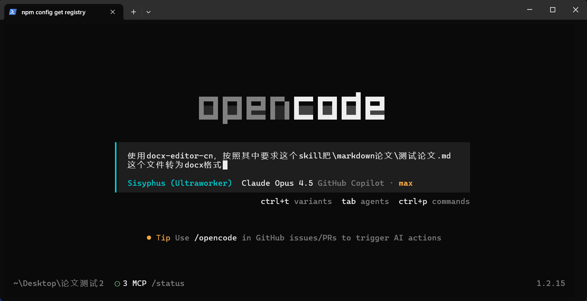
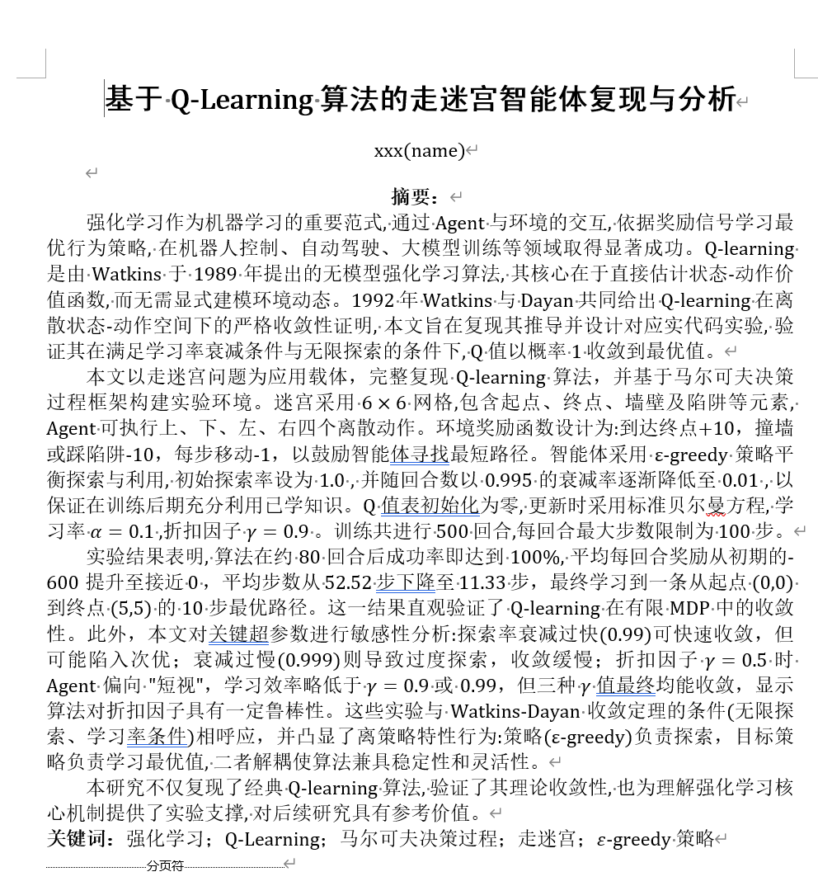
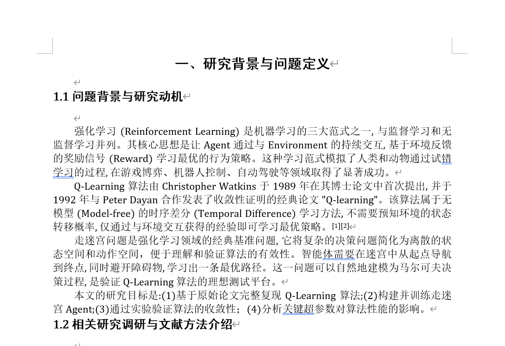
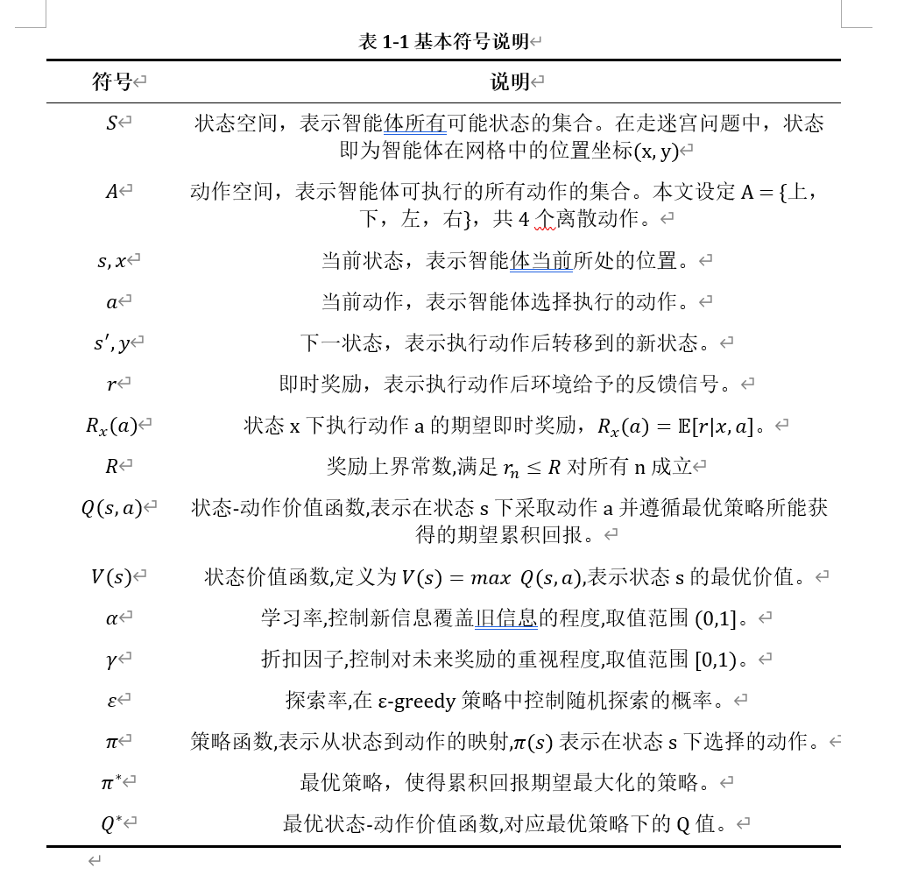
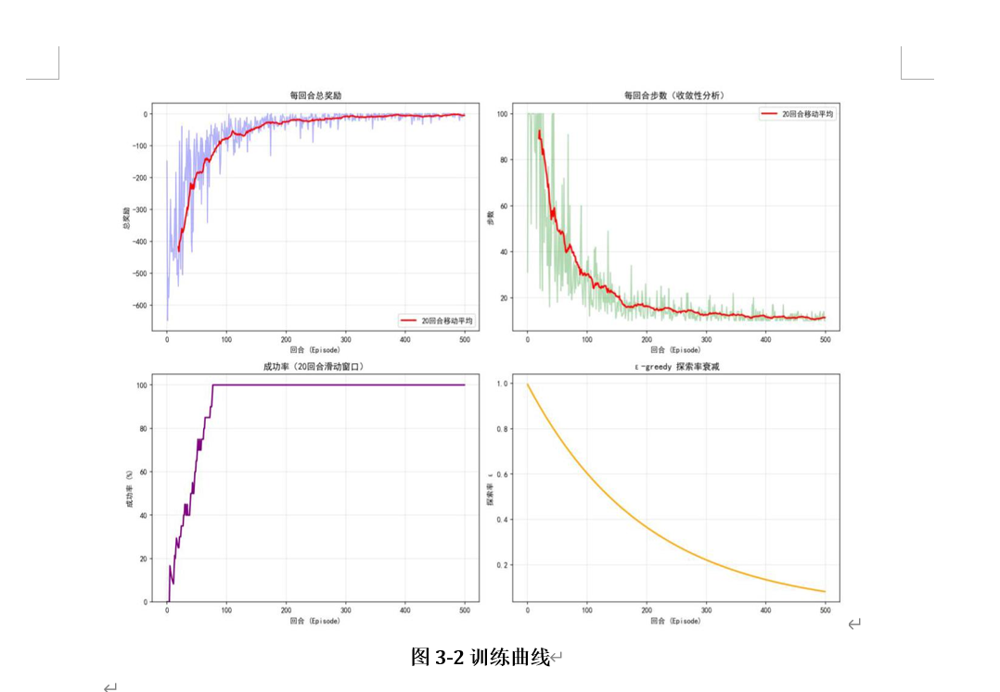
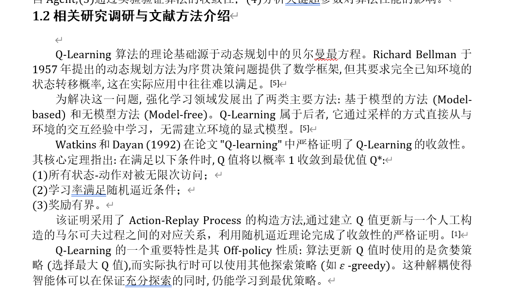
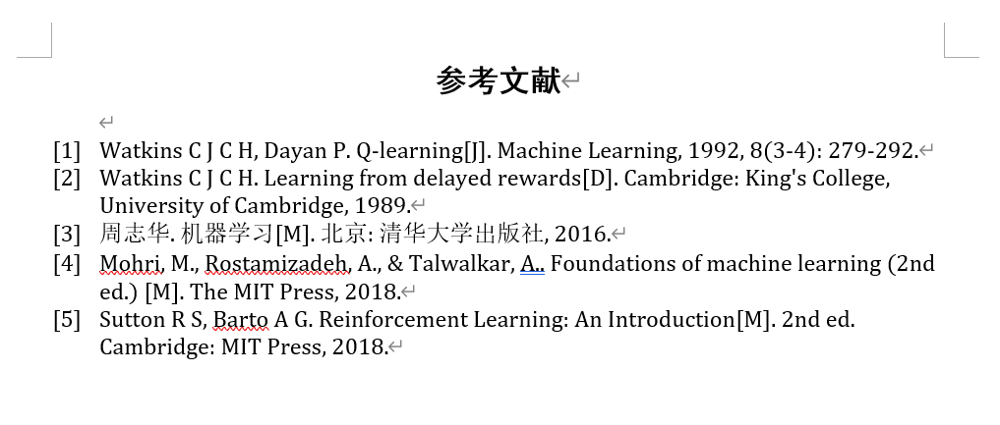

# 📄 docx-editor-cn

<p align="center">
  
  
  
  
</p>

<p align="center">
  <strong>🎓 中文学术文档风格排版Skill</strong><br>
  用于 AI Agent 按照规定格式编辑 Word 文档或将 Markdown 转换为 docx <br>
  适用文档：中文课程论文；中文毕业设计论文；中文数学建模论文 ...
</p>

---

## ✨ 功能特性

<table>
<tr>
<td width="50%">

### 📝 文档创建与编辑
- 基于原Claude Code的docx skill，预配置中文学术论文模板
- 自动生成符合规范的 `.docx` 文件
- 支持 A4 页面、标准页边距

</td>
<td width="50%">

### 🔄 格式转换
- Markdown → Word 一键转换
- LaTeX 公式 → Word 原生公式
- 保留完整格式和结构

</td>
</tr>
<tr>
<td width="50%">

### 📊 学术规范
- **三线表** 标准表格样式
- **自动编号** 标题/图/表
- **上标引用** `[1][2]` 格式

</td>
<td width="50%">

### ⚙️ 灵活定制
- 可配置字体、字号、行距
- 可自定义页面尺寸
- 支持添加新样式

</td>
</tr>
</table>

> 使用方式：直接下载docx-editor-cn文件夹，放到对应skills目录下。<br>
> 参考：https://support.claude.com/en/articles/12512180-use-skills-in-claude <br>
>       https://skillsmp.com/zh/docs#when-to-use <br>
>       https://opencode.ai/docs/zh-cn/skills/ <br>

---

## 🔄 工作流 Workflow

本 Skill 支持两种主要工作流：

### 工作流 1：Markdown → Word 转换

```
┌─────────────────┐     ┌─────────────────┐     ┌─────────────────┐
│  Markdown 文件  │ ──► │   解析内容      │ ──► │  生成 .docx     │
│  (论文源文件)   │     │  (标题/公式/表格)│     │  (格式化输出)   │
└─────────────────┘     └─────────────────┘     └─────────────────┘
                              │
                              ▼
                    ┌─────────────────────────┐
                    │ LaTeX 公式 → Word Math  │
                    │ (temml + mathmlToDocx)  │
                    └─────────────────────────┘
```

**步骤**：
1. 读取 Markdown 文件内容
2. 解析标题层级、正文、公式、表格、图片、参考文献
3. 调用 `new_doc.js` 中的辅助函数构建文档结构
4. LaTeX 公式通过 `temml` → MathML → `mathmlToDocxChildren` 转换为 Word 原生公式
5. 输出符合学术规范的 `.docx` 文件

### 工作流 2：编辑现有 Word 文档

```
┌─────────────────┐     ┌─────────────────┐     ┌─────────────────┐
│  现有 .docx     │ ──► │   解包 XML      │ ──► │   编辑内容      │
│                 │     │  (unpack.py)    │     │  (Python/JS)    │
└─────────────────┘     └─────────────────┘     └─────────────────┘
                                                       │
                                                       ▼
                                              ┌─────────────────┐
                                              │   重新打包      │
                                              │  (pack.py)      │
                                              └─────────────────┘
```

**步骤**：
1. 使用 `office/unpack.py` 解压 `.docx` 为 XML 文件
2. 编辑 `document.xml`（正文）、`styles.xml`（样式）等
3. 使用 `office/pack.py` 重新打包为 `.docx`
4. 可选：使用 `office/validate.py` 验证文档完整性

### 核心转换流程（公式处理）

```
LaTeX 字符串                    Word 原生公式
     │                              ▲
     ▼                              │
┌──────────┐    ┌──────────┐    ┌──────────┐
│  temml   │ ─► │  MathML  │ ─► │  docx.js │
│ (解析器) │    │  (XML)   │    │  Math()  │
└──────────┘    └──────────┘    └──────────┘
```

---

## 📐 默认格式模板

本 Skill 预设基本符合 **中国大陆高校常见学术论文（课程论文、毕业设计、数学建模论文等）标准** 的格式规范。

### 📄 页面设置

| 项目 | 规格 |
|:----:|:----:|
| 📏 纸张 | A4 (210mm × 297mm) |
| 📐 页边距 | 上下左右各 **2.5cm** |
| 🔢 页脚 | 居中页码 |

### 🔤 字体规范

| 元素 | 中文字体 | 英文/数字字体 | 字号 |
|:----:|:--------:|:-------------:|:----:|
| 正文 | 宋体 (SimSun) | Cambria Math | 12pt (小四) |
| 一级标题 | 黑体 (SimHei) | Cambria Math | 16pt (三号) |
| 二级标题 | 黑体 (SimHei) | Cambria Math | 14pt (四号) |
| 三级标题 | 黑体 (SimHei) | Cambria Math | 12pt (小四) |
| 图表标题 | 宋体 (SimSun) | Cambria Math | 11pt (五号) |

> 英文字体可选 Times New Roman等，这里为了保持与中文字体风格协调，采用Cambria Math。

### 📊 三线表样式

```
┏━━━━━━━━━━━━━━━━━━━━━━━━━━━━━━┓  ← 顶线 (1.5pt 粗线)
┃   表头1    │    表头2       ┃
┠──────────────────────────────┨  ← 栏目线 (0.75pt 细线)
┃   数据1    │    数据2       ┃
┃   数据3    │    数据4       ┃     (无竖线、无横线)
┗━━━━━━━━━━━━━━━━━━━━━━━━━━━━━━┛  ← 底线 (1.5pt 粗线)
```

### ➗ 公式排版

```
┌─────────────────────────────────────────────────┐
│                                                 │
│   (左留白)    E = mc²    (1)                  │
│               ↑            ↑                    │
│          居中公式      右对齐编号               │
│                                                 │
└─────────────────────────────────────────────────┘
        (整个布局使用无边框三列表格实现)
```

---

## 🛠️ 辅助函数

`scripts/new_doc.js` 提供以下便捷函数：

```javascript
// 📌 标题（自动编号）
h1Manual('一、引言')     // 中文数字编号
h1('研究背景')           // → 1 研究背景
h2('问题定义')           // → 1.1 问题定义
h3('数学模型')           // → 1.1.1 数学模型

// 📝 正文（自动检测公式和引用）
body('Q-learning 算法由 Watkins 提出[1]')  // [1] → 上标

// ➗ 公式
formula('E = mc^2', 1)   // 居中公式，编号 (1)

// 📊 表格
tableCaption('表 1-1 符号说明')
threeLineTable(['符号', '说明'], [['α', '学习率'], ['γ', '折扣因子']])

// 🖼️ 图片
figCaption('图 1-1 系统架构')

// 📚 参考文献
ref('Watkins C J C H. Q-learning[J]. Machine Learning, 1992.')

// ⚡ 辅助
blank()      // 空行
pageBreak()  // 分页符
```

---

## 🎨 自定义格式指南

<details>
<summary><b>📄 修改页面设置</b></summary>

编辑 `scripts/new_doc.js` 顶部常量：

```javascript
// 页面尺寸 (DXA 单位, 567 DXA ≈ 1cm)
const PAGE_W = 11906;   // A4 宽度
const PAGE_H = 16838;   // A4 高度
const MARGIN = 1418;    // 2.5cm 页边距

// 📝 修改为 US Letter:
const PAGE_W = 12240;
const PAGE_H = 15840;
```

</details>

<details>
<summary><b>🔤 修改字体</b></summary>

编辑 `STYLES` 对象中的 `font` 属性：

```javascript
// 修改正文字体
run: {
  font: { 
    ascii: 'Times New Roman',    // 英文字体
    hAnsi: 'Times New Roman',    // 英文字体
    eastAsia: 'SimSun'           // 中文字体
  },
  size: 24,  // 12pt (半点单位)
}

// 修改标题字体 (在 paragraphStyles 中找到 Heading1/2/3)
run: { 
  font: { 
    ascii: 'Arial', 
    eastAsia: 'Microsoft YaHei',  // 微软雅黑
    hAnsi: 'Arial' 
  }, 
  size: 32,  // 16pt
  bold: true 
}
```

</details>

<details>
<summary><b>↕️ 修改行距</b></summary>

```javascript
// 单倍行距
spacing: { line: 240, lineRule: LineRuleType.AUTO }

// 1.5 倍行距
spacing: { line: 360, lineRule: LineRuleType.AUTO }

// 双倍行距
spacing: { line: 480, lineRule: LineRuleType.AUTO }

// 固定 20pt 行距
spacing: { line: 400, lineRule: LineRuleType.EXACT }
```

</details>

<details>
<summary><b>⏩ 修改首行缩进</b></summary>

```javascript
// 2 字符缩进 (中文标准)
indent: { firstLine: 480 }

// 无缩进
indent: { firstLine: 0 }

// 3 字符缩进
indent: { firstLine: 720 }
```

</details>

<details>
<summary><b>✨ 添加新样式</b></summary>

在 `STYLES.paragraphStyles` 数组中添加：

```javascript
{
  id: 'MyCustomStyle',
  name: 'My Custom Style',
  basedOn: 'Normal',
  run: { 
    font: { ascii: 'Georgia', eastAsia: 'KaiTi', hAnsi: 'Georgia' },
    size: 28,
    italic: true
  },
  paragraph: {
    alignment: AlignmentType.JUSTIFIED,
    spacing: { line: 300, lineRule: LineRuleType.AUTO },
    indent: { firstLine: 0 }
  }
}
```

使用自定义样式：

```javascript
new Paragraph({ style: 'MyCustomStyle', children: [new TextRun('内容')] })
```

</details>


---

## 🧩 案例介绍
Word版本：Microsoft Office LTSC Word 2021
以下是一个使用`OpenCode`+`OMO`+ 本Skill 生成的示例课程论文文档，展示了各种格式元素：
- 调用指令


- 标题层级与摘要、正文段落



- 居中公式与编号


- 三线表


- 图表标题


- 上标引用


- 参考文献列表


- 等等...


---

## ✅ 已解决问题清单

本 Skill 已修复以下常见问题：

| # | 问题 | 状态 | 解决方案 |
|:-:|------|:----:|----------|
| 1 | 三线表中间横线可见 | ✅ | Body row borders 设为 `NONE` |
| 2 | 公式表格边框可见 | ✅ | `insideH/V` 边框设为 `NONE` |
| 3 | 标题编号不同步 | ✅ | 手动计数器管理编号 |
| 4 | 标题英文仍为宋体 | ✅ | 混合字体 (Cambria Math + SimHei) |
| 5 | 行间公式未用编辑器 | ✅ | `temml` → `mathmlToDocxChildren` |
| 6 | 主标题英文宋体 | ✅ | 标题字体改为混合配置 |
| 7 | 行内公式匹配错误 | ✅ | 严格正则排除纯数字/单词 |
| 8 | 引用非上标格式 | ✅ | 检测 `[n]` 设置 `superScript` |
| 10 | 缺少分页符 | ✅ | `pageBreak()` 函数 |

---

## 📁 文件结构

```
📂 docx-editor-cn/          ← 本文件
├── 📚 SKILL.md             ← 完整技术文档
└── 📂 scripts/
    ├── 🎯 new_doc.js       ← 主模板脚本 (推荐入口)
    ├── ➗ mathml-to-docx.js ← MathML → Word 公式
    ├── 🐍 formula.py       ← 公式 XML 插入
    ├── 🐍 table.py         ← 表格 XML 插入
    ├── 🐍 comment.py       ← 批注处理
    ├── 🐍 accept_changes.py
    └── 📂 office/
        ├── unpack.py       ← DOCX 解包
        ├── pack.py         ← DOCX 打包
        ├── validate.py     ← 文档验证
        └── soffice.py      ← LibreOffice 调用
```

---

## 📦 依赖项

**必需 (npm)**
```bash
npm install docx temml fast-xml-parser
```

**可选 (用于编辑现有文档)**
- 🐍 Python 3.x
- 📝 LibreOffice (`.doc` 转换、接受修订)
- 📄 Pandoc (内容提取)

---

## 📄 许可证

MIT License - 详见 [LICENSE.txt](LICENSE.txt)

---
## 🚩 Todo
- [ ] 支持更多文档元素（目录、自动跳转）
- [ ] 增强 Markdown 转换（适应word公式编辑器公式语法规定）
- [ ] 优化工作流性能（大文档处理速度）


