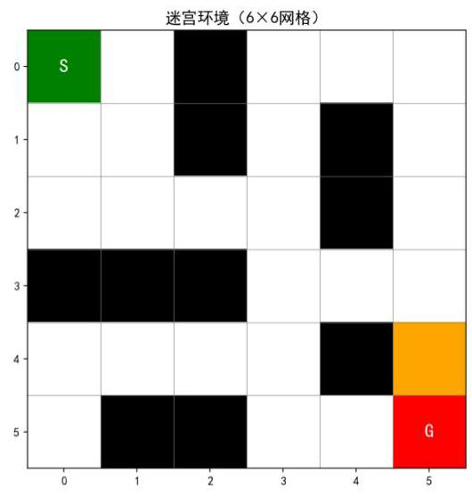
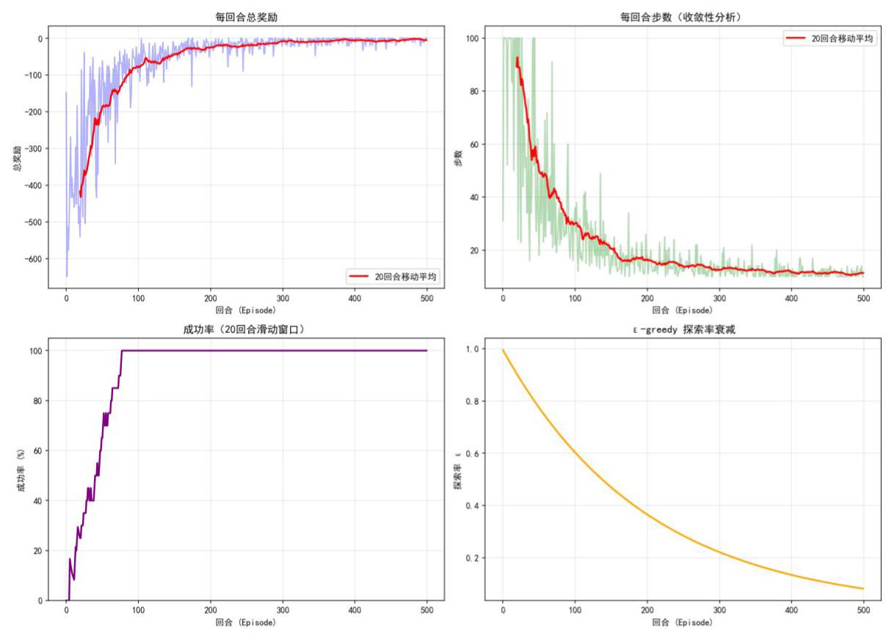
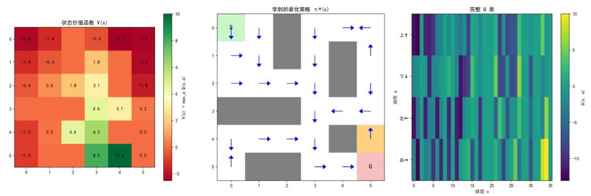
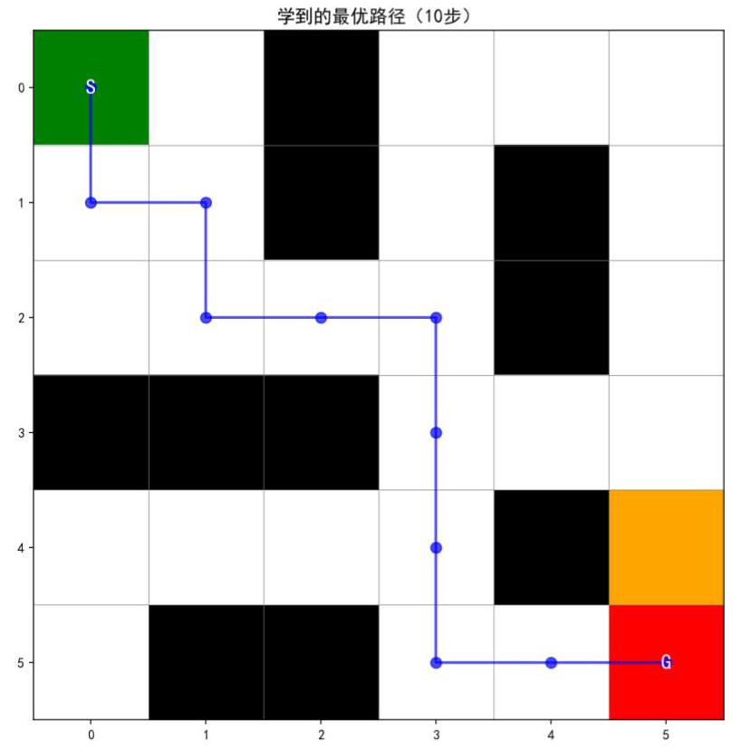
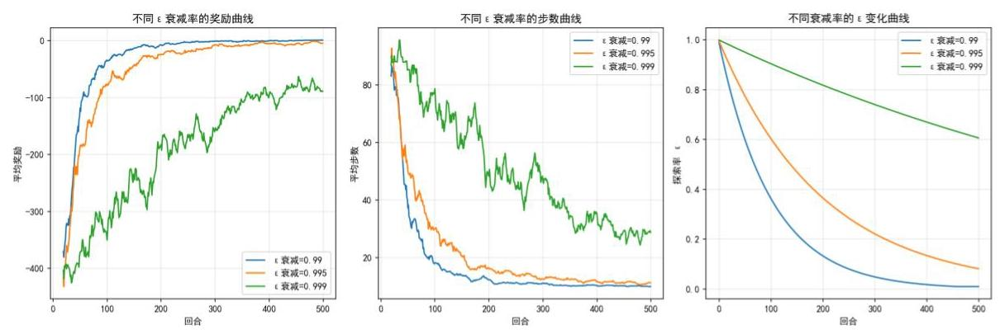
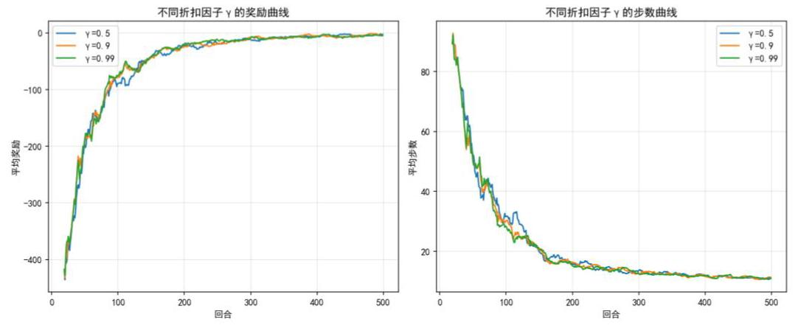

## 目录

基于 Q-Learning 算法的走迷宫智能体复现与分析 1

一、研究背景与问题定义 .2

1.1 问题背景与研究动机 .2

1.2 相关研究调研与文献方法介绍 .2

1.3 本文符号说明 .3

二、Q-Learning 核心原理 .3

2.1 问题定义与算法描述 4

2.2 收敛性定理 .5

2.3 证明核心思想: The Action-Replay Process .5

2.4 关键引理推导 .6

2.4.1 引理 A: $\mathbf{{Qnx}},\mathbf{a}$ 是 ARP 的最优动作值 .6

2.4.2 引理 B: ARP 收敛到真实过程 .7

2.5 收敛定理的证明 10

三、基于 Q-Learning 的走迷宫智能体构建 .12

3.1 实验环境设计 .13

3.2 代码设计 .13

3.3 Q-Learning 算法伪代码 .14

3.4 实验结果与分析 .14

3.5 参数敏感性分析 .17

参考文献 .19

附录 I:代码 .20

# 基于 Q-Learning 算法的走迷宫智能体复现与分析

## xxx(name)

## 摘要:

强化学习作为机器学习的重要范式, 通过 Agent 与环境的交互, 依据奖励信号学习最优行为策略, 在机器人控制、自动驾驶、大模型训练等领域取得显著成功。Q-learning 是由 Watkins 于 1989 年提出的无模型强化学习算法, 其核心在于直接估计状态-动作价值函数, 而无需显式建模环境动态。1992 年 Watkins 与 Dayan 共同给出 Q-learning 在离散状态-动作空间下的严格收敛性证明, 本文旨在复现其推导并设计对应实代码实验, 验证其在满足学习率衰减条件与无限探索的条件下, Q 值以概率 1 收敛到最优值。

本文以走迷宫问题为应用载体，完整复现 Q-learning 算法，并基于马尔可夫决策过程框架构建实验环境。迷宫采用 $6 \times  6$ 网格,包含起点、终点、墙壁及陷阱等元素, Agent 可执行上、下、左、右四个离散动作。环境奖励函数设计为:到达终点+10，撞墙或踩陷阱- 10，每步移动-1，以鼓励智能体寻找最短路径。智能体采用 ε-greedy 策略平衡探索与利用, 初始探索率设为 1.0 , 并随回合数以 0.995 的衰减率逐渐降低至 0.01 , 以保证在训练后期充分利用已学知识。Q 值表初始化为零, 更新时采用标准贝尔曼方程, 学习率 $\alpha  = {0.1}$ ,折扣因子 $\gamma  = {0.9}$ 。训练共进行 500 回合,每回合最大步数限制为 100 步。

实验结果表明, 算法在约 80 回合后成功率即达到 100%, 平均每回合奖励从初期的-600提升至接近 0 ，平均步数从 52.52 步下降至 11.33 步，最终学习到一条从起点 $\left( {0,0}\right)$ 到终点 $\left( {5,5}\right)$ 的 10 步最优路径。这一结果直观验证了 Q-learning 在有限 MDP 中的收敛性。此外，本文对关键超参数进行敏感性分析:探索率衰减过快(0.99)可快速收敛，但可能陷入次优；衰减过慢(0.999 )则导致过度探索，收敛缓慢；折扣因子 $\gamma  = {0.5}$ 时 Agent 偏向 “短视”，学习效率略低于 $\gamma  = {0.9}$ 或 0.99，但三种 $\gamma$ 值最终均能收敛，显示算法对折扣因子具有一定鲁棒性。这些实验与 Watkins-Dayan 收敛定理的条件(无限探索、学习率条件)相呼应，并凸显了离策略特性行为:策略(ε-greedy)负责探索，目标策略负责学习最优值, 二者解耦使算法兼具稳定性和灵活性。

本研究不仅复现了经典 Q-learning 算法, 验证了其理论收敛性, 也为理解强化学习核心机制提供了实验支撑, 对后续研究具有参考价值。

关键词:强化学习；Q-Learning；马尔可夫决策过程；走迷宫； $\varepsilon$ -greedy 策略

## 一、研究背景与问题定义

### 1.1 问题背景与研究动机

强化学习 (Reinforcement Learning) 是机器学习的三大范式之一, 与监督学习和无监督学习并列。其核心思想是让 Agent 通过与 Environment 的持续交互, 基于环境反馈的奖励信号 (Reward) 学习最优的行为策略。这种学习范式模拟了人类和动物通过试错学习的过程, 在游戏博弈、机器人控制、自动驾驶等领域取得了显著成功。

Q-Learning 算法由 Christopher Watkins 于 1989 年在其博士论文中首次提出, 并于 1992 年与 Peter Dayan 合作发表了收敛性证明的经典论文 “Q-learning”。该算法属于无模型 (Model-free) 的时序差分 (Temporal Difference) 学习方法, 不需要预知环境的状态转移概率, 仅通过与环境交互获得的经验即可学习最优策略。[1][2]

走迷宫问题是强化学习领域的经典基准问题, 它将复杂的决策问题简化为离散的状态空间和动作空间，便于理解和验证算法的有效性。智能体需要在迷宫中从起点导航到终点, 同时避开障碍物, 学习出一条最优路径。这一问题可以自然地建模为马尔可夫决策过程, 是验证 Q-Learning 算法的理想测试平台。

本文的研究目标是:(1)基于原始论文完整复现 Q-Learning 算法;(2)构建并训练走迷宫 Agent;(3)通过实验验证算法的收敛性；(4)分析关键超参数对算法性能的影响。

### 1.2 相关研究调研与文献方法介绍

Q-Learning 算法的理论基础源于动态规划中的贝尔曼最方程。Richard Bellman 于 1957 年提出的动态规划方法为序贯决策问题提供了数学框架, 但其要求完全已知环境的状态转移概率, 这在实际应用中往往难以满足。[5]

为解决这一问题, 强化学习领域发展出了两类主要方法: 基于模型的方法 (Model-based) 和无模型方法 (Model-free)。Q-Learning 属于后者, 它通过采样的方式直接从与环境的交互经验中学习，无需建立环境的显式模型。[5]

Watkins 和 Dayan (1992) 在论文 “Q-learning” 中严格证明了 Q-Learning 的收敛性。其核心定理指出: 在满足以下条件时, Q 值将以概率 1 收敛到最优值 Q*:

(1)所有状态-动作对被无限次访问；

(2)学习率满足随机逼近条件；

(3)奖励有界。

该证明采用了 Action-Replay Process 的构造方法,通过建立 $\mathrm{Q}$ 值更新与一个人工构造的马尔可夫过程之间的对应关系，利用随机逼近理论完成了收敛性的严格证明。[1]

Q-Learning 的一个重要特性是其 Off-policy 性质: 算法更新 Q 值时使用的是贪婪策略 (选择最大 Q 值),而实际执行时可以使用其他探索策略 (如 $\varepsilon$ -greedy)。这种解耦使得智能体可以在保证充分探索的同时, 仍能学习到最优策略。

### 1.3 本文符号说明

为便于后续讨论, 本文采用以下符号体系, 与原论文保持一致:

表1-3-1 基本符号说明

<table><tr><td>符号</td><td>说明</td></tr><tr><td>$S$</td><td>状态空间，表示智能体所有可能状态的集合。在走迷宫问题中，状态即为智能体在网格中的位置坐标(x, y)</td></tr><tr><td>$A$</td><td>动作空间，表示智能体可执行的所有动作的集合。本文设定 $A = \{$ 上，下， 左，右\}，共 4 个离散动作。</td></tr><tr><td>$s, x$</td><td>当前状态，表示智能体当前所处的位置。</td></tr><tr><td>$a$</td><td>当前动作，表示智能体选择执行的动作。</td></tr><tr><td>${s}^{\prime }, y$</td><td>下一状态，表示执行动作后转移到的新状态。</td></tr><tr><td>$r$</td><td>即时奖励，表示执行动作后环境给予的反馈信号。</td></tr><tr><td>${R}_{x}\left( a\right)$</td><td>状态 $x$ 下执行动作 $a$ 的期望即时奖励， ${R}_{x}\left( a\right)  = \mathbb{E}\left\lbrack  {r \mid  x, a}\right\rbrack$ 。</td></tr><tr><td>$R$</td><td>奖励上界常数,满足 ${r}_{n} \leq  R$ 对所有 $n$ 成立</td></tr><tr><td>$Q\left( {s, a}\right)$</td><td>状态-动作价值函数,表示在状态 $\mathrm{s}$ 下采取动作 $\mathrm{a}$ 并遵循最优策略所能获得的期望累积回报。</td></tr><tr><td>$V\left( s\right)$</td><td>状态价值函数,定义为 $V\left( s\right)  = \max Q\left( {s, a}\right)$ ,表示状态 $s$ 的最优价值。</td></tr><tr><td>$\alpha$</td><td>学习率,控制新信息覆盖旧信息的程度,取值范围 $(0,1\rbrack$ 。</td></tr><tr><td>$\gamma$</td><td>折扣因子,控制对未来奖励的重视程度,取值范围 $\lbrack 0,1)$ 。</td></tr><tr><td>$\varepsilon$</td><td>探索率,在 $\varepsilon$ -greedy 策略中控制随机探索的概率。</td></tr><tr><td>$\pi$</td><td>策略函数,表示从状态到动作的映射, $\pi \left( s\right)$ 表示在状态 $s$ 下选择的动作。</td></tr><tr><td>${\pi }^{ * }$</td><td>最优策略，使得累积回报期望最大化的策略。</td></tr><tr><td>$Q *$</td><td>最优状态-动作价值函数,对应最优策略下的 $\mathrm{Q}$ 值。</td></tr></table>

## 二、Q-Learning 核心原理

Q-Learning 是一种 Model-Free 的强化学习算法, 旨在让 Agent 在马尔可夫决策过程中通过学习找到最优策略。下面基于 Watkins 和 Dayan (1992) 的经典论文, 提取并整理了 Q-Learning 算法收敛性的完整理论推断过程。

目标: 证明在满足特定条件下, Q-Learning 算法估计的动作价值函数 ${Q}_{n}\left( {x, a}\right)$ 会以概率 1 收敛到最优动作价值函数 ${Q}^{ * }\left( {x, a}\right)$ 。收敛性证明是强化学习理论的基石。它保证了只要我们给算法足够的时间和探索机会, 它最终一定能学会最好的策略。

### 2.1 问题定义与算法描述

环境模型:智能体在一个离散、有限的世界中移动，这是一个受控的马尔可夫过程。

- 状态 (State): ${x}_{n} \in  X$

- 动作 (Action): ${a}_{n} \in  A$

- 奖励 (Reward): ${r}_{n}$ ,其期望值 $\overline{{r}_{x}}\left( a\right)$ 仅取决于状态和动作。

- 状态转移: 状态以概率 ${P}_{xy}\left\lbrack  a\right\rbrack$ 从 $x$ 变为 $y$ 。

- 折扣因子: $\gamma \left( {0 < \gamma  < 1}\right)$ ,表示未来奖励的现值折扣。

价值函数: 对于策略 $\pi$ ,状态 $x$ 的价值 ${V}^{\pi }\left( x\right)$ 定义为总折扣期望奖励。最优价值函数 ${V}^{ * }\left( x\right)$ 满足 Bellman 最优方程:

$$
{V}^{ * }\left( x\right)  = \mathop{\max }\limits_{a}\left( {{R}_{x}\left( a\right)  + \gamma \mathop{\sum }\limits_{y}{P}_{xy}\left\lbrack  a\right\rbrack  {V}^{ * }\left( y\right) }\right) \tag{1}
$$

$\mathbf{Q}$ 值: 定义为在状态 $x$ 执行动作 $a$ ,随后遵循策略 $\pi$ 的期望折扣奖励:

$$
{Q}^{\pi }\left( {x, a}\right)  = {R}_{x}\left( a\right)  + \gamma \mathop{\sum }\limits_{y}{P}_{xy}\left\lbrack  a\right\rbrack  {V}^{\pi }\left( y\right) \tag{2}
$$

最优 $Q$ 值记为 ${Q}^{ * }\left( {x, a}\right)$ 。显然有 ${V}^{ * }\left( x\right)  = \mathop{\max }\limits_{a}{Q}^{ * }\left( {x, a}\right)$ 。

Q-Learning 更新规则: 在第 $n$ 次经历 (episode) 中,智能体观察状态 ${x}_{n}$ ,选择动作 ${a}_{n}$ ,观察新状态 ${y}_{n}$ 并获得奖励 ${r}_{n}$ 。Q 值更新公式如下:

$$
{Q}_{n}\left( {x, a}\right)  = \left\{  \begin{array}{ll} \left( {1 - {\alpha }_{n}}\right) {Q}_{n - 1}\left( {x, a}\right)  + {\alpha }_{n}\left\lbrack  {{r}_{n} + \gamma {V}_{n - 1}\left( {y}_{n}\right) }\right\rbrack  & \text{ if }x = {x}_{n}\text{ and }a = {a}_{n} \\  {Q}_{n - 1}\left( {x, a}\right) & \text{ otherwise } \end{array}\right. \tag{3}
$$

其中:

${\alpha }_{n}$ 是学习率 $\left( {0 < {\alpha }_{n} < 1}\right)$ 。

${V}_{n - 1}\left( y\right)  = \mathop{\max }\limits_{b}{Q}_{n - 1}\left( {y, b}\right)$ 是智能体当前认为的状态 $y$ 的最大价值。

这个公式的核心思想是 “时序差分”。我们用当前的即时奖励 ${r}_{n}$ (短期收益)加上对未来价值的估计 $\gamma {V}_{n - 1}\left( {y}_{n}\right)$ (长期收益)来更新旧的估计值。

### 2.2 收敛性定理

定理条件:

(1)奖励有界: $\left| {r}_{n}\right|  \leq  R$ 。

(2)学习率条件:

$$
\mathop{\sum }\limits_{{i = 1}}^{\infty }{\alpha }_{{n}_{i}\left( {x, a}\right) } = \infty ,\;\mathop{\sum }\limits_{{i = 1}}^{\infty }{\alpha }_{{n}_{i}\left( {x, a}\right) }^{2} < \infty ,\;\forall x, a \tag{4}
$$

其中 ${n}_{i}\left( {x, a}\right)$ 表示动作 $a$ 在状态 $x$ 第 $i$ 次被尝试的时间步索引。学习率之和为无穷大保证能充分学习，平方和有限保证噪声逐渐减小，最终稳定。

(3)充分探索:所有状态 - 动作对(x，a)都被无限次地采样。

定理结论::

在上述条件下,当 $n \rightarrow  \infty$ 时,以概率 1 收敛到最优解:

$$
{Q}_{n}\left( {x, a}\right) \overset{1}{ \rightarrow  }{Q}^{ * }\left( {x, a}\right) ,\;\forall x, a \tag{5}
$$

### 2.3 证明核心思想: The Action-Replay Process

证明的关键在于构造一个人工的控制马尔可夫过程, 称为动作回放过程 (Action-Replay Process, 简称 ARP)。

ARP 定义: 基于智能体在真实环境中经历的一系列 Episodes 序列以及对应的学习率序列 ${\alpha }_{n}$ 。原论文使用 “Card Game” 进行类比: 每一段经历 $\left( {{x}_{t},{a}_{t},{y}_{t},{r}_{t},{\alpha }_{t}}\right)$ 被写在一张卡片上，所有卡片按时间顺序堆叠成无限高的牌堆。

ARP 的状态:由真实过程的状态 $x$ 和阶段 $n$ 组成，记为 $\left( {x, n}\right)$ 。AFIP 的动作: 与真实过程相同。

状态转移机制:

(1)若在 ARP 状态 $\left( {x, n}\right)$ 执行动作 $a$ 。

(2)从牌堆顶部向下查找，找到最近的一张记录了对 $\left( {x, a}\right)$ 操作的卡片(假设在第 $t$ 层)。

(3) 以概率 ${\alpha }_{t}$ 回放该卡片。获得奖励 ${r}_{t}$ ，转移到状态 $\left( {{y}_{t}, t - 1}\right)$ 。以概率 $1 - {\alpha }_{t}$ 反面朝上: 丢弃该卡片，继续向下查找更早的卡片。若查到底部卡片(第 0 层)，过程进入吸收态,奖励为 ${Q}_{0}\left( {x, a}\right)$ 。

构造这个过程是因为 Q-Learning 的更新规则非常像在这个牌堆上进行动态规划。 证明的核心逻辑是: Q-Learning 更新的 ${Q}_{n}$ 值恰好等于 ARP 过程在层级 $n$ 的最优价值。当 $n$ 很大时, ARP 过程统计上的转移概率和奖励会收敛到真实环境,因此 Q-Learning 的 ${Q}_{n}$ 会收敛到真实环境的最优 ${Q}^{ * }$ 。

### 2.4 关键引理推导

#### 2.4.1 引理 A: ${Q}_{n}\left( {x, a}\right)$ 是 ARP 的最优动作值

描述: ${Q}_{n}\left( {x, a}\right)$ 恰好是 ARP 状态 $\left( {x, n}\right)$ 下动作 $a$ 的最优动作价值。

$$
{Q}_{n}\left( {x, a}\right)  = {Q}_{ARP}^{ * }\left( {\langle x, n\rangle , a}\right) \tag{6}
$$

证明思路 (归纳法):

(1) $n = 0$ 时， ${Q}_{0}\left( {x, a}\right)$ 是初始值，也是 ARP 底层的唯一可能价值。

(2)归纳假设:假设对于某个 $n - 1\left( {n \geq  1}\right)$ ，有: ${Q}_{n - 1}\left( {x, a}\right)  = {Q}_{\mathrm{{ARP}}}^{ * }(\langle x, n - \; 1\rangle , a),\;\forall x, a.$

(3)归纳步骤:

若 $x \neq  {x}_{n}$ 或 $a \neq  {a}_{n}$ : 此时在 ARP 中执行动作 $a$ 与在状态 $\langle x, n - 1\rangle$ 中执行相同，因为第 $n$ 层没有新的 episode 匹配该状态-动作对。因此:

$$
{Q}_{\mathrm{{ARP}}}^{ * }\left( {\langle x, n\rangle , a}\right)  = {Q}_{\mathrm{{ARP}}}^{ * }\left( {\langle x, n - 1\rangle , a}\right)  = {Q}_{n - 1}\left( {x, a}\right)  = {Q}_{n}\left( {x, a}\right) \tag{7}
$$

其中最后一个等式成立是因为 ${Q}_{n}\left( {x, a}\right)$ 在未更新时保持不变。

若 $x = {x}_{n}$ 且 $a = {a}_{n}$ : 在 ARP 中,从状态 $\left\langle  {{x}_{n}, n}\right\rangle$ 执行动作 ${a}_{n}$ 时,根据构造,有两种可能: 以概率 $1 - {\alpha }_{n}$ 等同于从 $\left\langle  {{x}_{n}, n - 1}\right\rangle$ 执行动作 ${a}_{n}$ ; 或以概率 ${\alpha }_{n}$ 重放 episode $n$ ,得到即时奖励 ${r}_{n}$ 并转移到状态 $\left\langle  {{y}_{n}, n - 1}\right\rangle$ 因此,该动作的最优值满足 Bellman 方程:

$$
{Q}_{\mathrm{{ARP}}}^{ * }\left( {\left\langle  {{x}_{n}, n}\right\rangle  ,{a}_{n}}\right)
$$

$$
= \left( {1 - {\alpha }_{n}}\right) {Q}_{\mathrm{{ARP}}}^{ * }\left( {\left\langle  {{x}_{n}, n - 1}\right\rangle  ,{a}_{n}}\right)
$$

$$
+ {\alpha }_{n}\left\lbrack  {{r}_{n} + \gamma {V}_{\mathrm{{ARP}}}^{ * }\left( \left\langle  {{y}_{n}, n - 1}\right\rangle  \right) }\right\rbrack \tag{8}
$$

利用归纳假设, ${Q}_{\mathrm{{ARP}}}^{ * }\left( {\left\langle  {{x}_{n}, n - 1}\right\rangle  ,{a}_{n}}\right)  = {Q}_{n - 1}\left( {{x}_{n},{a}_{n}}\right)$ ,且 $\;\left( {{V}_{\mathrm{{ARP}}}^{ * }\left( \left\langle  {{y}_{n}, n - 1}\right\rangle  \right)  = }\right. \; \left. {{V}_{n - 1}\left( {y}_{n}\right) }\right)$ 。代入得:

$$
{Q}_{\mathrm{{ARP}}}^{ * }\left( {\left\langle  {{x}_{n}, n}\right\rangle  ,{a}_{n}}\right)  = \left( {1 - {\alpha }_{n}}\right) {Q}_{n - 1}\left( {{x}_{n},{a}_{n}}\right)  + {\alpha }_{n}\left\lbrack  {{r}_{n} + \gamma {V}_{n - 1}\left( {y}_{n}\right) }\right\rbrack \tag{9}
$$

这正是 Q-learning 更新公式所定义的 ${Q}_{n}\left( {{x}_{n},{a}_{n}}\right)$ 。因此归纳完成。

#### 2.4.2 引理 B: ARP 收敛到真实过程

这一组引理证明当层级 $n \rightarrow  \infty$ 时, ARP 的统计特性趋近于真实环境。也就是说采样次数足够多, 对期望的估计会越来越准

**_引理 B.1: 折扣序列的有限性_**

描述: 一个折扣、有界奖励、有限马尔可夫过程。从任意起始状态 $x$ 出发,执行任意 $s$ 个动作所获得的值,与执行这 $s$ 个动作后再执行任意后续策略所获得的值之差,当 $s \rightarrow  \infty$ 时趋于 0 。

证明: 设执行 $s$ 个动作 ${a}_{1},\ldots ,{a}_{s}$ 后,后续策略为 $\pi$ 。则完整无限序列的值为:

$$
Q\left( {x,{a}_{1},\ldots ,{a}_{s},\pi }\right)  = Q\left( {x,{a}_{1},\ldots ,{a}_{s}}\right)  + {\gamma }^{s}\mathop{\sum }\limits_{{y}_{s + 1}}{P}_{{y}_{s}{y}_{s + 1}}\left\lbrack  {a}_{s}\right\rbrack  {V}^{\pi }\left( {y}_{s + 1}\right) \tag{10}
$$

其中 ${y}_{s}$ 是第 $s$ 步后的状态。忽略后续部分带来的误差为:

$$
\delta  = {\gamma }^{s}\mathop{\sum }\limits_{{y}_{s + 1}}{P}_{{y}_{s}{y}_{s + 1}}\left\lbrack  {a}_{s}\right\rbrack  {V}^{\pi }\left( {y}_{s + 1}\right) \tag{11}
$$

由于所有奖励有界 $\left| {r}_{n}\right|  \leq  \mathrm{R}$ ,状态值也有界:

$$
\left| {{V}^{\pi }\left( y\right) }\right|  \leq  \frac{\mathrm{R}}{1 - \gamma } \tag{12}
$$

因此,

$$
\left| \delta \right|  \leq  {\gamma }^{s}\frac{\mathrm{R}}{1 - \gamma } \rightarrow  0\;\text{ 当 }s \rightarrow  \infty \tag{13}
$$

**_引理 B.2:执行s 步后跌至低层的概率可任意小_**

描述: 对于任意层级 $l$ ,存在一个更高的层级 $h$ ,使得从 $h$ 开始执行 $s$ 步动作后, 层级掉到 $l$ 以下的概率可以任意小。

证明: 固定状态-动作对 $\left( {x, a}\right)$ 。定义 ${i}_{h}$ 为满足 ${n}^{i}\left( {x, a}\right)  \leq  n$ 的最大 $i,{i}_{l}$ 为满足 ${n}^{i}\left( {x, a}\right)  \geq  l$ 的最小 $i$ 。从层 $n > l$ 执行一次动作 $a$ 后,跌至低于 $l$ 的概率等于在搜索匹配卡片过程中最终重放的卡片索引小于 ${i}_{l}$ 的概率。根据 ARP 的构造,该概率为:

$$
\left\lbrack  {\mathop{\prod }\limits_{{i = {i}_{l}}}^{{i}_{h}}\left( {1 - {\alpha }_{{n}^{i}}}\right) }\right\rbrack  \mathop{\sum }\limits_{{j = 0}}^{{{i}_{l} - 1}}\left\{  {{\alpha }_{{n}^{j}}\mathop{\prod }\limits_{{k = j + 1}}^{{{i}_{l} - 1}}\left( {1 - {\alpha }_{{n}^{k}}}\right) }\right\} \tag{14}
$$

上式左边因子表示所有从 ${i}_{l}$ 到 ${i}_{h}$ 的卡片都被跳过 (即未重放),右边求和表示最终重放的卡片来自低于 ${i}_{l}$ 的某张。该概率不大于:

$$
\mathop{\prod }\limits_{{i = {i}_{l}}}^{{i}_{h}}\left( {1 - {\alpha }_{{n}^{i}}}\right)  \leq  \exp \left( {-\mathop{\sum }\limits_{{i = {i}_{l}}}^{{i}_{h}}{\alpha }_{{n}^{i}}}\right) \tag{15}
$$

由于条件 (3) 保证 $\mathop{\sum }\limits_{{i = {i}_{l}}}^{\infty }{\alpha }_{{n}^{i}} = \infty$ ,当 $n$ 趋于无穷时,该指数趋于 0 。因此,对任意 $\eta  > 0$ ,存在足够大的 $n$ 使得上述概率小于 $\eta$ 。因为状态和动作空间有限,我们可以统一选择 $n$ 使得对所有 $\left( {x, a}\right)$ 都满足。

对于 $s$ 步的情况,我们需确保每一步后都不跌至低于 $l$ 。通过递推,可以选取足够高的起始层,使得每一步跌落的概率都足够小,从而总概率可控。具体地,给定 $\epsilon  > 0$ , 先取 $\eta  = \epsilon /s$ ,再取 $h$ 使得从该层开始一步跌至低于某中间层的概率小于 $\eta$ ,然后逐步提高起始层以保证 $s$ 步后低于 $l$ 的总概率小于 $\epsilon$ 。

**_B.3 奖励和转移概率以概率 1 收敛_**

描述: ARP 中的期望即时奖励 ${R}_{x}^{\left( n\right) }\left( a\right)$ 和转移概率 ${P}_{xy}^{\left( n\right) }\left\lbrack  a\right\rbrack$ 当层数 $n \rightarrow  \infty$ 时收敛以概率 1 到真实过程的 ${R}_{x}\left( a\right)$ 和 ${P}_{xy}\left\lbrack  a\right\rbrack$

证明: 采用随机逼近理论中的经典结论 (Kushner & Clark, 1978, 定理 2.3.1): 若随机变量序列 ${X}_{n}$ 满足更新规则:

$$
{X}_{n + 1} = {X}_{n} + {\beta }_{n}\left( {{\xi }_{n} - {X}_{n}}\right) \tag{16}
$$

其中 $0 \leq  {\beta }_{n} < 1,\mathop{\sum }\limits_{{i = 1}}^{\infty }{\beta }_{n} = \infty \;\mathop{\sum }\limits_{{i = 1}}^{\infty }{\beta }_{n}^{2} < \infty$ ,且 ${\xi }_{n}$ 是有界随机变量,期望为 $\Xi$ , 则 ${X}_{n}\overset{1}{ \rightarrow  }\Xi$ 。

奖励的收敛: 对于固定的 $\left( {x, a}\right)$ ,令 ${n}^{i}$ 表示第 $i$ 次在状态 $x$ 执行动作 $a$ 的时刻。在 ARP 中,期望奖励 ${R}_{\left\langle  x,{n}^{i + 1}\right\rangle  }\left( a\right)$ 的更新为:

$$
{R}_{\left\langle  x,{n}^{i + 1}\right\rangle  }\left( a\right)  = {R}_{\left\langle  x,{n}^{i}\right\rangle  }\left( a\right)  + {\alpha }_{{n}^{i + 1}}\left( {{r}_{{n}^{i + 1}} - {R}_{\left\langle  x,{n}^{i}\right\rangle  }\left( a\right) }\right) \tag{17}
$$

因此,由上述定理 ${R}_{\left\langle  x,{n}^{i}\right\rangle  }\left( a\right) \overset{1}{ \rightarrow  }{R}_{x}\left( a\right)$ 。由于状态和动作有限,收敛是一致的。 转移概率的收敛: 先定义指示函数:

$$
{\chi }_{n}\left( y\right)  = \left\{  \begin{matrix} 1 & \text{ if }{y}_{n} = y \\  0 & \text{ otherwise } \end{matrix}\right. \tag{18}
$$

其期望为 ${P}_{xy}\left\lbrack  a\right\rbrack$ 。ARP 中转移概率 ${P}_{xy}^{\left( {n}^{i + 1}\right) }\left\lbrack  a\right\rbrack$ 的更新为:

$$
{P}_{xy}^{\left( {n}^{i + 1}\right) }\left\lbrack  a\right\rbrack   = {P}_{xy}^{\left( {n}^{i}\right) }\left\lbrack  a\right\rbrack   + {\alpha }_{{n}^{i + 1}}\left( {{\chi }_{{n}^{i + 1}} - {P}_{xy}^{\left( {n}^{i}\right) }\left\lbrack  a\right\rbrack  }\right) \tag{19}
$$

同样满足定理条件,故 ${P}_{xy}^{\left( n\right) }\left\lbrack  a\right\rbrack  \overset{1}{ \rightarrow  }{P}_{xy}\left\lbrack  a\right\rbrack$ 。

此外，结合 B.2，若我们条件于执行 $S$ 步后仍高于某个固定层 $k$ ，则上述收敛性仍然成立,因为条件事件概率趋于 1,不影响极限。

**_B.4 接近的奖励和转移概率导致接近的动作值_**

描述: 设有 $s$ 个马尔可夫链,其转移矩阵分别为 ${P}_{xy}^{i}\left\lbrack  a\right\rbrack$ ,奖励函数分别为 ${\mathrm{R}}_{x}^{i}\left( a\right) \; \left( {i = 1,\ldots , s}\right)$ 。考虑由这些链依次串联而成的 $s$ 步链: 从状态 ${x}_{1}$ 出发,按 ${P}^{1}\left\lbrack  {a}_{1}\right\rbrack$ 转移到 ${x}_{2}$ ,获得奖励 ${\mathrm{R}}_{x}^{i}\left( {a}_{1}\right)$ ,然后按 ${P}^{2}\left\lbrack  {a}_{2}\right\rbrack$ 转移,以此类推。给定 $\eta  > 0$ ,若对任意 $a, x, y$ 有:

$$
\left| {{P}_{xy}^{i}\left\lbrack  a\right\rbrack   - {P}_{xy}\left\lbrack  a\right\rbrack  }\right|  < \frac{\eta }{R},\;\left| {{R}_{x}^{i}\left( a\right)  - {R}_{x}\left( a\right) }\right|  < \eta \tag{20}
$$

则串联链中执行动作 ${a}_{1},\ldots ,{a}_{s}$ 所获得的值与真实过程中执行相同动作的值之差不超过 $\frac{s\left( {s + 1}\right) }{2}\eta$ 。

证明: 首先考虑 $s = 2$ 的情况。定义真实过程的两步值:

$$
Q\left( {x,{a}_{1},{a}_{2}}\right)  = {R}_{x}\left( {a}_{1}\right)  + \gamma \mathop{\sum }\limits_{y}{P}_{xy}\left\lbrack  {a}_{1}\right\rbrack  {R}_{y}\left( {a}_{2}\right) \tag{21}
$$

串联链的两步值:

$$
{Q}^{\prime }\left( {x,{a}_{1},{a}_{2}}\right)  = {R}_{x}^{1}\left( {a}_{1}\right)  + \gamma \mathop{\sum }\limits_{y}{P}_{xy}^{1}\left\lbrack  {a}_{1}\right\rbrack  {R}_{y}^{2}\left( {a}_{2}\right) \tag{22}
$$

其差值:

$$
\left| {{Q}^{\prime } - Q}\right|  \leq  \left| {{R}_{x}^{1}\left( {a}_{1}\right)  - {R}_{x}\left( {a}_{1}\right) }\right|  + \gamma \left| {\mathop{\sum }\limits_{y}{P}_{xy}{}^{2}\left\lbrack  {a}_{2}\right\rbrack  \left( {{R}_{x}^{2}\left( {a}_{2}\right)  - {R}_{x}\left( {a}_{2}\right) }\right) }\right|
$$

(23)

$$
+ \gamma \left| {\mathop{\sum }\limits_{y}\left( {{P}_{xy}{}^{2}\left\lbrack  {a}_{2}\right\rbrack   - {P}_{xy}\left\lbrack  {a}_{2}\right\rbrack  }\right) {R}_{x}\left( {a}_{2}\right) }\right|  < {3\gamma }
$$

由假设,第一项 $< \eta$ 。第二项中,由于 $\mathop{\sum }\limits_{y}{P}_{xy}^{1}\left\lbrack  {a}_{1}\right\rbrack   = 1$ ,且每个 $\left| {{R}_{x}^{2}\left( {a}_{2}\right)  - {R}_{x}\left( {a}_{2}\right) }\right|  < \; \eta )$ ,故第二项 $\left( { < {\gamma \eta }}\right)$ 。第三项中, $\left( {\left| {{R}_{x}\left( {a}_{2}\right) }\right|  \leq  \mathrm{R}}\right)$ ,且 $\left( {\left| {{P}_{xy}^{1}\left\lbrack  {a}_{1}\right\rbrack   - {P}_{xy}\left\lbrack  {a}_{1}\right\rbrack  }\right|  < \eta /\mathrm{R}}\right)$ ,因此:

$$
\left| {\mathop{\sum }\limits_{y}\left( {{P}_{xy}^{1}\left\lbrack  {a}_{1}\right\rbrack   - {P}_{xy}\left\lbrack  {a}_{1}\right\rbrack  }\right) {R}_{y}\left( {a}_{2}\right) }\right|  \leq  \mathop{\sum }\limits_{y}\left| {{P}_{xy}^{1}\left\lbrack  {a}_{1}\right\rbrack   - {P}_{xy}\left\lbrack  {a}_{1}\right\rbrack  }\right|  \cdot  R < \eta \tag{24}
$$

所以第三项 $< {\gamma \eta }$ 。总和 $< \left( {1 + {2\gamma }}\right) \eta  \leq  {3\eta }$ (因 $\gamma  \leq  1$ )。

对于一般的 $s$ 步,逐层递推。每一步的误差会累积,且每增加一步,新的误差项数量增加。可以证明总误差不超过:

$$
\mathop{\sum }\limits_{{k = 1}}^{s}{k\eta } = \frac{s\left( {s + 1}\right) }{2}\eta \tag{25}
$$

这可以通过归纳法严格证明: 设前 $t$ 步的误差界为 $\frac{t\left( {t + 1}\right) }{2}\eta$ ,则第 $t + 1$ 步引入的新误差 (来自奖励和转移) 不超过 $\left( {t + 1}\right) \eta$ ,总误差为 $\frac{t\left( {t + 1}\right) }{2}\eta  + \left( {t + 1}\right) \eta  = \frac{\left( {t + 1}\right) \left( {t + 2}\right) }{2}\eta$ 。

### 2.5 收敛定理的证明

定理描述:

在上述给定的条件下, 有

$$
{Q}_{n}\left( {x, a}\right) \overset{1}{ \rightarrow  }{Q}^{ * }\left( {x, a}\right) \;n \rightarrow  \infty \tag{26}
$$

证明:

采用引理 $\mathrm{A}$ 和 $\mathrm{B}$ 的结果。固定状态 $x$ 和动作 $a$ ,给定任意 $\epsilon  > 0$ 。

选择截断步数 $s$ : 由 B.1,存在 $s$ 使得对于任何策略,忽略 $s$ 步后的奖励所带来的误差小于 $\epsilon /6$ 。具体地,取 $s$ 满足:

$$
{\gamma }^{s}\frac{R}{1 - \gamma } < \frac{\epsilon }{6} \tag{27}
$$

选择足够高的层数 $l$ : 由 B.3,以概率 1,存在 $l$ 使得对 $\forall n > l$ 和 $\forall x, a, y$ ,有:

$$
\left| {{P}_{xy}^{\left( n\right) }\left\lbrack  a\right\rbrack   - {P}_{xy}\left\lbrack  a\right\rbrack  }\right|  < \frac{\epsilon }{{3s}\left( {s + 1}\right) R},\;\left| {{R}_{x}^{\left( n\right) }\left( a\right)  - {R}_{x}\left( a\right) }\right|  < \frac{\epsilon }{{3s}\left( {s + 1}\right) } \tag{28}
$$

选择更高的起始层 $h$ : 由 B.2, $\exists h > l$ 使得从任何高于 $h$ 的层开始,在 ARP 中执行 $S$ 步后跌至低于 $l$ 的概率小于:

$$
\delta  \mathrel{\text{ := }} \min \left\{  {\frac{\epsilon \left( {1 - \gamma }\right) }{6sR},\frac{\epsilon }{{3s}\left( {s + 1}\right) R}}\right\} \tag{29}
$$

这意味着,对于 $n > h$ ,考虑条件概率 ${P}_{xy}^{{\left( n\right) }^{\prime }}\left\lbrack  a\right\rbrack$ 和 ${\mathrm{R}}_{x}^{{\left( n\right) }^{\prime }}\left( a\right)$ ,条件于执行 $s$ 步后仍高于 $l$ ,它们与真实值的偏差可进一步控制。

估计 ARP 中 $s$ 步动作值与真实值的差: 考虑在 ARP 中从状态 $\left( {\langle x, n\rangle }\right)$ 执行动作 ${a}_{1},\ldots ,{a}_{s}$ 的 $s$ 步值 $\overline{{Q}_{\mathrm{{ARP}}}}\left( {\langle x, n\rangle ,{a}_{1},\ldots ,{a}_{s}}\right)$ ,与真实过程中相同动作序列的值 $\bar{Q}\left( {x,{a}_{1},\ldots ,{a}_{s}}\right)$ 之差。将其分解为两部分: 一部分是由于可能跌至低于 $l$ 造成的风险; 另一部分是在高于 $l$ 的条件下,转移概率和奖励的偏差。

首先,跌至低于 $l$ 的概率不超过 $\delta$ ,而一旦跌至低于 $l$ ,可能导致的奖励偏差最大为 $\frac{2sR}{1 - \gamma }$ (因为每一步奖励最大 $R$ ,且折扣后总和不超过 $\frac{R}{1 - \gamma }$ ,但这里步数有限,实际更小, 但用此上界足够)。因此, 风险项的贡献不超过:

$$
\delta  \cdot  \frac{2sR}{1 - \gamma } \leq  \frac{\epsilon }{3} \tag{30}
$$

其次,在高于 $\left( l\right)$ 的条件下,由步骤 2 和 B. 3 的收敛性,我们可以认为条件概率和奖励满足:

$$
\left| {{P}_{xy}^{\prime \left( n\right) }\left\lbrack  a\right\rbrack   - {P}_{xy}\left\lbrack  a\right\rbrack  }\right|  < \frac{2\epsilon }{{3s}\left( {s + 1}\right) R},\;\left| {{R}_{x}^{\prime \left( n\right) }\left( a\right)  - {R}_{x}\left( a\right) }\right|  < \frac{2\epsilon }{{3s}\left( {s + 1}\right) } \tag{31}
$$

这里乘以 2 是因为条件事件可能使偏差略大, 但可通过选择更小的初始误差来吸收。

然后应用 B.4 (取 $\eta  = \frac{2\epsilon }{{3s}\left( {s + 1}\right) }$ ) 得到条件部分的误差不超过:

$$
\frac{s\left( {s + 1}\right) }{2} \cdot  \frac{2\epsilon }{{3s}\left( {s + 1}\right) } = \frac{\epsilon }{3} \tag{32}
$$

因此, 总误差:

$$
\left| {{Q}_{\mathrm{{ARP}}}\left( {\langle x, n\rangle ,{a}_{1},\ldots ,{a}_{s}}\right)  - Q\left( {x,{a}_{1},\ldots ,{a}_{s}}\right) }\right|  < \frac{\epsilon }{3} + \frac{\epsilon }{3} = \frac{2\epsilon }{3} \tag{33}
$$

考虑无限步与有限步的差异: 由 B.1,真实过程中,用 $s$ 步近似代替无限步的误差小于 $\epsilon /6$ ; 同样,在 ARP 中,由于折扣因子相同,截断误差也小于 $\epsilon /6$ 。因此,对于任意动作序列, 特别是对于最优动作, 有:

$$
\left| {{Q}_{\mathrm{{ARP}}}^{ * }\left( {\langle x, n\rangle , a}\right)  - {Q}^{ * }\left( {x, a}\right) }\right|  < \frac{2\epsilon }{3} + \frac{\epsilon }{6} + \frac{\epsilon }{6} = \epsilon \tag{34}
$$

结合引理 A: 我们有 ${Q}_{n}\left( {x, a}\right)  = {Q}_{\mathrm{{ARP}}}^{ * }\left( {\langle x, n\rangle , a}\right)$ 。因此, $\left| {{Q}_{n}\left( {x, a}\right)  - {Q}^{ * }\left( {x, a}\right) }\right|  < \; \epsilon ,\forall n > h$ . 由于 $\epsilon$ 任意,且上述论证对几乎所有样本路径成立 (以概率 1 ),故:

$$
{Q}_{n}\left( {x, a}\right) \overset{1}{ \rightarrow  }{Q}^{ * }\left( {x, a}\right) \;\text{ 当 }n \rightarrow  \infty \tag{35}
$$

## 三、基于 Q-Learning 的走迷宫智能体构建

Q-Learning 算法的核心是 Q 值更新公式, 其数学表达如下:

$$
{Q}_{n}\left( {x, a}\right)  = \left( {1 - {\alpha }_{n}}\right) {Q}_{n - 1}\left( {x, a}\right)  + {\alpha }_{n}\left\lbrack  {{r}_{n} + \gamma \mathop{\max }\limits_{b}{Q}_{n - 1}\left( {{y}_{n}, b}\right) }\right\rbrack \tag{36}
$$

原始论文的收敛性证明依赖于 ‘所有状态-动作对被无限次访问’ 的存在性条件，并未指定具体探索方式。在实际实现中,我们采用 $\epsilon$ -greedy 策略来保证这一条件:

$$
\pi \left( s\right)  = \left\{  \begin{matrix} {\operatorname{argmax}}_{a}Q\left( {s, a}\right) ,\text{ 以概率 }1 - \varepsilon \text{ 利用 } \\  \text{ 均匀概率随机选择动作,以概率 }\varepsilon \text{ 探索 } \end{matrix}\right. \tag{37}
$$

该策略通过 $\varepsilon$ 参数平衡探索与利用: 大部分时间选择当前认为最优的动作 (利用), 小部分时间随机尝试其他动作 (探索), 以确保充分探索状态空间。[3][4]

### 3.1 实验环境设计

本文构建了一个 6×6 的网格迷宫环境，共包含 36 个状态。迷宫中的状态编码如下: 0 表示空地 (可通行的白色格子), 1 表示墙壁 (不可通行的黑色区域, 共 10 个), 2 表示起点 (位于坐标 $\left( {0,0}\right)$ 的绿色格子),3 表示终点 (位于坐标 $\left( {5,5}\right)$ 的红色格子),4 表示陷阱 (位于坐标 $\left( {4,5}\right)$ 的橙色格子)。动作空间包含 4 个离散动作 (上、下、左、右)。

奖励函数设计遵循以下原则:到达终点给予 +10 的正奖励以激励智能体完成任务； 撞墙和踩陷阱给予-10的负奖励以惩罚错误行为；每走一步给予-1的小额负奖励以鼓励 agent 寻找最短路径。

图3-1 迷宫环境示意图

### 3.2 代码设计

本文的代码实现采用模块化设计，主要包含以下几个核心模块:

(1)MazeEnv 类:环境模拟模块。实现了迷宫环境的核心功能，包括 reset (重置环境到初始状态)、step(执行动作并返回下一状态、奖励和终止标志)、is_valid_position (判断位置是否可通行)等方法。

(2)QLearningAgent 类:Q 表管理模块。负责维护 Q 表 (大小为[36, 4]的二维矩阵)、基于ε-greedy 策略选择动作(以概率ε随机探索，否则选择 Q 值最大的动作)、以及使用贝尔曼更新公式进行 Q 值更新。

(3)train 函数:训练循环模块。实现了完整的训练流程，包括回合迭代、状态转移、 $\mathrm{Q}$ 值更新和探索率衰减,同时记录每回合的统计数据 (总奖励、步数、是否成功)。

(4)可视化模块:多个可视化函数，用于生成训练曲线(奖励、步数、成功率、探索率衰减)、Q表热力图(状态价值、最优策略、Q表)、最优路径展示以及参数敏感性分析图表。

### 3.3 Q-Learning 算法伪代码

下面给出本文实现的 Q-Learning 迷宫探索算法的伪代码描述:

---

Algorithm: Q-Learning for Maze Navigation

Input: 学习率 $\alpha  = {0.1}$ ,

		折扣因子 $\gamma  = {0.9}$ ,

			初始探索率 $\varepsilon  = {1.0}$

Initialize: $Q\left( {s, a}\right)  = 0$ for all $s \in  S, a \in  A$

For episode $= 1$ To 500:

		$s \leftarrow$ reset environment (start position)

	While $s$ is not terminal and steps $< {100}$ :

				With probability $\varepsilon  : \mathrm{a} \leftarrow  {\operatorname{random}}_{a}\alpha \left( {s, a}\right)$

				Otherwise: $a \leftarrow  {\operatorname{argmax}}_{a}Q\left( {s, a}\right)$

				Execute a, observe reward r and next state s'

				$Q\left( {s, a}\right)  \leftarrow  Q\left( {s, a}\right)  + \alpha \left\lbrack  {r + \gamma  \cdot  \mathop{\max }\limits_{{a}^{\prime }}Q\left( {{s}^{\prime },{a}^{\prime }}\right)  - Q\left( {s, a}\right) }\right\rbrack$

				$s \leftarrow  {s}^{\prime }$

		End While

		$\varepsilon  \leftarrow  \max \left( {{0.01},\varepsilon  \times  {0.995}}\right)$

End For

---

该算法的核心是贝尔曼更新公式, 其中学习率α控制新信息的接受程度, 折扣因子 $\gamma$ 决定未来奖励的重要性。ε-greedy 策略在探索与利用之间取得平衡,随着训练进行逐渐从探索转向利用。每回合最多 100 步的限制防止智能体在早期无限循环。

### 3.4 实验结果与分析

经过 500 回合训练, Q-Learning 算法在本文构建的 $6 \times  6$ 迷宫环境中表现出良好的收敛性和有效性。下面从迷宫环境结构、训练过程、 $\mathrm{Q}$ 表学习结果、最优路径等方面进行详细分析。

图3-2 训练曲线

图 3-2 展示了训练过程中各项指标的变化趋势。左上子图为每回合总奖励曲线, 可见奖励从初期的约 -600 逐步提升，在约 300 回合后稳定在接近 0 附近；右上子图为每回合步数曲线，步数从初期的 100 步(达到上限)逐渐下降，在约 200 回合后稳定在约 11-13 步; 左下子图为成功率曲线, 显示智能体在约 80 回合后即达到 100% 成功率并保持稳定; 右下子图为探索率 $\varepsilon$ 的衰减曲线,从 1.0 平滑衰减至约 0.08 。整体来看,算法在约 200-300 回合实现全面收敛。

图3-3 Q 表可视化

图 3-3 包含三个子图, 从不同角度展示了 $\mathrm{Q}$ 表的学习结果。左图为状态价值函数 V(s)热力图,显示了每个状态的最大 $\mathrm{Q}$ 值,值域从 -2.5(深红色，远离终点的死胡同区域)到10.0(深绿色，终点位置)，形成了清晰的价值梯度，引导智能体向终点移动。中图为最优策略 ${\pi }^{ * }\left( s\right)$ 可视化，用蓝色箭头表示每个状态的最优动作方向，灰色方块表示障碍物,可见箭头均指向终点方向并巧妙绕过障碍。右图为完整 $\mathrm{Q}$ 表热力图,横轴为 36 个状态，纵轴为 4 个动作，明亮的黄色区域集中在终点附近状态，表明这些状态-动作对具有较高的期望回报。

图3-4 最优路径

图 3-4 展示了训练完成后智能体学会的最优路径。该路径共计 10 步, 具体走法为: 从起点 $\left( {0,0}\right)$ 出发，经过 $\left( {1,0}\right)  \rightarrow  \left( {1,1}\right)  \rightarrow  \left( {2,1}\right)  \rightarrow  \left( {2,2}\right)  \rightarrow  \left( {2,3}\right)  \rightarrow  \left( {3,3}\right)  \rightarrow  \left( {4,3}\right)  \rightarrow  \left( {5,3}\right)  \rightarrow  \left( {5,4}\right)$ 最终到达终点 $\left( {5,5}\right)$ 。蓝色连线和圆形标记清晰地显示了路径轨迹,智能体成功绕过了所有黑色墙壁障碍和橙色陷阱，找到了一条安全且高效的路径。该结果证实了 Q-Learning 算法在离散状态空间中学习最优策略的能力。

### 3.5 参数敏感性分析

图3-5 探索率 $\varepsilon$ 敏感性分析

图 3-5 对比了三种不同 $\varepsilon$ 衰减率(0.99、0.995、0.999)对算法性能的影响。左图显示奖励曲线: $\varepsilon$ 衰减率为 0.99 时收敛最快，奖励快速接近最优值；0.995 时收敛稍慢但最终也能达到相似水平; 0.999 时因探索过多导致学习明显较慢, 500 回合内未能充分收敛。中图显示步数曲线: 0.99 和 0.995 均能快速降至最优步数 (约 10 步), 而 0.999 保持在约 30 步且波动较大。右图显示 $\varepsilon$ 衰减过程: 0.99 在 400 回合前已接近 0,0.995 在 500 回合时降至约 0.08，0.999 在 500 回合时仍约为 0.6 。实验表明，适当的探索率衰减速度对算法性能至关重要, 衰减过慢会导致过度探索, 阻碍策略收敛。

图3-6 折扣因子 $\gamma$ 敏感性分析

图 3-6 对比了三种不同折扣因子 $\gamma$ (0.5、0.9、0.99)对算法性能的影响。左图为平均奖励曲线，三种配置均从约 -450 逐步提升并收敛，其中 $\gamma  = {0.5}$ (蓝色)波动稍大且收敛稍慢， $\gamma  = {0.9}$ (橙色)和 $\gamma  = {0.99}$ (绿色)表现相近且更为平滑。右图为平均步数曲线， 均从约 90 步降至约 10-15 步, $\gamma  = {0.9}$ 和 0.99 收敛更快。实验表明,算法对折扣因子的选择具有一定的鲁棒性,三种 $\gamma$ 值最终均能收敛。但较高的 $\gamma$ 值(0.9 和 0.99)有利于智能体考虑长期回报，学习速度更快且收敛更平滑，而 $\gamma  = {0.5}$ 时智能体偏向“短视”，只关注即时奖励，导致学习效率略低。

综合以上实验结果, 本文验证了 Q-Learning 算法的有效性和收敛性。算法成功学会了从起点到终点的 10 步最优路径, 最终成功率达到 100%, 平均步数从初期的 52.52 步降至最终的 11.33 步。与原论文的理论分析一致, 在满足所有状态-动作对被充分访问的条件下, $\mathrm{Q}$ 值收敛到最优值。探索率 $\varepsilon$ 的衰减策略和折扣因子 $\gamma$ 的选择对算法性能有显著影响, 合理的参数设置是算法成功的关键。实验同时证实了 Q-Learning 的离策略特性 ——智能体使用 ε-greedy 策略进行探索，但 Q 值更新使用贪婪策略，两者解耦使得算法能够在探索的同时学习最优策略。

## 参考文献

[1] Watkins C J C H, Dayan P. Q-learning[J]. Machine Learning, 1992, 8(3-4): 279-292.

[2] Watkins C J C H. Learning from delayed rewards[D]. Cambridge: King's College, University of Cambridge, 1989.

[3] 周志华. 机器学习[M]. 北京: 清华大学出版社, 2016.

[4] Mohri, M., Rostamizadeh, A., & Talwalkar, A.. Foundations of machine learning (2nd ed.) [M]. The MIT Press, 2018.

[5] Sutton R S, Barto A G. Reinforcement Learning: An Introduction[M]. 2nd ed. Cambridge: MIT Press, 2018.