# 第3章 可行性分析

## 3.1 可行性分析

本节从工程基础与技术路径两个层面评估系统落地条件。LifePilot 已形成前端应用、AI 业务服务、工具服务与知识服务的分层结构，模块边界清晰。当前版本完成了任务管理、对话交互、文档入库与检索问答的联调流程。部署侧已具备容器化与持续集成链路，后续功能设计具备实现基础。

### 3.1.1 技术可行性分析

本系统采用 TypeScript 与 Python 的组合路线。前端基于 Next.js 与 React 构建，配合状态管理与组件化开发模式完成页面渲染、交互响应和数据绑定。该技术栈在工程实践中应用广泛，配套文档、调试工具与社区支持较为完备，适合论文项目的持续迭代。

服务端按职责拆分为 AI 业务服务、MCP 工具服务与 RAG 服务。AI 业务服务负责对话编排与任务调度，MCP 服务承接受控数据操作，RAG 服务承担文档解析与语义检索。各服务通过标准 HTTP 接口通信，跨语言协作成本可控，单个模块可独立演进，不会牵动整体结构。

数据层采用 MySQL、MongoDB、Redis 与 Weaviate 的组合。MySQL 承载结构化业务数据，MongoDB 存储对话与日志记录，Redis 负责缓存与定时队列，Weaviate 支持向量检索。该分工与各数据库的典型使用场景一致，数据访问组件与对象映射工具较成熟，可降低实现复杂度并压缩后期迁移代价。

在工程实施层面，项目已具备 Docker 与 Jenkins 的构建发布流程，并完成多服务联调。文件上传、文档处理与语音相关能力已接入对象存储和 Python 服务。现有技术路径能够支撑课题功能实现与实验推进，主要风险集中在外部模型接口波动和网络依赖，当前架构通过服务解耦与降级路径对该风险进行控制。

### 3.1.2 经济可行性分析

本课题采用开源框架与通用云服务组合，初期投入主要集中在算力调用、存储与基础运维，不依赖专用硬件采购。前端、后端与知识服务均可在常规服务器环境部署，开发阶段可按需启停服务，资源使用成本可控。

从运行成本看，系统采用模块化拆分策略。任务管理链路与知识检索链路可独立扩缩容，避免全量服务同步升级带来的冗余开销。文档存储与向量检索采用按量计费模式，适合论文阶段的渐进式数据增长。

从维护成本看，项目已形成容器化部署与持续集成流程，版本迭代不需要大规模人工发布操作。综合开发投入、部署复杂度与运行成本，当前方案能够满足课题实施周期内的资源约束，具备经济可行性。

### 3.1.3 操作可行性分析

本课题面向日程管理与个人知识管理场景。目标用户在学习和工作中已普遍接触待办清单、日历应用与对话式助手，因此交互认知门槛较低。

系统界面围绕任务、日历、知识库和对话四类高频功能组织，主要操作入口位置固定。关键按钮提供明确的文字标签和状态反馈，用户在少量尝试后即可完成创建任务、调整计划、上传文档与检索问答等常用操作。对于影响数据状态的提交动作，界面在执行前提供确认步骤，用于降低误操作风险。

当前版本已完成多模块联调，主要功能路径可连续闭环。交互结构与用户既有使用习惯保持一致，能够满足论文系统对上手效率和日常使用连续性的要求，因此该方案具备操作可行性。

## 3.2 需求可行性分析与功能可行性分析

3.1 节已经给出技术与部署条件，3.2 节进一步讨论需求覆盖与功能落实。判断可行性时，关键不在模块数量，而在功能是否对应真实使用场景，且能够稳定执行。因此，本节从用户任务出发，逐项分析需求与功能之间的对应关系。

### 3.2.1 需求可行性分析

1. 用户需要制定并持续执行日程，系统提供任务拆解、任务创建、提醒调度和状态跟踪能力。输入计划后，系统可生成可执行任务，并在执行阶段持续更新状态。
2. 用户需要进行知识库及任务信息查询，系统提供文档入库、语义检索、问答生成和任务信息查询能力。查询结果可直接用于任务调整，信息利用路径保持连续。
3. 用户需要进行个人状态视频记录，系统提供基于 WebRTC 媒体采集的个人记录功能，支持摄像头与麦克风采集、视频保存和记录管理。
4. 用户需要降低输入负担并减少切换成本，系统提供文本语音双通道交互和统一工作界面。任务操作、知识库及任务信息查询、个人状态视频记录可在同一应用内完成。

如图 3-1 所示，用户角色与系统功能用例之间存在直接对应关系，需求覆盖范围由此得到验证。

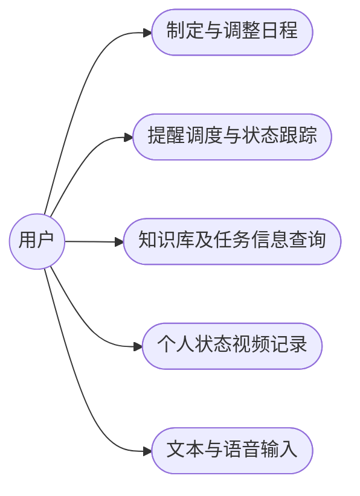

图 3-1 用户功能用例关系图

### 3.2.2 功能可行性分析

功能可行性需要落实到操作流程。针对 3.2.1 的各项需求，系统均给出可执行链路，而非停留在概念描述层。

图 3-1 至图 3-6 在论文定稿阶段将按 UML 绘图规范统一重绘，以满足学院对流程图与用例图的版式要求。

如图 3-2 所示，用户输入先进入对话入口，系统完成任务拆解并生成计划。涉及关键变更时，界面先给出确认，再将结果写入任务存储。任务进入调度阶段后触发提醒并更新状态，执行结果回写到对话层，作为下一轮调整依据。

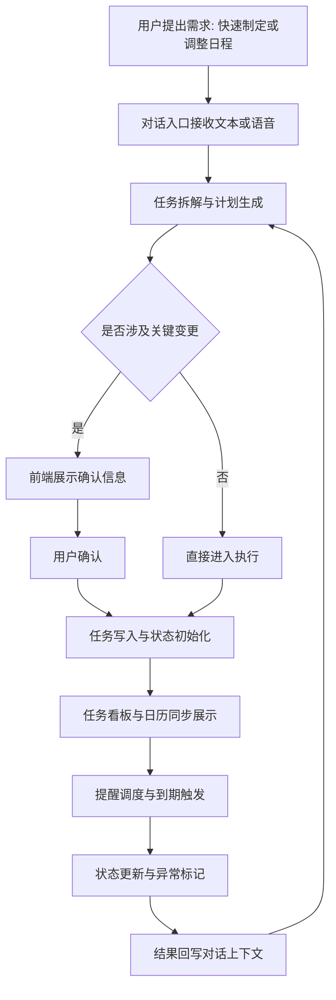

图 3-2 日程制定与调整功能实现流程

知识库及任务信息查询的实现路径见图 3-3。查询请求进入系统后先进行意图识别。知识库查询走语义召回与问答生成链路，任务信息查询走任务数据检索链路，结果在同一界面返回，并用于后续任务调整。

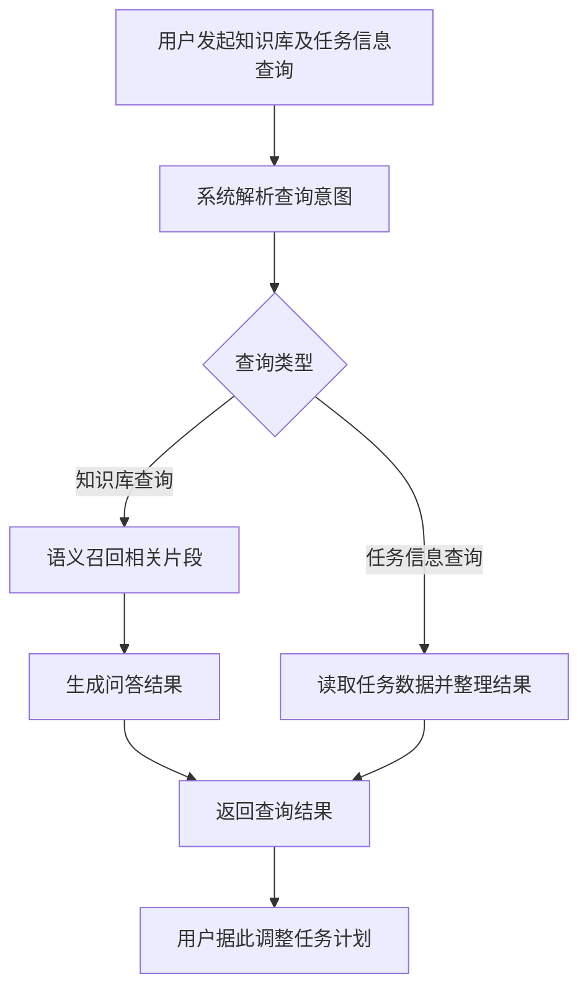

图 3-3 知识库及任务信息查询功能实现流程

个人状态视频记录的实现路径见图 3-4。用户进入记录页面后开启设备采集，系统将实时画面与音频写入记录流；结束记录后执行对象存储上传，并将时长、体积和资源地址写入记录库。

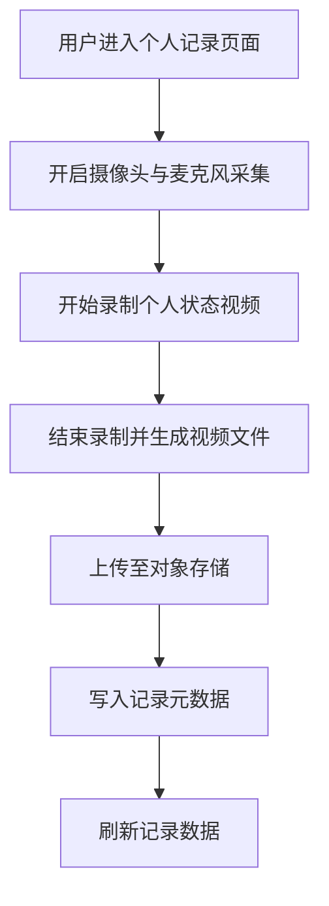

图 3-4 WebRTC 个人状态记录功能实现流程

文本与语音双通道输入的实现路径见图 3-5。用户可选择文本输入或语音输入，语音输入先完成识别再与文本输入汇合，系统通过统一请求入口路由到日程、查询或记录相关功能，从而保持交互链路一致。

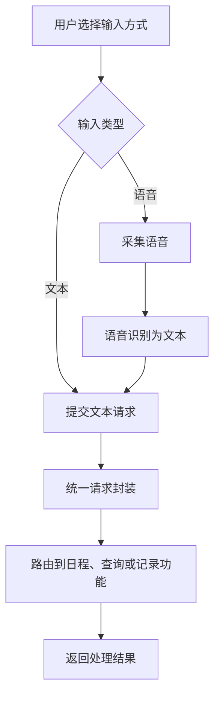

图 3-5 文本与语音双通道输入功能实现流程

任务调度功能的实现路径见图 3-6。任务创建或更新后，系统计算触发时间并写入调度队列。调度进程按时间窗口拉取到期任务，再结合任务当前状态决定提醒、重排或终止，形成可持续执行的调度闭环。

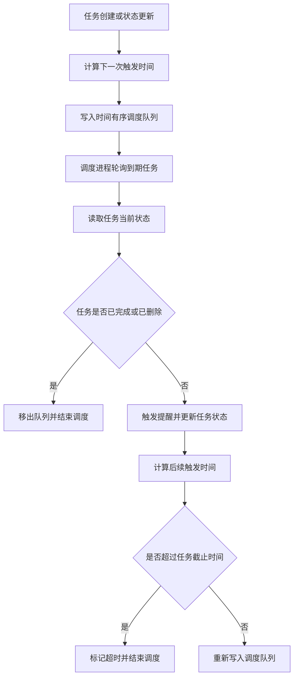

图 3-6 任务调度功能实现流程


# 第4章 概要设计

第3章完成可行性分析后，系统进入概要设计阶段。本章直接对应当前项目的工程结构，围绕 `LifePilot` 前端、`LifePilotServer` 业务服务、`LifePilot_mcp` 工具服务与 `ai-server` 知识服务展开。章节目标是给出模块边界、协同路径、数据落点与接口组织，为第5章详细设计和第6章实现与测试提供统一框架。

## 4.1 设计目标

本项目的设计目标来自三类高频业务：任务规划与执行、知识入库与问答、个人状态记录。系统需要在同一应用内支持三类业务连续完成，减少页面跳转和信息割裂。系统还要支持持续迭代，前端、业务服务、工具服务和知识服务采用独立演进方式，便于后续扩展能力。

如图4-1所示，设计目标与系统能力形成固定映射关系。后续架构划分与流程组织均基于该映射执行。

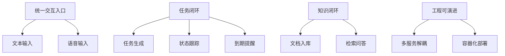

图4-1 设计目标与能力映射

图4-2给出本章覆盖范围。概要设计关注系统结构和协同逻辑，不进入代码实现细节。

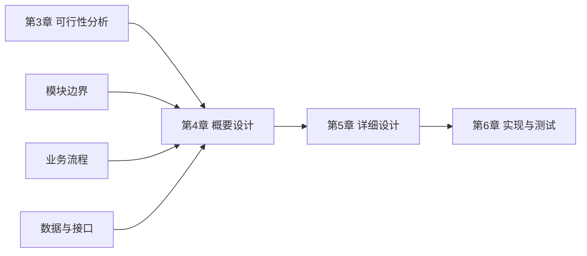

图4-2 章节衔接关系

## 4.2 系统总体架构

系统采用四层结构。表现层对应 `LifePilot`，负责页面组织与交互承载。业务层对应 `LifePilotServer`，负责对话编排、工作流路由和调度控制。工具层对应 `LifePilot_mcp`，负责任务域数据操作。能力层对应 `ai-server`，负责文档解析、检索问答与语音处理。数据层由 MySQL、MongoDB、Redis、向量存储和对象存储组成。

如图4-3所示，当前版本的部署节点与连接方向已经固定，主链路从前端进入业务服务，再按意图分发至工具服务和知识服务。

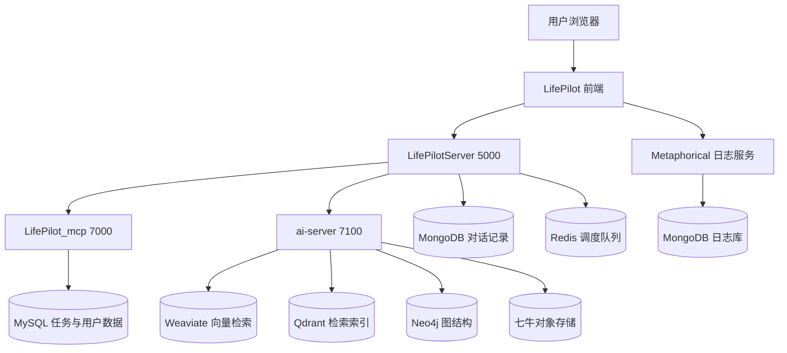

图4-3 系统总体架构图

图4-4展示一次完整请求的协同过程。该时序覆盖当前项目中的核心调用关系。

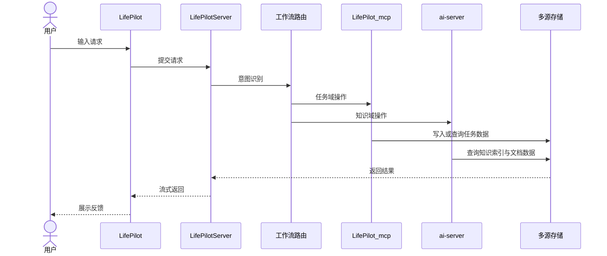

图4-4 业务协同时序图

## 4.3 功能模块划分

前端模块按用户任务组织，主页面覆盖清单、日历、知识库与记录四类入口。业务服务模块按能力组织，包含对话编排、任务规划、任务操作、出行规划、检索问答和提醒调度。工具服务负责任务和标签相关操作。知识服务负责文档解析、检索召回、语音识别和语音合成。

如图4-5所示，前端功能围绕 `home` 主路径组织，知识库和记录功能在同一应用内独立成页，和任务模块保持联动。

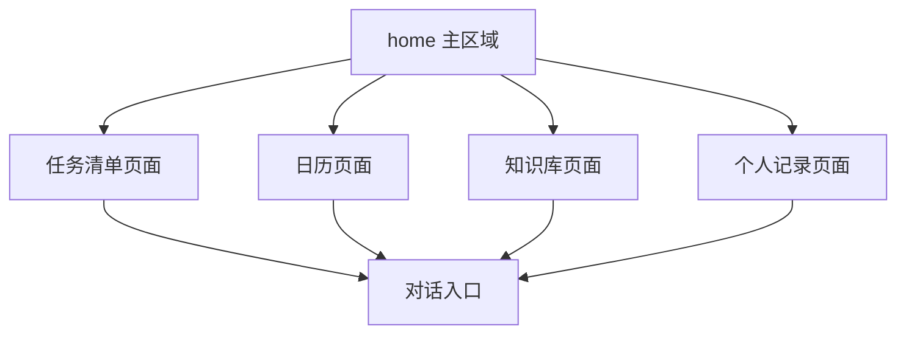

图4-5 前端功能结构图

如图4-6所示，业务服务内部以路由节点组织多个工作流。不同工作流共享上下文准备节点，再进入各自处理链路。

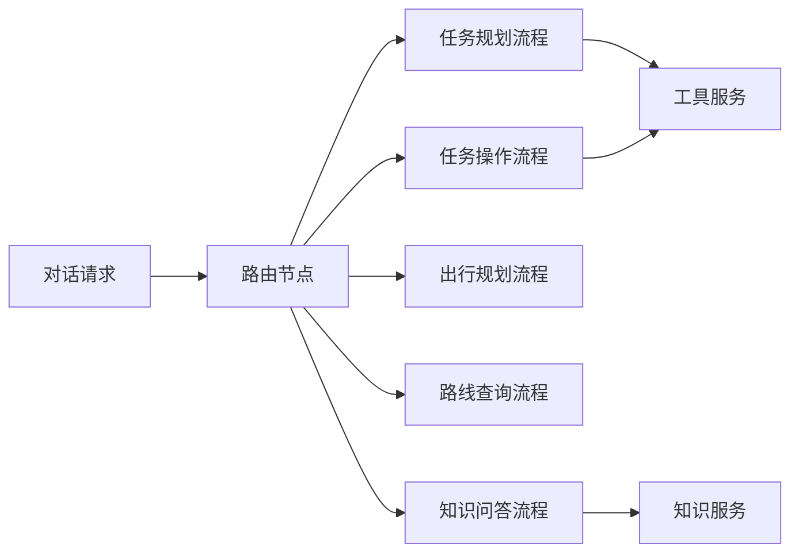

图4-6 业务服务工作流结构图

## 4.4 核心设计视图

第3章已经给出业务执行流程，本节改为展示系统设计视图。图4-7至图4-11分别覆盖职责分配、状态模型、事件协议、索引结构与调度协作。该组织方式与第3章形成分工：第3章偏过程验证，第4章偏结构设计。

如图4-7所示，系统以“前端交互层、业务编排层、工具服务层、知识服务层”分配职责，各层通过明确接口协作。

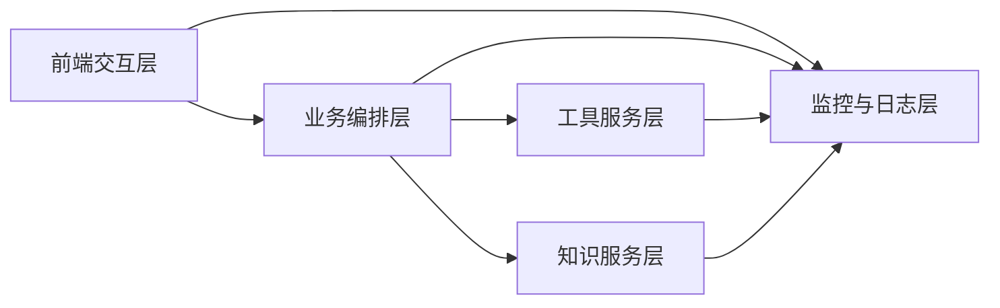

图4-7 分层职责视图

如图4-8所示，任务对象以状态迁移组织，提醒逻辑和超时逻辑以状态变化为触发条件。

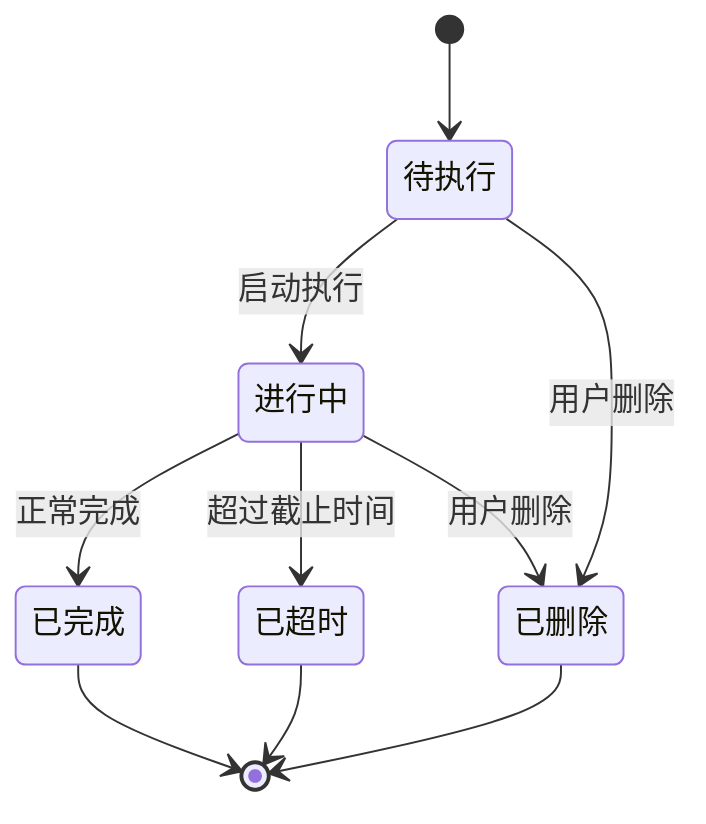

图4-8 任务状态模型图

如图4-9所示，对话链路采用事件协议返回内容。事件类型用于区分过程信息、结果信息和界面刷新信号。

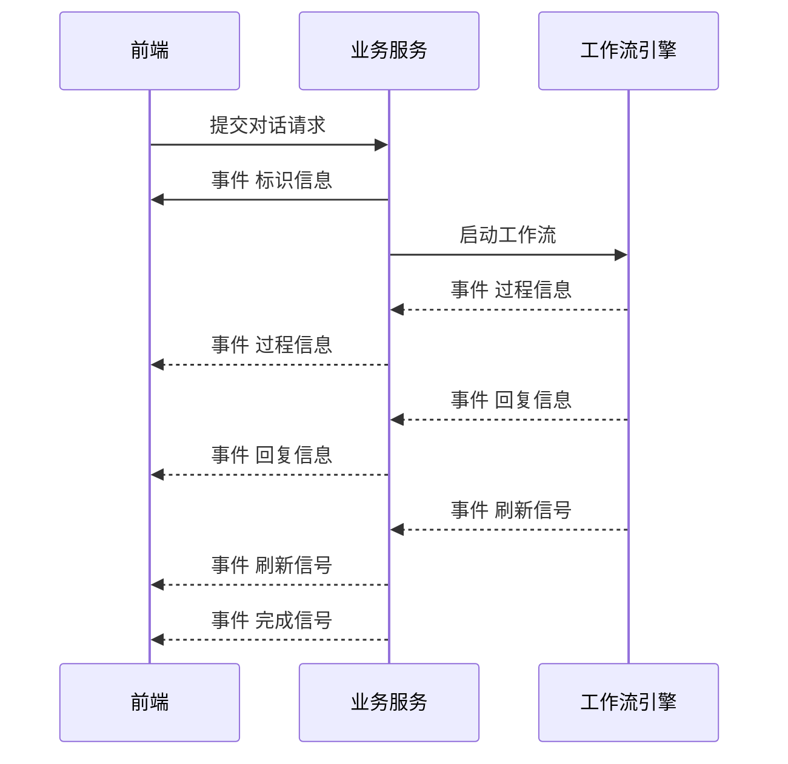

图4-9 对话事件协议图

如图4-10所示，知识服务将原始文档拆分为片段，再分别写入向量索引和图结构索引，问答阶段从双索引取回证据后生成结果。

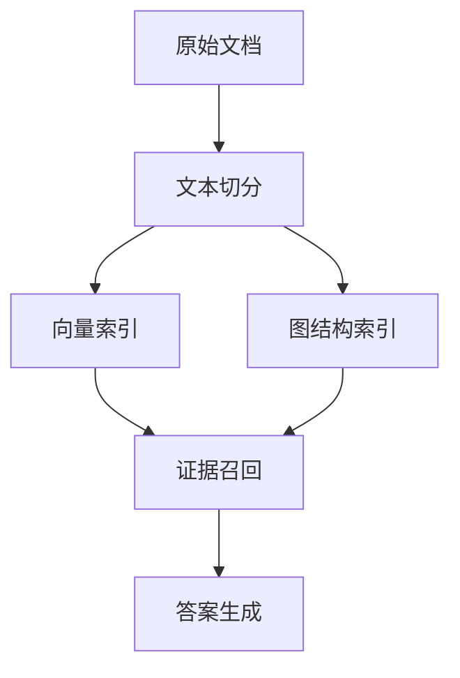

图4-10 知识索引结构图

如图4-11所示，调度模块与缓存、任务库和通知模块形成协作闭环。到期任务先从队列取出，再根据任务状态执行提醒或结束处理。

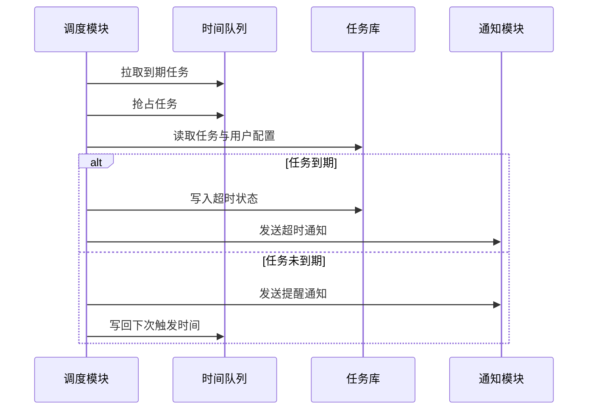

图4-11 调度协作视图

## 4.5 数据与接口概要

数据层采用职责分工方式。MySQL承载任务、用户、标签与会话索引数据。MongoDB承载对话消息与日志记录。Redis承载调度时间队列。知识服务将文档切片写入向量存储，并维护图结构索引。媒体文件统一进入对象存储。

如图4-12所示，当前项目的数据落点关系已经固定，业务域与存储域呈一对多映射。

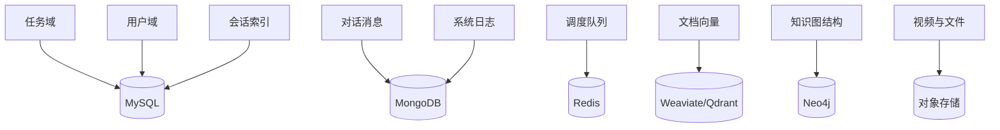

图4-12 数据存储映射图

接口层按通信对象分为三组：前端到业务服务、业务服务到工具服务、业务服务到知识服务。前端对话链路使用流式返回，文件和任务操作使用请求响应。服务间调用采用协议化或标准 HTTP 调用，接口语义围绕任务、知识和媒体三类业务组织。

如图4-13所示，不同接口通道承担不同职责，接口层和存储层之间没有跨域直连。

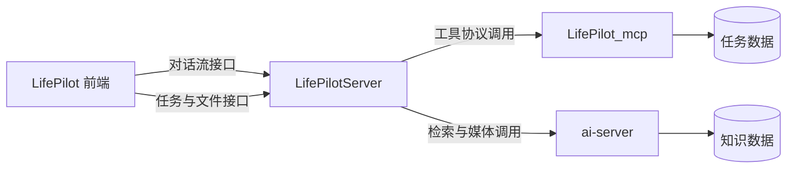

图4-13 接口分层关系图


# 第5章 详细设计

第4章给出了系统分层、模块边界和协同路径，第5章继续下沉到实现层，回答“各子系统如何稳定运行、如何协同闭环、如何落到存储与接口”三个问题。章节组织按业务子系统展开：登录认证、任务管理、个人记录、智能代理、RAG 管线、数据库与存储、接口设计。写作结构参考《基于Golang框架iris的社交媒体平台的设计与实现（最终版）》中“业务模块与数据接口并行展开”的方式，避免只按组件罗列功能。

## 5.1 登录与身份认证设计

LifePilot 登录层承担两个目标：其一，覆盖不同用户入口；其二，在认证通过后统一下发会话凭证。当前系统提供密码登录、邮箱验证码登录、Google 登录、微信扫码登录四条入口，其中 Google 与微信登录会处理“首次登录补齐账号”的分支。登录结果统一返回短周期访问令牌，并由服务端写入长周期续签令牌。

认证链路采用“前端页面发起、认证接口校验、令牌写入与页面跳转”流程。密码登录与邮箱验证码登录走账号体系，Google 和微信走外部身份体系，再在本地用户库完成映射。图 5-1 展示了四条路径的统一认证流程。

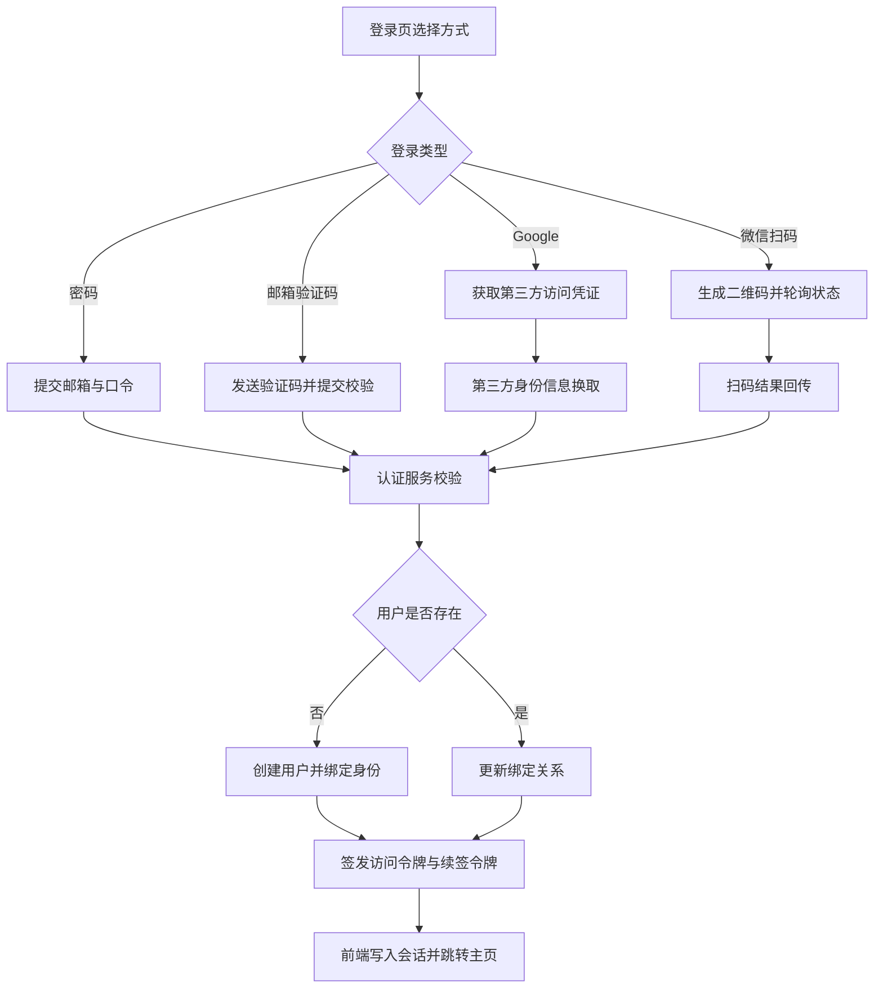

图 5-1 登录认证总流程图

不同登录方式的输入、校验点与输出保持统一口径，表 5-1 给出对比。统一输出口径后，前端只需维护一个会话初始化流程，后续页面鉴权可以复用同一中间件逻辑。

| 登录方式 | 输入信息 | 关键校验点 | 登录成功后处理 |
|---|---|---|---|
| 密码登录 | 邮箱、口令 | 账号存在性、口令比对 | 返回访问令牌，写入续签令牌 |
| 邮箱验证码登录 | 邮箱、验证码 | 验证码匹配与时效校验 | 新用户自动建档，返回令牌 |
| Google 登录 | Google 访问凭证 | 第三方身份信息拉取、邮箱映射 | 绑定 Google 标识，返回令牌 |
| 微信扫码登录 | 场景码、状态码 | 扫码状态、开放标识映射 | 绑定微信标识，返回令牌 |

表 5-1 登录方式对比表

令牌生命周期按“短访问、长续签”组织，访问令牌用于业务接口鉴权，续签令牌由服务端保存到 Cookie。接口层在每次业务访问前读取访问令牌并校验有效期，过期后可通过续签链路换发新令牌。图 5-2 展示令牌生命周期。

```mermaid
stateDiagram-v2
    [*] --> 未登录
    未登录 --> 已登录: 登录成功并签发令牌
    已登录 --> 可续签: 访问令牌过期
    可续签 --> 已登录: 续签成功
    可续签 --> 未登录: 续签失败
    已登录 --> 未登录: 主动退出或令牌失效
```

图 5-2 会话令牌生命周期图

## 5.2 任务管理子系统详细设计

任务子系统由任务实体、标签实体、过滤检索、提醒调度四部分组成。业务主线并非“增删改查”本身，而是“计划生成、状态演进、提醒执行、结果回写”闭环。任务对象的核心字段包含标题、描述、状态、优先级、截止时间、提醒开关、收藏标记与标签集合。

任务状态采用有限状态机组织，状态迁移由用户操作和调度事件共同驱动。未完成任务可进入进行中或已完成，超过截止时间后可进入超时态，用户删除时进入终止态。图 5-3 给出状态迁移路径。

```mermaid
stateDiagram-v2
    [*] --> 待执行
    待执行 --> 进行中: 启动处理
    进行中 --> 已完成: 完成打卡
    待执行 --> 已完成: 直接完成
    待执行 --> 已超时: 超过截止时间
    进行中 --> 已超时: 超过截止时间
    待执行 --> 已删除: 用户删除
    进行中 --> 已删除: 用户删除
    已完成 --> [*]
    已超时 --> [*]
    已删除 --> [*]
```

图 5-3 任务状态迁移图

任务创建来源有两类。第一类是用户在任务面板直接创建，输入字段完整后进入任务表。第二类是智能代理生成计划后，经用户确认再批量写入。两条路径最终都进入同一数据接口，并在写入后触发调度队列更新。图 5-4 描述任务写入与更新流程。

```mermaid
flowchart TD
    A[任务创建请求] --> B{来源}
    B -->|面板直建| C[校验字段并写入任务表]
    B -->|代理规划| D[用户确认后批量写入]
    C --> E[计算下次提醒时间]
    D --> E
    E --> F[写入时间队列]
    F --> G[前端刷新清单与日历]
    G --> H[后续更新: 编辑/完成/删除]
    H --> I[同步更新队列与任务状态]
```

图 5-4 任务写入与更新流程图

提醒调度采用 Redis 有序队列。调度进程按时间窗口拉取到期任务，先执行抢占，再读取任务最新状态，再决定提醒、重排或超时处理。该设计可以避免同一任务被多个进程重复执行。图 5-5 给出调度链路。

```mermaid
sequenceDiagram
    participant SCH as 调度进程
    participant REDIS as 时间队列
    participant MYSQL as 任务库
    participant MAIL as 通知服务

    SCH->>REDIS: 拉取到期任务
    SCH->>REDIS: 抢占任务
    REDIS-->>SCH: 返回抢占结果
    SCH->>MYSQL: 读取任务与用户提醒配置
    alt 超过截止时间
        SCH->>MYSQL: 写入超时状态
        SCH->>MAIL: 发送超时通知
    else 未超过截止时间
        SCH->>MAIL: 发送到期提醒
        SCH->>REDIS: 写回下一次触发时间
    end
```

图 5-5 任务调度时序图

标签模块承担分类与筛选功能。标签在任务表内以集合字段保存，在标签表内维护名称和颜色。任务列表支持按状态、收藏、关键字、创建时间分页过滤，任务量增长后仍可保持可读性。

## 5.3 个人记录子系统详细设计

个人记录子系统面向日常复盘场景，包含视频录制、贴图叠加、资源上传、元数据管理与回放。系统在浏览器端将摄像画面绘制到画布，贴图操作直接作用于画布层，再由录制器导出视频。该路径的优点是编辑与录制在同一流水线完成，用户无需二次剪辑工具。

贴图能力由“贴图库管理”和“画布实例管理”两层组成。贴图库负责上传、命名、删除和复用；画布实例负责缩放、移动、透明度等运行态属性。用户可上传本地图片到对象存储，也可从贴图库将素材插入到当前画布。图 5-6 展示记录与贴图联合流程。

```mermaid
flowchart TD
    A[开启摄像头预览] --> B[画布实时渲染]
    B --> C[插入贴图并调整位置尺寸]
    C --> D[开始录制]
    D --> E[停止录制并封装视频]
    E --> F[上传对象存储]
    F --> G[写入记录元数据]
    G --> H[刷新视频列表并支持回放]

    I[上传贴图素材] --> J[对象存储写入]
    J --> K[写入贴图库元数据]
    K --> C
```

图 5-6 个人记录与贴图联动流程图

记录表保存标题、描述、视频地址、时长、体积和创建时间。贴图库保存素材地址、标题和用户标识。视频列表页面按创建时间倒序读取，可执行重命名、删除和回放。图 5-7 给出贴图与记录数据对象关系。

```mermaid
flowchart LR
    U[用户] --> RV[记录视频]
    U --> ST[贴图库素材]
    ST --> CANVAS[画布实例]
    CANVAS --> RV
```

图 5-7 记录对象关系图

该子系统与任务子系统通过同一用户标识贯通，记录内容可作为后续任务调整的输入证据，形成“执行记录-计划修订”的闭环链路。

## 5.4 智能代理与工作流详细设计

### 5.4.1 路由决策机制

智能代理承担的并非单一问答任务，而是跨越“写入型任务、分析型任务、开放型规划、路径型规划、知识型问答”五类请求。若将五类请求压进同一提示词，执行路径会很快变得不可控：写入场景要求严格校验，开放问答强调覆盖面，路线规划又依赖地理工具，三类约束天然冲突。系统在架构层采用“入口路由 + 专用工作流子图”的分层编排思路，先确定任务类型，再进入对应子图，避免单图过载带来的上下文污染和策略串扰。

路由节点输出三个字段：目标工作流、置信度与决策理由。前两者用于服务端分发和异常兜底，理由字段通过流式事件回传给前端，前端可展示“当前为何进入该子流程”，从而提高交互可解释性。若路由结果无法可靠解析，系统默认落到知识问答分支，维持请求始终可达，不在入口处中断会话。

五条工作流中，前四条位于智能代理子系统：`build_todo`、`what_to_do`、`trivel`、`howToGo`；第五条为 `rag`，其工程细节在 5.5 节单独展开。图 5-8 给出路由分发关系。

```mermaid
flowchart LR
    IN[用户输入] --> R[路由决策]
    R --> W1[build_todo]
    R --> W2[what_to_do]
    R --> W3[trivel]
    R --> W4[howToGo]
    R --> W5[rag]
```

图 5-8 代理路由分发图

四条代理工作流共享两个前置节点：时间注入节点与上下文准备节点。时间注入统一采用北京时间格式，避免容器时区差异导致截止时间判定偏移；上下文准备节点按“历史消息裁剪 + 当前任务快照加载”组织输入，将模型上下文长度维持在稳定范围。该共享设计把时间语义和上下文语义前置为公共能力，减少每个子图重复处理同类逻辑。

### 5.4.2 `build_todo` 工作流

`build_todo` 属于写入型流程，目标是把自然语言计划转成可落库的任务集合。流程采用“生成-校验-确认-写入”的主线，回环路径用于处理时间冲突、字段缺失和语义偏差。图 5-9 给出节点级工作流。

```mermaid
flowchart TD
    A[get_time 时间注入 统一当前时间基准]
    B[prepare_context 上下文准备 加载历史对话与任务快照]
    C[executor 任务草案生成 拆解标题/截止时间/描述/标签]
    D[inspector 草案校验 校验格式、冲突与语义一致性]
    E{校验分流}
    F[formatter 结果格式化 转成前端可确认文本]
    G[user_judgment 人工判断中断 等待 accept/reject]
    H{用户决策}
    I[save_to_mcp 任务写入 调用工具服务批量落库]
    J[refresh event 刷新通知 驱动任务列表重拉]
    K((END))

    A --> B --> C --> D --> E
    E -->|未通过且未达阈值| C
    E -->|通过或达到重试阈值| F
    F --> G --> H
    H -->|reject| C
    H -->|accept| I --> J --> K
```

图 5-9 `build_todo` 节点级工作流图

在该流程中，人工判断节点承担门控职责。用户拒绝后不写入任务池，流程返回生成节点继续修订；用户接受后才进入写入节点并触发刷新事件。
### 5.4.3 `what_to_do` 工作流

`what_to_do` 属于分析型流程，目标是将任务状态转为可执行建议。流程采用“事实生成 + 质量校验 + 结果整理”结构，并在回环次数过高时走直接输出分支，控制对话时延。图 5-10 给出节点级工作流。

```mermaid
flowchart TD
    A[get_time 时间注入 统一时间表达基准]
    B[prepare_context 上下文准备 加载历史对话与任务快照]
    C[executor 事实层生成 输出任务分析与建议草稿]
    D[inspector 质量校验 检查遗漏、范围偏移、指代错误]
    E{校验分流}
    F[manager 结果整理 输出自然表达]
    G[direct_output 直接输出 达到拒绝阈值时返回当前结果]
    H((END))

    A --> B --> C --> D --> E
    E -->|通过| F --> H
    E -->|不通过且未达阈值| C
    E -->|不通过且达到阈值| G --> H
```

图 5-10 `what_to_do` 节点级工作流图

该流程把“事实正确性”与“表达可读性”分离到执行节点和整理节点，避免两类目标在单节点中相互干扰。
### 5.4.4 `trivel` 工作流

`trivel` 面向开放型出行咨询，输入通常包含模糊偏好与连续追问。流程采用 ReAct 工具协同：规划节点按需调用地图与内容工具，回读结果后继续推理，直到形成可执行行程建议。图 5-11 给出节点级工作流。

```mermaid
flowchart TD
    A[get_time 时间注入 提供当前时段信息]
    B[prepare_context 上下文准备 处理连续追问与省略指代]
    C[planner 规划节点 拆解行程目标并选择工具]
    D{工具选择}
    E[maps tools 地理/天气/距离查询]
    F[content tools 攻略/地点/活动信息查询]
    G[planner 结果整合 合并工具结果并重规划]
    H[response 输出行程建议]
    I((END))

    A --> B --> C --> D
    D -->|需要地理信息| E --> G
    D -->|需要内容信息| F --> G
    D -->|信息已充分| H --> I
    G --> C
    C -->|完成规划| H
```

图 5-11 `trivel` 节点级工作流图

该流程不涉及数据库写入，链路重点放在“信息补齐-规划收敛-答案生成”的循环效率。
### 5.4.5 `howToGo` 工作流

`howToGo` 面向路径与通勤问题，流程约束是“先位置、后路线、再比较方案”。规划节点围绕起终点、交通方式、耗时估计进行工具编排，输出聚焦可执行路线。图 5-12 给出节点级工作流。

```mermaid
flowchart TD
    A[get_time 时间注入 提供出行时段基准]
    B[prepare_context 上下文准备 解析历史位置指代]
    C[planner 规划节点 解析起终点与出行意图]
    D{位置信息是否完整}
    E[maps_ip_location 定位补全起点]
    F[maps_geo 地理编码 解析终点坐标]
    G{交通方式选择}
    H[maps_direction_driving 驾车路径]
    I[maps_direction_transit_integrated 公共交通路径]
    J[maps_direction_walking/bicycling 步行或骑行路径]
    K[planner 方案整合 比较时长、换乘与可达性]
    L[response 输出路线方案]
    M((END))

    A --> B --> C --> D
    D -->|起点缺失| E --> C
    D -->|信息完整| F --> G
    G --> H --> K
    G --> I --> K
    G --> J --> K
    K --> L --> M
```

图 5-12 `howToGo` 节点级工作流图

起点缺失时优先补全再规划，可避免无效路线输出。
### 5.4.6 事件协议与前端刷新机制

为支撑多工作流统一接入，系统定义了统一事件协议，事件消息包含类型、节点标识与负载内容。协议层不直接暴露内部节点实现细节，前端依据事件类型更新界面状态。该解耦方式让后端可以迭代节点实现，前端渲染逻辑无需同步重写。表 5-2 给出当前事件类型。

| 事件类型 | 用途 | 前端动作 |
|---|---|---|
| `id` | 返回会话标识 | 初始化会话状态 |
| `think` | 返回过程文本 | 展示处理过程 |
| `response` | 返回回复内容 | 增量渲染回答 |
| `confirm` | 进入人工确认节点 | 展示接受/拒绝按钮 |
| `thread_id` | 返回恢复标识 | 缓存恢复参数 |
| `refresh` | 通知数据已更新 | 刷新任务数据 |
| `done` | 流程完成 | 结束流式读取 |

表 5-2 工作流事件类型表

从交互链路看，`id` 事件建立会话上下文，`think` 和 `response` 承担过程可视化与正文渲染，`confirm` 与 `thread_id` 组成可恢复中断握手，`refresh` 驱动业务数据重拉，`done` 标记流结束。异常时服务端发送 `error` 后再发送结束信号，前端可按统一收尾逻辑释放连接。图 5-13 展示协议时序。

```mermaid
sequenceDiagram
    participant FE as 前端
    participant BE as 业务服务
    participant WF as 工作流
    FE->>BE: 提交请求
    BE-->>FE: id
    BE->>WF: 启动流程
    WF-->>FE: think
    WF-->>FE: response
    WF-->>FE: confirm/thread_id
    FE->>BE: judgment
    WF-->>FE: refresh
    WF-->>FE: done
```

图 5-13 事件协议时序图

## 5.5 RAG 知识服务详细设计

`rag` 是第五条 agent 工作流，采用“agent 入口分流 + RAG 服务深管线”架构。agent 侧负责命中判断与回退，服务侧负责检索融合与答案生成。

入库管线支持 PDF、Word、TXT、Excel、PPTX 与图片等格式。文件下载后先执行解析，再进行语义切分与批量向量化，随后写入向量索引。并行地，系统从文本片段抽取实体关系并写入图索引。图 5-14 展示入库流程。

```mermaid
flowchart TD
    A[接收文件地址] --> B[下载原始文件]
    B --> C[按格式解析文本]
    C --> D[语义切分]
    D --> E[批量向量化]
    E --> F[写入向量索引]
    D --> G[抽取实体关系]
    G --> H[写入图索引]
    F --> I[回写处理状态]
    H --> I
```

图 5-14 RAG 入库管线图

问答链路按节点拆解见图 5-15。该图同时包含 agent 侧分流节点和服务侧检索节点。

```mermaid
flowchart TD
    A[user query 用户问题]
    B[agent.rag RAG执行节点 调用知识服务]
    C{是否命中知识片段}
    D[rag_fallback 回退普通回答]

    E[query_analyzer 意图识别与查询改写]
    F{意图分流}
    G[chat_node 闲聊直接回复]
    H[retrieval_node 多路召回 稠密+稀疏+关系检索]
    I[filter_merge_node 去重与权限过滤]
    J[reranker_node 候选重排]
    K[generator_node 答案生成与证据组织]
    L[response 返回答案]

    A --> B --> C
    C -->|未命中| D --> L
    C -->|命中| E --> F
    F -->|chat| G --> L
    F -->|retrieval| H --> I --> J --> K --> L
```

图 5-15 RAG 问答节点级工作流图

删除链路按“用户标识 + 文件标识”执行，并在删除后回写文件状态。若目标集合不存在，接口返回空删除结果而非抛错，调用方可以按幂等语义重试，不会因重复删除引发额外异常。
## 5.6 数据库与存储详细设计

### 5.6.1 存储体系与数据落点

系统采用多源存储。结构化业务数据落在 MySQL，对话消息落在 MongoDB，时间调度落在 Redis，向量与图索引落在检索引擎，文件与媒体落在对象存储。图 5-16 展示数据落点。

```mermaid
flowchart TB
    BIZ[业务层] --> MYSQL[(MySQL)]
    BIZ --> MONGO[(MongoDB)]
    BIZ --> REDIS[(Redis)]
    BIZ --> VEC[(Qdrant/Weaviate)]
    BIZ --> GRAPH[(Neo4j)]
    BIZ --> OSS[(对象存储)]
```

图 5-16 数据落点图

### 5.6.2 MySQL 结构设计

MySQL 承担结构化业务数据。当前实现包含七张核心业务表，分别对应用户、任务、标签、会话目录、知识文件、记录视频与贴图资源。表 5-3 给出表级概览。

| 数据表 | 主业务职责 | 主标识与关键约束 |
|---|---|---|
| `User` | 存储账号信息、提醒配置、第三方绑定关系 | `id` 自增；`userID` 唯一；`email` 唯一 |
| `Task` | 存储任务计划、状态、优先级、提醒相关字段 | `id` 唯一 |
| `Tags` | 存储标签名称与颜色配置 | `id` 唯一 |
| `ChatHistory` | 存储会话目录，不存放消息正文 | `id` 唯一 |
| `folder` | 存储知识文件元数据与 RAG 处理状态 | `id` 唯一 |
| `RecordVideo` | 存储个人记录视频元数据 | `id` 唯一 |
| `Sticker` | 存储贴图素材元数据 | `id` 唯一 |

表 5-3 MySQL 业务表概览

用户表字段明细见表 5-4。

| 字段 | 类型 | 约束/默认值 | 说明 |
|---|---|---|---|
| `id` | Int | 自增主键 | 数据库内部主键 |
| `userID` | String | 唯一、必填 | 业务侧用户标识，跨表关联主键域 |
| `email` | String | 唯一、必填 | 登录邮箱 |
| `tipsTime` | Int | 默认 `48` | 提前提醒时长，单位小时 |
| `tipsFrequency` | Int | 默认 `6` | 提醒频率，单位小时 |
| `name` | String | 可空，默认空字符串 | 用户昵称 |
| `password` | String | 可空，默认空字符串 | 密码哈希 |
| `avatar` | String | 可空，默认空字符串 | 头像地址 |
| `phone` | String | 可空，默认空字符串 | 手机号 |
| `githubID` | String | 可空，默认空字符串 | GitHub 绑定标识 |
| `googleID` | String | 可空，默认空字符串 | Google 绑定标识 |
| `wxID` | String | 可空，默认空字符串 | 微信绑定标识 |
| `tags` | Json | 可空，默认空数组 | 用户侧标签缓存 |
| `tasks` | Json | 可空，默认空数组 | 用户侧任务缓存 |
| `createdAt` | DateTime | 默认当前时间 | 创建时间 |
| `updatedAt` | DateTime | 自动更新时间 | 最后更新时间 |

表 5-4 `User` 字段明细

任务表字段明细见表 5-5。

| 字段 | 类型 | 约束/默认值 | 说明 |
|---|---|---|---|
| `id` | String | 唯一、必填 | 任务业务标识 |
| `title` | String | 必填 | 任务标题 |
| `description` | String | 可空 | 任务描述 |
| `status` | String | 必填 | 任务状态（如 pending/completed/timeout） |
| `priority` | Int | 必填 | 任务优先级 |
| `endAt` | DateTime | 可空 | 截止时间 |
| `needTips` | Boolean | 默认 `false` | 是否启用提醒 |
| `favorite` | Boolean | 默认 `false` | 收藏标记 |
| `tags` | Json | 必填 | 标签集合 |
| `completedAt` | DateTime | 可空 | 完成时间 |
| `userID` | String | 必填 | 所属用户标识 |
| `createdAt` | DateTime | 默认当前时间 | 创建时间 |
| `updatedAt` | DateTime | 自动更新时间 | 最后更新时间 |

表 5-5 `Task` 字段明细

其余业务表字段见表 5-6。

| 数据表 | 字段明细 |
|---|---|
| `Tags` | `id`(唯一), `text`, `color`(可空), `userID` |
| `ChatHistory` | `id`(唯一), `title`, `chatId`, `userID`, `createdAt`, `updatedAt` |
| `folder` | `id`(唯一), `name`, `size`, `url`, `userID`, `alreadyRag`, `ragError`(可空), `createdAt`, `updatedAt` |
| `RecordVideo` | `id`(唯一), `url`, `title`, `description`(可空), `duration`, `size`, `userID`, `createdAt`, `updatedAt` |
| `Sticker` | `id`(唯一), `url`, `title`(可空), `userID`, `createdAt`, `updatedAt` |

表 5-6 其余 MySQL 表字段明细

表间关联以 `userID` 形成逻辑主键域。接口写入统一携带用户标识，读写两侧都维持用户域边界。

### 5.6.3 MongoDB 结构设计

MongoDB 承担半结构化数据，当前包含对话消息与运行日志两类集合。对话集合采用追加写模式，便于按会话和时间回溯；日志集合记录请求入参与异常信息，便于故障定位。

对话集合 `ChatHistory` 字段见表 5-7。

| 字段 | 类型 | 说明 |
|---|---|---|
| `user_id` | String | 所属用户标识 |
| `chat_id` | String | 会话标识 |
| `message_id` | String | 消息标识 |
| `role` | String | 消息角色（user/assistant） |
| `type` | String | 消息类型（question/answer） |
| `content_type` | String | 内容类型（text/audio） |
| `question` | String | 用户问题正文 |
| `answer` | String | 助手回答正文 |
| `think` | String | 过程思考文本 |
| `audio_url` | String | 语音资源地址 |
| `duration` | Number | 语音时长（秒） |
| `createdAt` | Date | 写入时间 |

表 5-7 MongoDB 对话集合字段明细

日志集合字段见表 5-8。

| 集合 | 字段 | 说明 |
|---|---|---|
| `ErrorLog` | `data`, `error`, `createdAt` | 请求上下文与错误对象 |
| `LogOperate` | `request`, `Response`, `createdAt` | 请求与响应快照 |

表 5-8 MongoDB 日志集合字段明细

对话查询链路采用 `user_id + chat_id + createdAt` 的组合检索模式。该模式可以支撑“按会话拉取最近 N 条”与“按时间正序回放”两类高频场景。

### 5.6.4 Redis 调度队列设计

Redis 在系统中承担“定时调度 + 短期认证态缓存”两类职责。调度链路依赖有序集合，认证链路依赖短 TTL 字符串键。表 5-9 给出键空间明细。

| 键名模式 | 数据结构 | 值/分值格式 | 写入来源 | 读取来源 | 过期或清理策略 |
|---|---|---|---|---|---|
| `scheduler:tasks` | ZSet | member=`taskId`，score=`触发时间戳` | 任务创建/更新、调度重排 | 调度器轮询 | 任务完成、删除或超时后 `zrem` |
| `{type}-{email}-login` | String | 6 位验证码 | OTP 下发接口 | 邮箱验证码登录 | TTL 5 分钟 |
| `{type}-{email}-register` | String | 6 位验证码 | OTP 下发接口 | 注册接口 | TTL 5 分钟，使用后删除 |
| `{type}-{email}-forgot` | String | 6 位验证码 | OTP 下发接口 | 找回密码接口 | TTL 5 分钟，使用后删除 |
| `email-{email}-bind-email` | String | 6 位验证码 | OTP 下发接口 | 绑定邮箱接口 | TTL 5 分钟，使用后删除 |
| `wx:code:{scene}` | String | `{state}-{status}` 或 `{state}-1-{openId}` | 生成二维码接口、微信回调接口 | 扫码轮询接口 | 初始 TTL 10 分钟，登录后删除；回调成功态可延长 |

表 5-9 Redis 键空间字段级明细

调度集合 `scheduler:tasks` 的生命周期见表 5-10。

| 阶段 | 关键操作 | 说明 |
|---|---|---|
| 创建任务 | `zadd(taskId, nextTrigger)` | 任务写入后计算首次提醒时间 |
| 轮询拉取 | `zrangebyscore(0, now)` | 拉取到期任务批次 |
| 抢占处理 | `zrem(taskId)` | 抢占成功才进入后续处理 |
| 重新调度 | `zadd(taskId, nextTrigger/endAt)` | 发送提醒后写回下一触发时间 |
| 终止清理 | `zrem(taskId)` | 完成、删除或无后续提醒时移除 |

表 5-10 调度键生命周期明细

### 5.6.5 向量库与对象存储设计

向量层以分集合管理用户知识，片段元数据中保存用户标识、文件标识、来源信息和分片序号。图层保存实体与关系，供图检索分支使用。对象存储统一承接知识文件、语音与视频资源，业务层仅保存访问地址与元数据，不在数据库中存二进制内容。

### 5.6.6 核心实体关系图与字段说明

图 5-17 给出核心实体关系。关系采用“用户为主键域，任务/标签/记录/知识文件为从属域”结构，会话索引和消息记录共同支撑对话链路。

```mermaid
erDiagram
    USER ||--o{ TASK : owns
    USER ||--o{ TAGS : owns
    USER ||--o{ CHAT_INDEX : owns
    USER ||--o{ RECORD_VIDEO : owns
    USER ||--o{ STICKER : owns
    USER ||--o{ FOLDER : owns
    CHAT_INDEX ||--o{ CHAT_MESSAGE : contains
```

图 5-17 核心实体关系图

## 5.7 接口详细设计

接口层分为三组：前端到业务接口、业务服务到工具服务、业务服务到知识服务。前端任务、记录、知识、登录接口统一走网关层；对话请求和确认请求走流式接口；工具与知识调用在服务端完成聚合。该分层让前端只面对统一语义接口，复杂编排由服务端消化。

表 5-11 列出前端核心业务接口。

| 接口 | 方法 | 输入摘要 | 输出摘要 |
|---|---|---|---|
| `/api/auth/login` | POST | 登录类型与凭证 | 访问令牌、是否新用户 |
| `/api/auth/oauth` | POST | 第三方访问凭证 | 访问令牌、绑定结果 |
| `/api/auth/wx/code` | GET/POST | 场景码、状态码 | 二维码信息、登录结果 |
| `/api/task` | GET/PUT/POST/DELETE | 任务筛选或任务变更数据 | 任务列表或变更结果 |
| `/api/tags` | GET/PUT/POST/DELETE | 标签集合或变更数据 | 标签列表 |
| `/api/record/video` | GET/POST/PUT/DELETE | 视频元数据 | 记录列表或变更结果 |
| `/api/record/sticker` | GET/POST/PUT/DELETE | 贴图元数据 | 贴图库列表或变更结果 |
| `/api/knowledge` | GET/POST/PUT/DELETE | 文件元数据、命名、删除参数 | 文件列表或变更结果 |
| `/api/file` | POST | 文件解析状态回写 | 状态更新结果 |

表 5-11 前端业务接口清单

表 5-12 列出对话与工作流接口。

| 接口 | 方法 | 通信方式 | 说明 |
|---|---|---|---|
| `/chat/chat` | POST | SSE | 对话主入口，按事件流回传过程与结果 |
| `/chat/chat/judgment` | POST | SSE | 人工确认恢复入口 |
| `/chat/history/list` | GET | HTTP | 会话目录读取 |
| `/chat/history/message` | GET | HTTP | 单会话消息读取 |
| `/tts/stream` | POST | 音频流 | 文本转语音流返回 |
| `/oss/code` | GET | HTTP | 短期上传凭证 |
| `/oss/putPolicy` | GET | HTTP | 长期上传凭证 |

表 5-12 对话与媒体接口清单

表 5-13 列出服务间接口。

| 调用方向 | 接口或协议 | 用途 |
|---|---|---|
| 业务服务 -> 工具服务 | `/mcp` + 工具调用协议 | 任务创建、查询、更新、删除、标签创建 |
| 业务服务 -> 知识服务 | `/documents/process-url` | 文档解析与入库 |
| 业务服务 -> 知识服务 | `/chat/ask` | 检索问答 |
| 业务服务 -> 知识服务 | `/asr/transcribe` | 语音识别 |
| 业务服务 -> 知识服务 | `/tts/stream` | 语音合成 |
| 业务服务 -> 知识服务 | `/documents/delete` | 知识删除 |

表 5-13 服务间接口清单

异常处理采用统一返回码和错误事件。同步接口统一返回 `code/data/message` 结构，流式接口在异常时返回 `error` 事件并紧跟完成事件。幂等控制主要体现在三处：任务调度抢占、知识文件状态回写、扫码状态一次性消费。通过这三处控制点，接口层可将重复提交和并发请求收敛到可控范围。


# 第6章 系统架构与部署

系统进入上线阶段后，设计重点从功能实现转向运行稳定性、发布可控性与维护成本。前文已完成前端、业务服务、工具服务与 AI 服务的功能划分，本章将部署目标限定为单台狐蒂云 Ubuntu 服务器可持续运行，并支持后续版本迭代。部署链路采用四层组织方式：宿主环境提供统一运行基础，Docker 承载服务实例，Jenkins 负责构建发布流程，Nginx Proxy Manager 负责公网入口、域名转发与 HTTPS 接入。该组织方式的核心价值在于将系统变更收敛到镜像与流水线层，减少临时人工操作对线上环境的一次性影响。

## 6.1 部署架构设计

部署节点采用 Ubuntu 长期维护版本。该平台在容器生态、自动化工具与运维脚本方面具备较完整的支持，版本维护周期也与毕业设计项目的运行周期匹配。部署初期先完成宿主机层面的统一配置，包括软件仓库更新、时区校准、系统账户分级、远程访问策略与基础网络策略。此阶段不引入业务服务，目的是将系统层问题与应用层问题拆分处理，避免发布窗口内同时排查两类故障。

宿主机资源按“最小可运行”原则分配。系统层只保留容器引擎、持续集成执行端与反向代理管理工具所需组件，业务运行时依赖统一放入镜像。该做法降低了环境漂移概率，即便后续迁移到新节点，也可通过同一镜像与编排文件恢复运行状态。对于论文项目而言，这种部署策略比手工安装多套语言运行时更易复现，评审阶段也更便于说明系统可迁移性。

系统服务采用 Docker 容器化封装。前端服务、业务服务、工具服务与 AI 服务分为独立容器实例，通过容器网络完成内部通信，对外仅暴露代理层需要的入口端口。该结构避免了不同服务在同一运行空间内的依赖冲突，服务升级时也不需要在宿主机进行逐项替换。

容器编排使用声明式配置管理，配置项覆盖镜像版本、启动顺序、环境参数、重启策略与持久化目录。服务上线过程遵循固定顺序：先加载配置，再启动依赖服务，最后开放对外访问。发布新版本时以“镜像替换”为主路径，不在运行容器内部执行临时修改。该路径使每次发布都能与具体镜像版本建立一一对应关系，出现异常后可直接回退到上一版本镜像。日志输出按服务维度归档，排查时可快速定位到故障来源服务。

发布流程由 Jenkins 统一调度。流水线阶段由代码拉取、镜像构建、镜像推送、目标节点部署、健康检查组成。每次执行都生成独立构建记录，记录内包含提交版本、执行编号与阶段状态。该记录机制将“发布行为”转化为可追踪对象，避免仅凭手工命令历史回溯线上变更。

自动化发布的关键作用在于减少重复性人工操作。若采用手工发布，常见风险包括命令遗漏、版本误用与多服务更新顺序错位。流水线将这些步骤固化后，发布稳定性由流程一致性保障。部署阶段采用“先启动新实例，再切换入口流量”的顺序，健康检查失败时终止切换并保留旧实例。由此可将故障影响控制在单次发布窗口内，线上访问连续性得到保障。

系统部署过程中除容器服务外，还复用两个已发布的 npm 包：`yanmengs-logs` 与 `yanmengs-rag-package`。`yanmengs-logs` 用于统一日志上报接口，将前后端运行日志写入日志看板；`yanmengs-rag-package` 作为统一 AI 客户端封装，承接知识检索问答、语音识别、语音合成与对象存储上传等调用。

这两个 npm 包属于代码依赖而非独立进程服务，其发布方式采用人工打包与发布，不通过 Jenkins 流水线构建，也不进入 Docker 镜像编排。应用服务在发布阶段仅安装并消费已发布版本，从流程上将“应用部署变更”与“SDK 发版变更”分开管理，便于后续问题定位与版本回退。

公网访问入口由 Nginx Proxy Manager 统一维护。每个业务入口配置为单独代理主机条目，条目内维护域名、目标地址、转发端口与访问策略。外部请求先到达 80 或 443 端口，再由代理层按域名路由到对应容器服务。该模式将“入口管理”与“业务处理”拆分，服务容器无需直接处理公网接入细节。

HTTPS 证书由 Let’s Encrypt 提供自动签发与续期。证书生命周期交由代理层统一管理后，业务服务只需关注接口逻辑与数据处理。代理层集中维护访问规则还带来另一个好处：当域名或端口映射发生调整时，修改点集中在单一管理面板，变更路径短，验证步骤清晰。对于单机部署架构，这种集中式入口管理能够在不增加复杂中间件的情况下提升运维效率。

当前生产环境采用四个公网域名，分别对应前端访问入口、业务服务入口、工具服务入口与 AI 服务入口。域名映射关系见表 6-1。表内目标地址采用宿主机内部地址与端口组合，代理层负责将公网请求转发到对应服务容器。

| 域名 | 目标地址 | 对应服务 | 访问属性 |
|---|---|---|---|
| lifepilot.website | 172.17.0.1:3000 | 前端服务 | Public，HTTPS |
| server.lifepilot.website | 172.17.0.1:5000 | 业务服务 | Public，HTTPS |
| mcp.lifepilot.website | 172.17.0.1:7000 | 工具服务 | Public，HTTPS |
| yanmengsss.xyz | 172.17.0.1:7100 | AI 服务 | Public，HTTPS |

表 6-1 生产环境域名与端口映射关系

四个入口分离后，访问路径与职责边界保持清晰。前端域名面向用户交互，业务域名处理主业务接口，工具域名承载工具调用能力，AI 域名承载模型与知识处理能力。服务边界清晰后，后续扩容可按域名入口对应的服务压力进行独立调整，无需整体迁移全部组件。
