# LifePilot 生态 — 整体架构说明

## 一、核心产品背景：关于 LifePilot

虽然本项目由多个独立运作的子系统（如观测看板、数据中台、工具集、SDK等）协同构成，但最初的业务源头与核心体验载体为 **LifePilot（AI 日程 & 任务助理）**。

- **产品背景**：在信息与任务碎片化时代，人们需要一个能理解自然语言、结合个人上下文历史记录并主动辅助规划的智能系统。传统 To-Do 应用纯靠手动管理，缺乏智能化思考与执行手段。
- **目标人群**：需要高效管理日程的学生、职场人士、以及需要构建个人专属知识库的知识型工作者。
- **产品定位**：一个以大语言模型（LLM）和 LangGraph 工作流为大脑，支持多模态（语音、文本、图片、文档）交互的“全能型私人任务与知识助理”。
- **核心功能**：
  - **智能任务与日程管理**：通过自然语言对话（如“帮我规划今天下午的任务”），AI 会自动分析并调用 MCP 工具拆解任务、排期并在前端日历与任务列表中呈现。
  - **专属私人知识库（RAG）**：支持上传多种格式的文档文件，AI 基于用户个人私有数据提供精准的问答支持。
  - **快捷语音交互（ASR & TTS）**：内置流式语音识别与高质量语音合成，支持类似真实对话的便利沟通方式。
  - **出行与攻略搜索**：整合高德地图与小红书等外部 MCP 工具，能通过自主推理（ReAct Agent）进行复杂的城市路线规划、导航及旅游攻略检索。
- **它能带来什么帮助**：将用户从繁琐的日程排期、计划制定与资料翻找中彻底解放出来。它不仅仅是一个记录工具，更是一个能“听懂复杂指令、自主进行规划切分、查阅用户私人资料、甚至连接外部世界（地图/社交内容）”的主动型数字伴侣。

---

## 二、项目全景概览

本项目由多个子项目协同组成，覆盖前端、AI 后端、工具服务、RAG 知识库、日志监控以及共享 SDK。各子项目通过明确的接口约定（REST、SSE、MCP、HTTP SDK）相互解耦，可独立部署与扩展。

```
Graduation Project/
├── LifePilot/            # 前端主应用（Next.js 15）
├── LifePilotServer/      # AI 后端服务（Express + LangGraph）
├── LifePilot_mcp/        # MCP 工具服务（Model Context Protocol Server）
├── ai-server/            # RAG / AI 能力服务（Python FastAPI）
├── Metaphorical/         # 日志监控看板（Next.js 16）→ metaphorical.yanmengsss.xyz
├── OmniBase/             # 数据库观测汇总平台（Next.js 16）→ omnibase.yanmengsss.xyz
├── yanmengs-logs/        # 日志上报 SDK（正式 npm 包 ^1.0.0）
└── yanmengs-ragPackage/  # 统一 AI 能力客户端 SDK（npm 发布包）
```

---

## 三、各子项目说明

各子项目各司其职，通过 API/SDK 与其他模块通信，共同支撑 LifePilot 完整功能。

| 项目 | 技术栈 | 端口 / 域名 | 核心职责 |
|------|--------|------------|----------|
| `LifePilot` | Next.js 15, React 19, Prisma, MobX, TailwindCSS | `lifepilot.website` | 前端主应用：任务管理、日历、知识库、AI 对话 |
| `LifePilotServer` | Express 5, LangGraph, LangChain, MCP SDK | `server.lifepilot.website` (:5000) | AI 后端：LangGraph Agent、流式对话、OSS、TTS |
| `LifePilot_mcp` | Express, @modelcontextprotocol/sdk, Prisma | `mcp.lifepilot.website` (:7000) | MCP 服务器：为 AI Agent 提供任务的 CRUD 工具 |
| `ai-server` | FastAPI, LangChain, Weaviate, qiniu | RAG 服务地址 | RAG 知识库：文档解析、向量检索、ASR/TTS/OSS |
| `Metaphorical` | Next.js 16, React 19, Mongoose, shadcn/ui | `metaphorical.yanmengsss.xyz` (:6500) | 日志看板：查看/管理所有项目上报的运行日志，Jenkins+Docker 部署 |
| `OmniBase` | Next.js 16, React 19, weaviate-client, mysql2, redis, mongodb, shadcn/ui | `omnibase.yanmengsss.xyz` (:3500) | 数据库观测汇总平台：多数据源（Weaviate/MySQL/MongoDB/Redis）可视化管理 |
| `yanmengs-logs` | TypeScript (**正式 npm 包 `^1.0.0`**) | — | 日志上报 SDK：埋点并上报日志至 Metaphorical |
| `yanmengs-ragPackage` | TypeScript (npm 包 `^1.0.1`) | — | RAG/TTS/ASR/七牛 统一客户端 SDK，供前后端共用 |

---

## 四、整体架构图

下图展示了各子系统之间的调用关系，分为用户端、前端、AI 后端、MCP 工具服务、RAG 服务、可观测性/数据平台和共享基础设施七个层次。

- **用户浏览器** 通过 HTTPS 访问前端 LifePilot
- **前端**通过 REST/SSE 与 AI 后端通信，通过 HTTP 调用 RAG 服务（经 `yanmengs-rag-package` SDK 封装）
- **AI 后端（LifePilotServer）** 内置 LangGraph，通过 MCP 协议与 `LifePilot_mcp` 通信并接入高德地图 MCP 和小红书 MCP
- **日志链路**：前端通过 `yanmengs-logs`（正式 npm 包 `^1.0.0`）上报日志至 Metaphorical 看板
- **OmniBase**：独立的数据库观测汇总平台，直连 Weaviate / MySQL / MongoDB / Redis 进行可视化管理
- **共享基础设施**：MySQL（主数据）、MongoDB（历史+日志）、Redis（缓存）、Weaviate（向量）、七牛云（OSS+CDN）

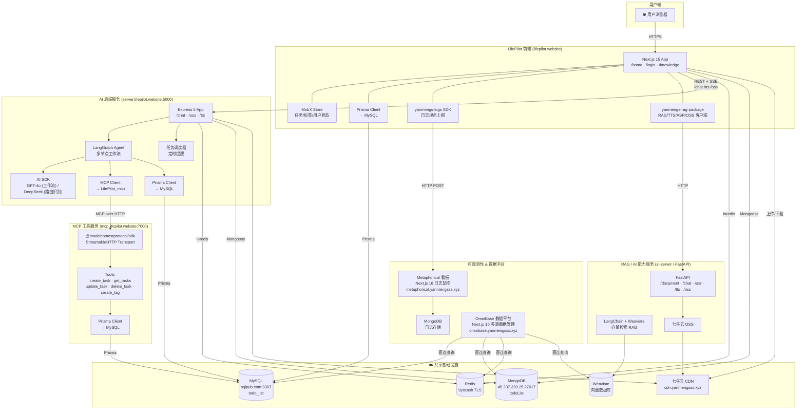

---

## 五、核心功能工作流

本章详细描述 LifePilot 四条核心业务链路：AI 对话（SSE 流式）、TTS 语音合成、ASR 语音识别、知识库（RAG 文档入库与检索问答）。

### 5.1 AI 对话（SSE 流式）

用户输入自然语言或语音，前端通过 **Server-Sent Events（SSE）** 实时接收 AI 回复流，避免了 HTTP 长轮询的性能损耗。服务端在返回第一个 chunk 之前会先保存用户消息到 MongoDB，对话结束后再保存 AI 最终回复，确保历史记录完整。

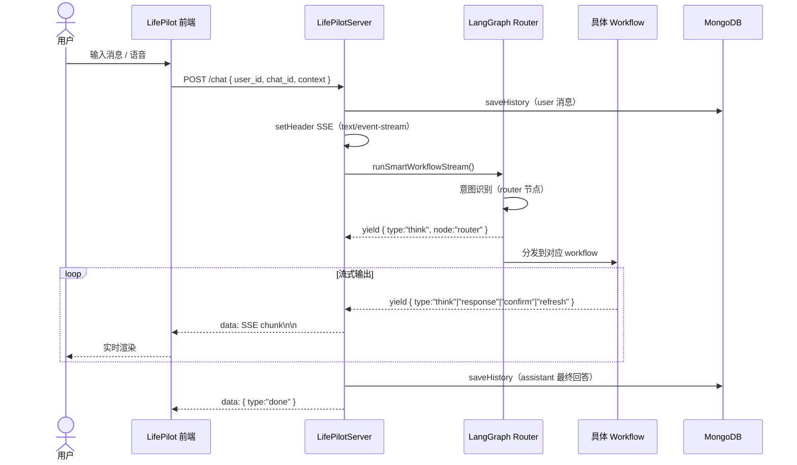

**SSE 事件类型说明：**

每个 SSE chunk 携带一个 `type` 字段，前端根据类型决定渲染行为：

| type | 含义 |
|------|------|
| `id` | 新对话的 chat_id + message_id |
| `think` | 节点推理过程（显示为"思考中..."） |
| `response` | 最终回复内容（流式追加渲染） |
| `confirm` | buildToDo 暂停，前端展示 accept/reject 按钮 |
| `thread_id` | buildToDo checkpoint 的线程 ID，供 resume 用 |
| `refresh` | 通知前端刷新任务列表 |
| `done` | 流结束 |

---

### 5.2 TTS（文字转语音）工作流

当 AI 回复需要以语音播放时，前端将文本发送到 LifePilotServer，由后端进行 **Markdown 清洗**（去除代码块、`#`、`**` 等符号）后，再通过 `yanmengs-rag-package` SDK 转发给 `ai-server`（FastAPI），最终将 MP3 音频流 pipe 回前端直接播放。后端代理的好处是 FastAPI 服务地址和鉴权 Key 不暴露给客户端。

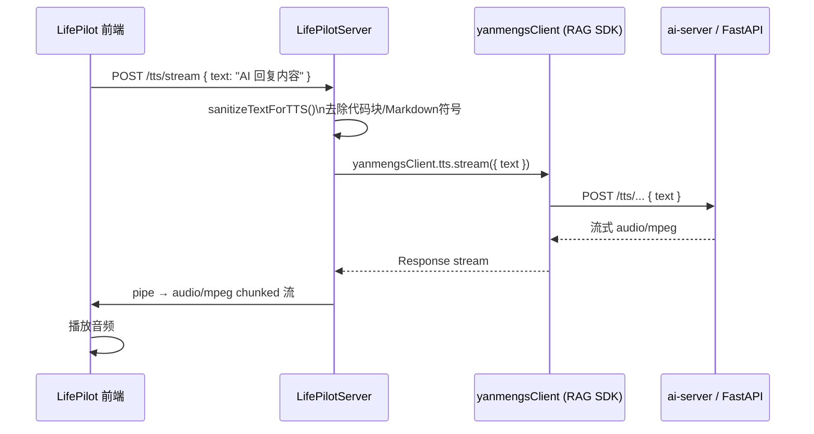

---

### 5.3 ASR（语音识别）工作流

用户在前端长按录音，浏览器通过 `MediaRecorder` API 采集音频，录音结束后以 `multipart/form-data` 格式直接 POST 到 `ai-server`（FastAPI），跳过 LifePilotServer，以降低延迟。`ai-server` 验证 APP_KEY 后调用 **SiliconFlow 的 SenseVoiceSmall 模型**完成转写，将识别文本填回前端对话框并自动触发 AI 对话流程（详见 4.1）。

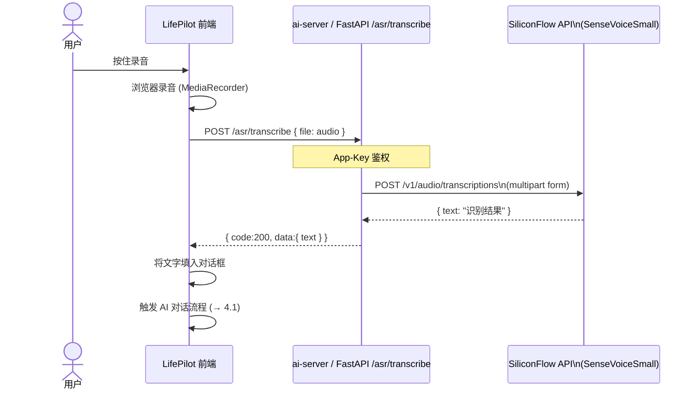

---

### 5.4 知识库（RAG）工作流

知识库分为**文档入库**和**检索问答**两个阶段，分别使用不同的数据链路。

#### 文档入库

用户上传文件后，前端先将文件**直传七牛云 OSS** 获取 CDN URL，再将 URL 交给 `ai-server` 处理。`ai-server` 从 CDN 下载文件，通过对应的解析器（PDF/Word/Excel/PPT/图片/TXT）提取文本，切块后写入 **Weaviate 向量数据库**，以用户 ID 和项目名隔离数据。前端直传七牛云的设计避免了大文件经过 Node.js 服务器，减少后端压力。

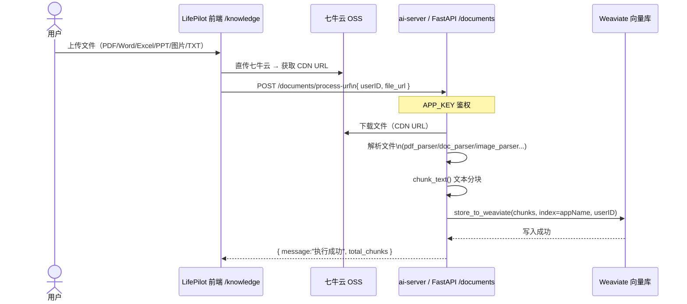

#### 检索问答（RAG Workflow）

当用户提问触发 `rag` workflow 时，LangGraph 调用 `yanmengsClient.chat.ask()` 向 `ai-server` 发出检索请求。`ai-server` 在 Weaviate 中按用户 ID 过滤后取 Top-K 相关文本块，拼装 RAG Prompt 交给 GPT-4o 生成答案。若未命中（向量相似度不足），则 fallback 到普通 LLM 问答，保证用户始终得到回复。

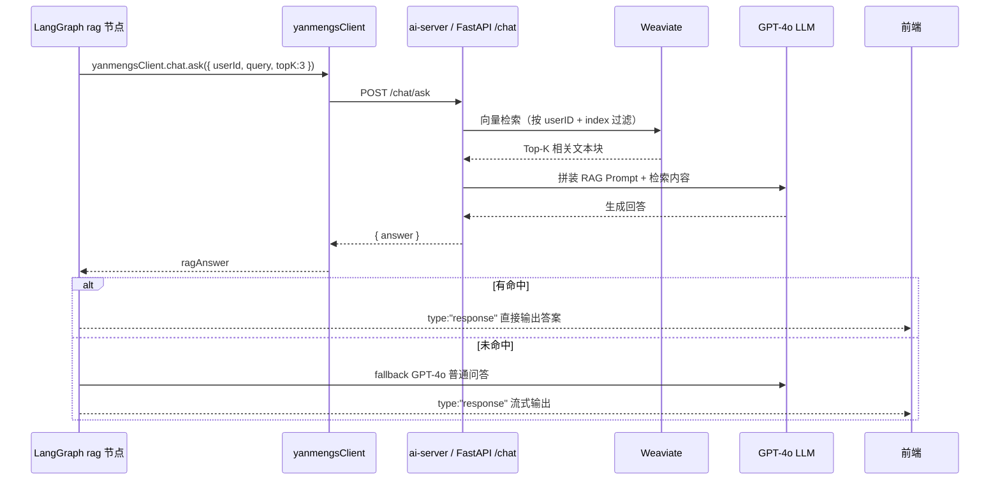

---

### 5.5 异步任务调度与邮件提醒机制

LifePilot 具备基于 **Redis Zset（有序集合）** 和 **Node.js 定时轮询** 的高性能异步任务调度系统，专用于到期待办任务的邮件提醒。架构保证了高效性、无阻塞和强容错能力。

#### 核心调度与派发流程

1. **抢占式轮询 (Redis Zrangebyscore + Zrem)**
   - 后端启动一个内置的 Scheduler，每次循环通过 `zrangebyscore` 从 Redis 的 `scheduler:tasks` 队列（Score 为触发时间戳）中拉取当前时间应该触发提醒的任务 ID。
   - 为了防止可能的并发重复处理，拉取后立刻通过 `zrem` 将任务出队。只有 ZREM 抢占成功（返回 1）的进程才会接管处理。
2. **状态判定与邮件发送 (Nodemailer)**
   - 调度器从 MySQL (Prisma) 中获取任务最新详情和用户配置的提醒频率（`tipsFrequency`）。如果任务由于前端操作已经被删除或标记为完成，则静默丢弃。
   - 若任务已晚于截止时间 (`endAt`)，更新数据库状态为 `timeout`，并通过 `Nodemailer` 及定制的 HTML 模板向用户邮箱发送“任务超时”告警邮件。
   - 若任务仍在进行中，则发送格式优美的“任务即将到期提醒”通知。
3. **循环再调度 (Zadd)**
   - 邮件发送完成后，系统根据用户的提醒频率（如每 1 小时）计算下一次触发时间。如果下次触发时间仍早于任务截止时间，则通过 `zadd` 再次放入 Redis Zset 挂起等待；否则将最终的到期时间作为最后一次提醒。
   
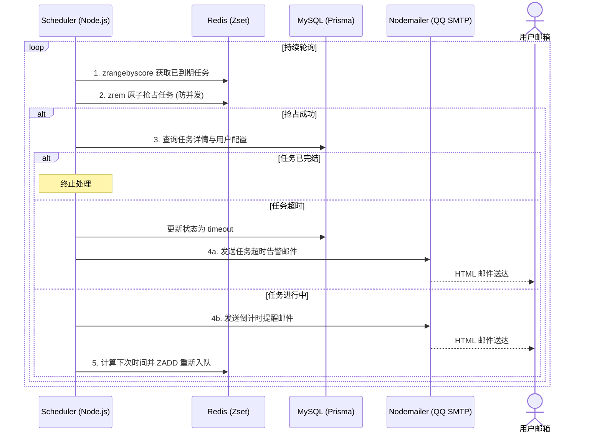

---

## 六、LangGraph Agent 工作流详解

LangGraph 是整个 AI 对话能力的核心，运行于 `LifePilotServer` 中。所有对话请求经由顶层 **Router 节点**进行意图识别，路由到 5 条工作流之一。每条工作流在正式处理前都会执行两个**公共前置节点**：

- **`get_time`**：获取当前时间（注入到 Prompt，使 LLM 感知时区和日期）
- **`prepare_context`**：从 MongoDB 拉取历史对话记录 + 从 MySQL 拉取用户当前任务列表

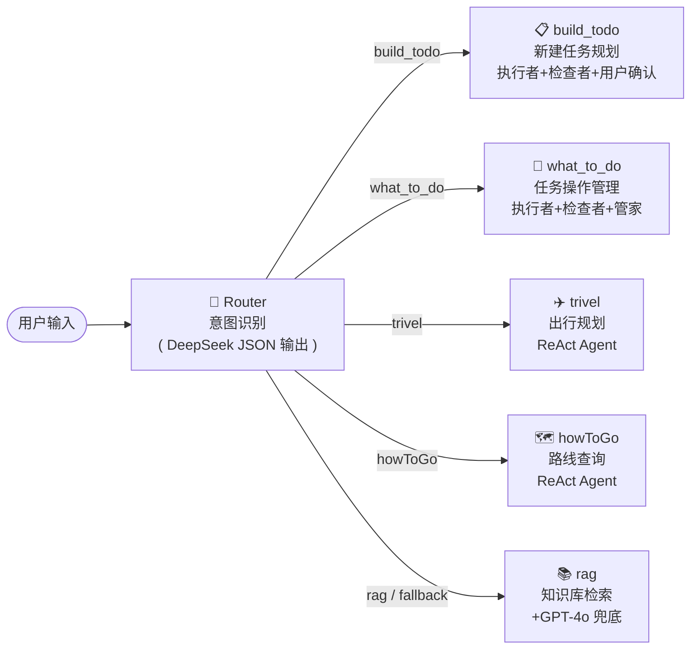

---

### 6.1 build_todo — 新建任务规划（执行者 × 检查者 × 用户确认 × MCP）

这是最复杂的 workflow，包含**人在回路（Human-in-the-Loop）**机制。当用户表达"帮我规划今天的任务"之类的意图时触发。

整个流程采用**三角色 + 用户确认**模式：
1. **执行者（executor）** 分析用户需求，生成包含 `tips`（计划建议）和 `list`（任务列表 JSON）的结构化输出
2. **检查者（inspector）** 验证输出质量，不通过则驱动执行者重新生成（循环）
3. **formatter** 将结构化 JSON 格式化为对用户友好的 Markdown + JSON 代码块
4. **user_judgment** 调用 `interrupt()` 中断工作流，前端显示"接受/拒绝"按钮
5. 用户接受后，**save_to_mcp** 通过 MCP 协议批量写入 MySQL，并通知前端刷新任务列表

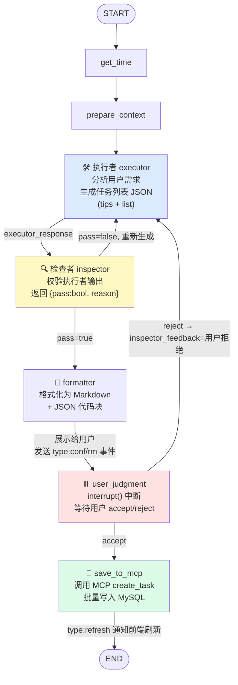

**状态字段：**

| 字段 | 说明 |
|------|------|
| `executor_response` | 执行者输出的 JSON（tips + list） |
| `inspector_feedback` | 检查者反馈（pass/reason）|
| `manager_response` | 格式化后的最终展示内容 |
| `list` | 任务列表 JSON（持久化到 checkpoint） |
| `thread_id` | MemorySaver checkpoint ID，用于 resume |

**人在回路交互：**

- 工作流在 `user_judgment` 节点调用 `interrupt()` 暂停，前端收到 `type:confirm` 事件展示确认按钮
- 用户点击后，前端 POST `/chat/judgment { thread_id, decision: "accept"|"reject" }`
- 后端调用 `resumeBuildToDoStream(thread_id, decision)` 恢复工作流

---

### 6.2 what_to_do — 任务操作管理（执行者 × 检查者 × 管家）

针对"帮我查看/修改/删除哪个任务"类意图的三角色协作模式。与 `build_todo` 不同，本 workflow **不调用 MCP、不写数据库**，定位为纯分析与建议输出，由"管家"角色以自然语言向用户呈现结论。

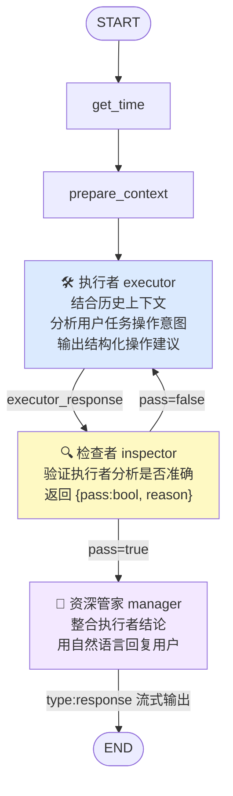

**三角色职责对比：**

| 角色 | 节点 | 输出格式 | 作用 |
|------|------|---------|------|
| **执行者** | `executor` | 结构化 JSON / 分析报告 | 理解用户意图，提取关键信息 |
| **检查者** | `inspector` | `{ pass: boolean, reason: string }` | 质量把关，循环直至通过 |
| **管家** | `manager` | 自然语言（流式） | 润色包装，直接与用户对话 |

---

### 6.3 trivel & howToGo — 出行规划（ReAct Agent）

两者均使用 **ReAct（Reason + Act）** 架构：单一 `planner` 节点，LLM 开启 `useTools: true`，**自主决定何时调用工具**（高德地图 MCP、小红书 MCP）、何时输出最终回答。

ReAct 模式的优势在于无需预定义固定的节点链路，LLM 可在"推理→调用工具→观察结果→再推理"的循环中自主解决复杂的多跳问题，适合开放式出行规划与内容搜索场景。

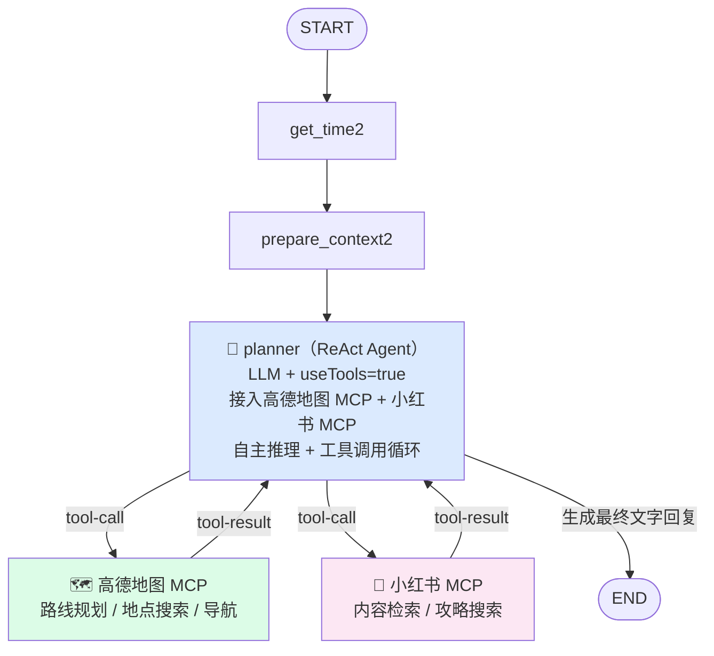

**已接入 MCP 工具：**

| MCP 工具 | 用途 | 接入 Workflow |
|---------|------|---------------|
| **高德地图 MCP** | 路线规划、地点搜索、导航信息 | `trivel` / `howToGo` |
| **小红书 MCP** | 旅游攻略检索、目的地内容搜索 | `trivel` |

**ReAct 与三角色模式对比：**

| | ReAct (trivel/howToGo) | 三角色 (build/what_todo) |
|---|---|---|
| 节点数 | 1（planner 自循环） | 3+（executor/inspector/manager） |
| 工具调用 | LLM 自主决策（useTools） | 由 MCP Client 固定节点调用 |
| 循环控制 | LLM 内部 | LangGraph 条件边 |
| 适合场景 | 开放式搜索/规划 | 结构化操作/数据写入 |

---

### 6.4 rag — 知识库问答（RAG + GPT-4o 兜底）

当用户询问与其上传文档相关的问题时，Router 将其路由到 `rag` workflow。`rag` 节点调用 `yanmengsClient.chat.ask()` 在 Weaviate 中进行向量检索，若命中则直接将答案以 `type:response` 流式推给前端；若未命中（检索内容为空或相似度过低），则 fallback 到 GPT-4o 原生 LLM 进行普通问答，确保用户始终得到有效回复。

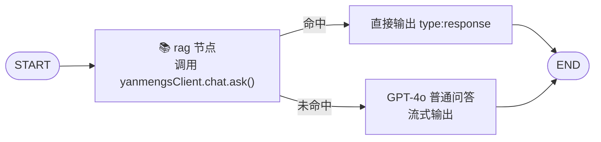

---

## 七、MCP 工具服务（LifePilot_mcp）

`LifePilot_mcp` 是基于 **Model Context Protocol** 构建的工具微服务，专为 AI Agent 提供对任务数据的受控访问。AI Agent（LifePilotServer 内的 MCP Client）通过标准 MCP 协议（Streamable HTTP Transport）与其通信，工具调用结果经 Prisma 落库到 MySQL。

该设计的优势：将数据库操作权限收口到 MCP 服务，AI Agent 只能调用预定义工具，无法执行任意 SQL，提升了系统安全性。

MCP 服务器提供 5 个工具，供 AI Agent 通过 MCP 协议操作 MySQL 中的任务数据：

| 工具名 | 功能 | 必填参数 |
|--------|------|---------|
| `create_task` | 创建任务 | `userID`, `title` |
| `get_tasks` | 查询任务列表（多条件过滤）| `userID` |
| `update_task` | 更新任务 | `userID`, `id` |
| `delete_task` | 删除任务（支持批量）| `userID`, `id` |
| `create_tag` | 创建标签 | `userID`, `tags[]` |

**调用链：** `LifePilotServer (McpClient)` → HTTP → `LifePilot_mcp (:7000/mcp)` → `Prisma` → `MySQL`

---

## 八、日志可观测链路

LifePilot 内置了一套轻量级可观测性方案，通过 `yanmengs-logs` SDK 在前端业务代码中埋点，将日志实时上报至 **Metaphorical 看板**（独立 Next.js 服务），日志持久化到 MongoDB。开发者/运维人员可通过看板按项目、时间、日志等级筛选查看运行状态。

该链路完全独立于主业务链路，不影响 LifePilot 的正常运行，即使 Metaphorical 服务不可用，SDK 内部的错误也不会传播到主应用。

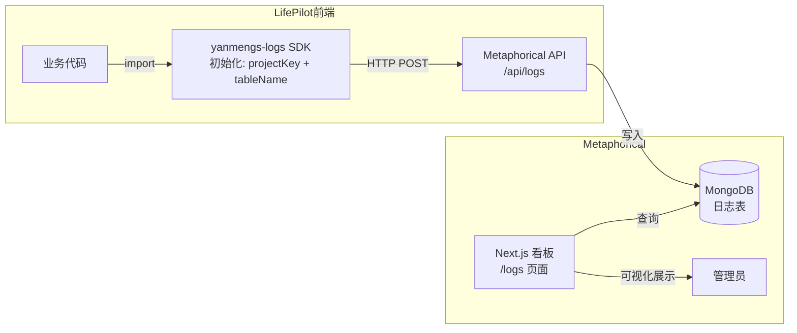

---

## 九、共享 SDK 依赖关系

项目通过两个 SDK 包实现能力复用，避免重复造轮子：

- **`yanmengs-rag-package`**（npm 发布包 `^1.0.1`）：封装了对 `ai-server` 的 RAG、TTS、ASR、七牛 OSS 的 HTTP 调用，供 `LifePilot` 前端和 `LifePilotServer` 后端共用，统一了鉴权和接口规范
- **`yanmengs-logs`**（**正式 npm 发布包 `^1.0.0`**）：轻量日志上报 SDK，已从本地文件依赖升级为正式 npm 包，可在任意项目中安装使用，通过 `projectKey + tableName` 初始化后即可上报日志

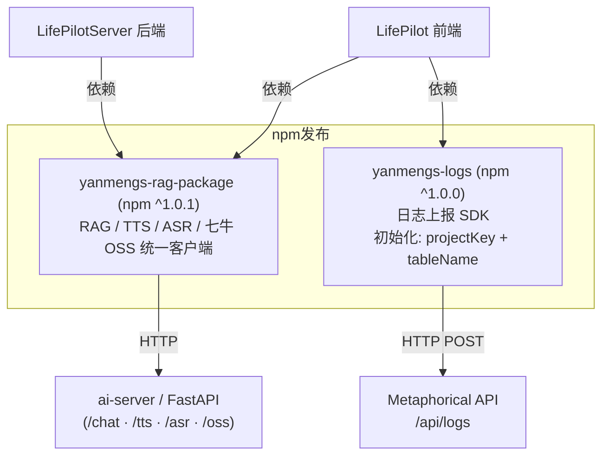

---

## 十、部署架构

所有服务均通过 **Jenkins CI/CD + Docker** 完成自动化构建和部署。每个子项目有独立的 `Jenkinsfile`，触发 Pipeline 后自动构建 Docker 镜像并推送，容器启动后通过 Nginx 反向代理绑定到对应域名。

- **`LifePilot`**：`next build && next start`，映射到 `lifepilot.website`
- **`LifePilotServer`**：`tsx app.ts` 启动，监听 `:5000`，映射到 `server.lifepilot.website`
- **`LifePilot_mcp`**：编译后 `node dist/index.js` 启动，监听 `:7000`，映射到 `mcp.lifepilot.website`
- **`ai-server`**：`uvicorn main:app` 启动 FastAPI
- **`Metaphorical`**：`next build && next start -p 6500`，Jenkins + Docker 部署，映射到 `metaphorical.yanmengsss.xyz`
- **`OmniBase`** (`weaviate-manager`)：`next build && next start`，Jenkins + Docker 部署，映射到 `omnibase.yanmengsss.xyz`

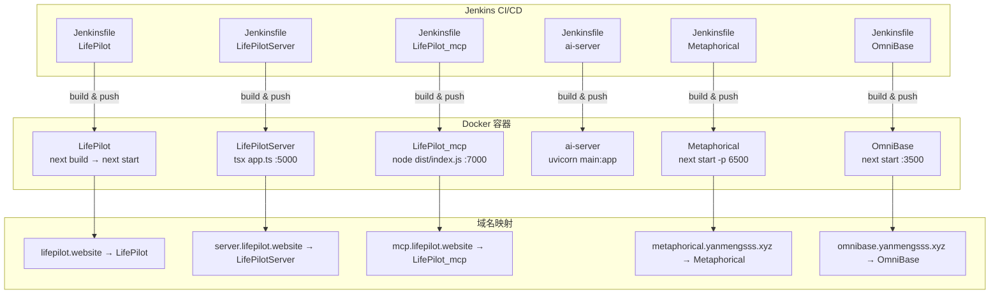

---

## 十一、技术栈汇总

| 分层 | 技术 |
|------|------|
| **前端框架** | Next.js 15/16 · React 19 · TypeScript |
| **UI 组件** | shadcn/ui · Radix UI · TailwindCSS |
| **状态管理** | MobX 6 |
| **后端框架** | Express 5 (Node.js) · FastAPI (Python) |
| **AI/Agent** | LangGraph · LangChain · Vercel AI SDK · GPT-4o（主力 LLM）· DeepSeek（仅路由意图识别）|
| **Agent 模式** | Router → ReAct（trivel/howToGo） / 三角色（build/what_todo） / RAG |
| **MCP** | @modelcontextprotocol/sdk（Streamable HTTP Transport）· 高德地图 MCP · 小红书 MCP |
| **Human-in-Loop** | LangGraph `interrupt()` + `Command({ resume })` + MemorySaver |
| **ORM** | Prisma 6（MySQL）· Mongoose（MongoDB）|
| **数据库** | MySQL（主数据）· MongoDB（对话历史/日志）· Redis（缓存/会话）· Weaviate（向量）|
| **语音** | TTS: yanmengsClient → FastAPI / ASR: SiliconFlow SenseVoiceSmall |
| **存储/CDN** | 七牛云 OSS + CDN |
| **部署** | Docker + Jenkins CI/CD |
| **包管理** | pnpm |
| **日志 SDK** | `yanmengs-logs`（正式 npm 包 `^1.0.0`，`projectKey + tableName` 初始化）|
| **数据平台** | OmniBase（`omnibase.yanmengsss.xyz`）— 多源可视化：Weaviate / MySQL / MongoDB / Redis |
| **日志看板** | Metaphorical（`metaphorical.yanmengsss.xyz`）— 集中式日志监控看板 |
