# 图汇总（含 Mermaid）

## 第

### 图 3-1 用户功能用例关系图
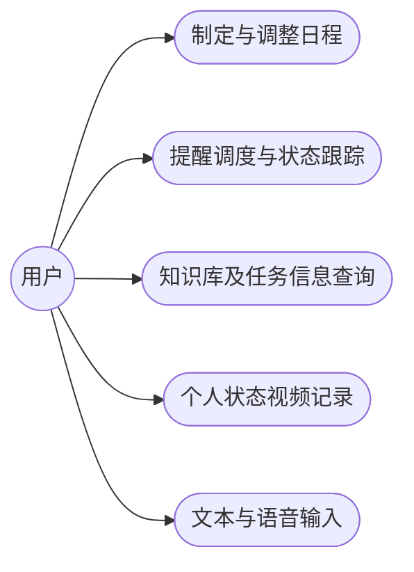

### 图 3-2 日程制定与调整功能实现流程
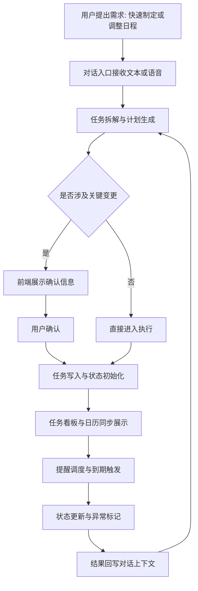

### 图 3-3 知识库及任务信息查询功能实现流程
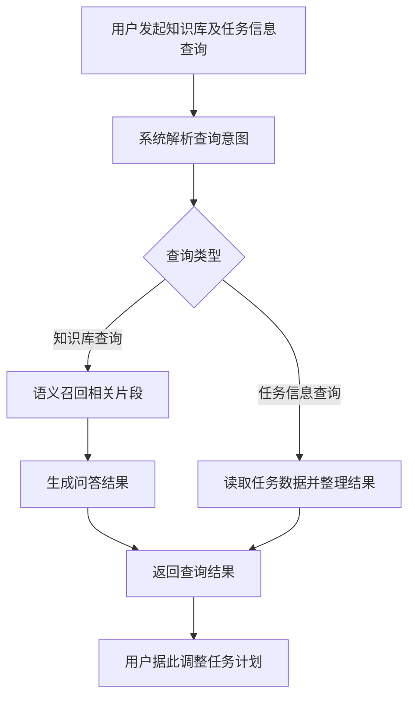

### 图 3-4 WebRTC 个人状态记录功能实现流程
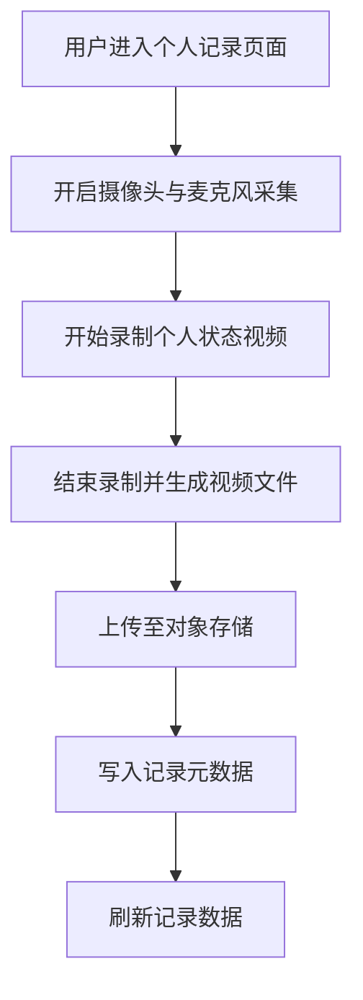

### 图 3-5 文本与语音双通道输入功能实现流程
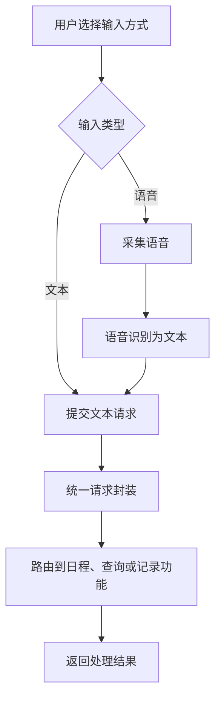

### 图 3-6 任务调度功能实现流程
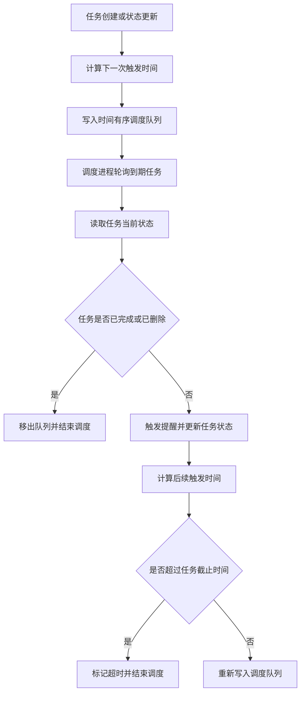

## 第

### 图 4-1 设计目标与能力映射
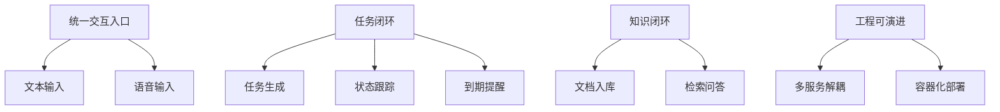

### 图 4-2 章节衔接关系
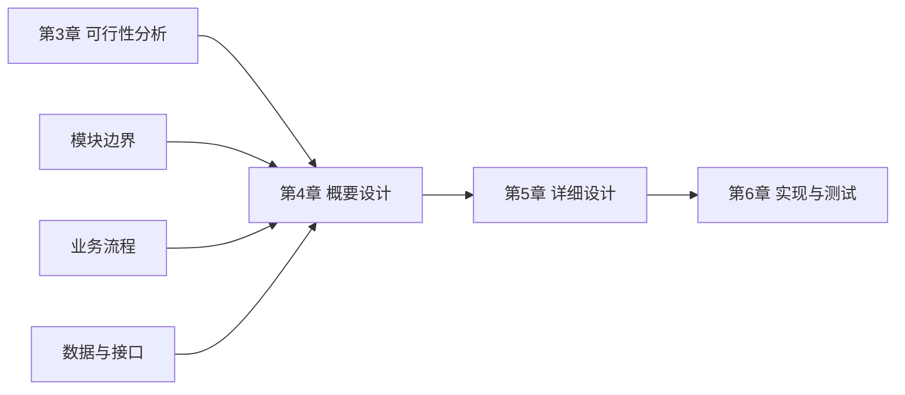

### 图 4-3 系统总体架构图
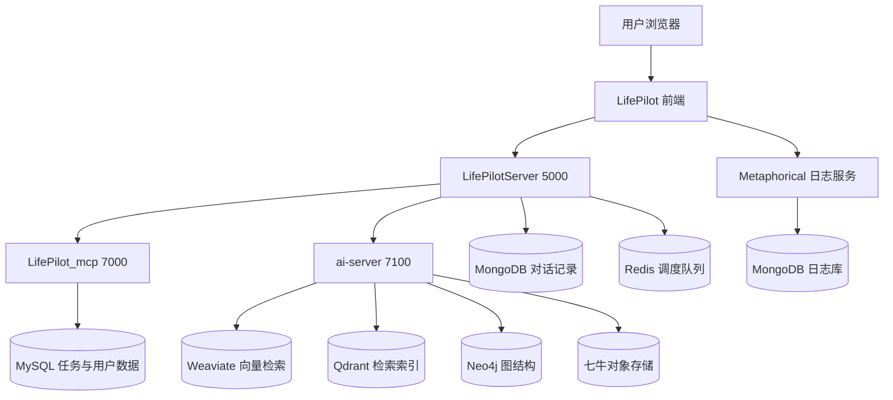

### 图 4-4 业务协同时序图
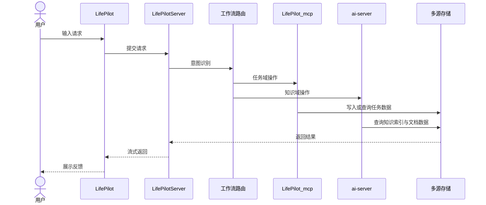

### 图 4-5 前端功能结构图
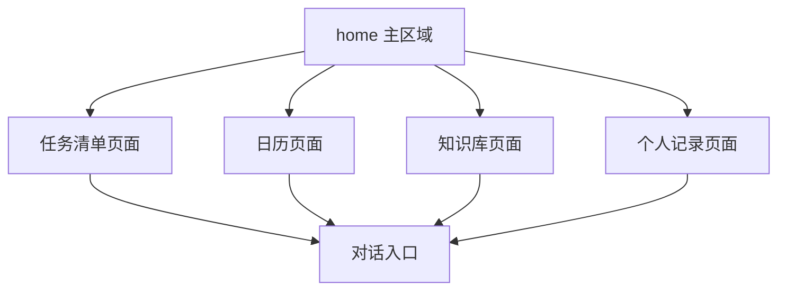

### 图 4-6 业务服务工作流结构图
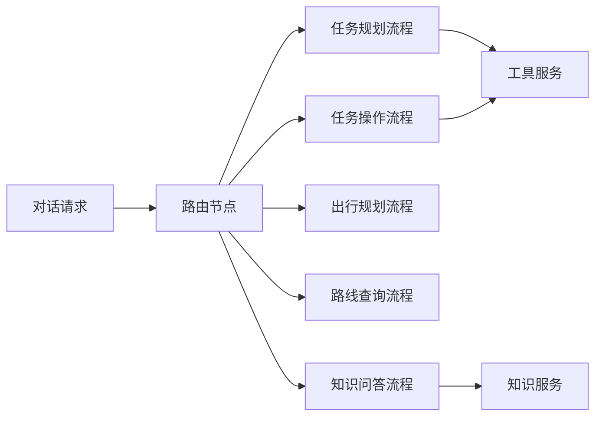

### 图 4-7 分层职责视图
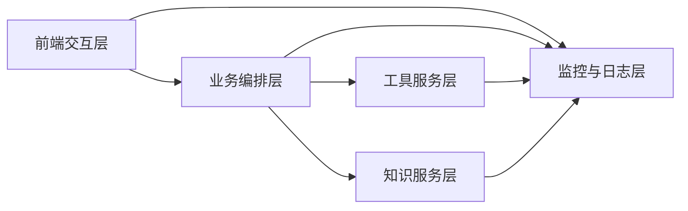

### 图 4-8 任务状态模型图
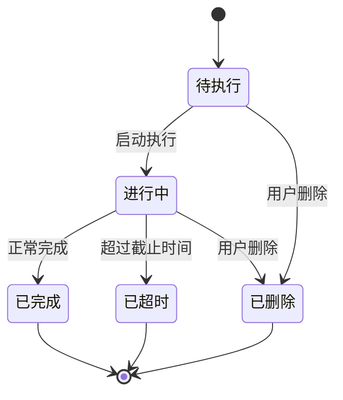

### 图 4-9 对话事件协议图
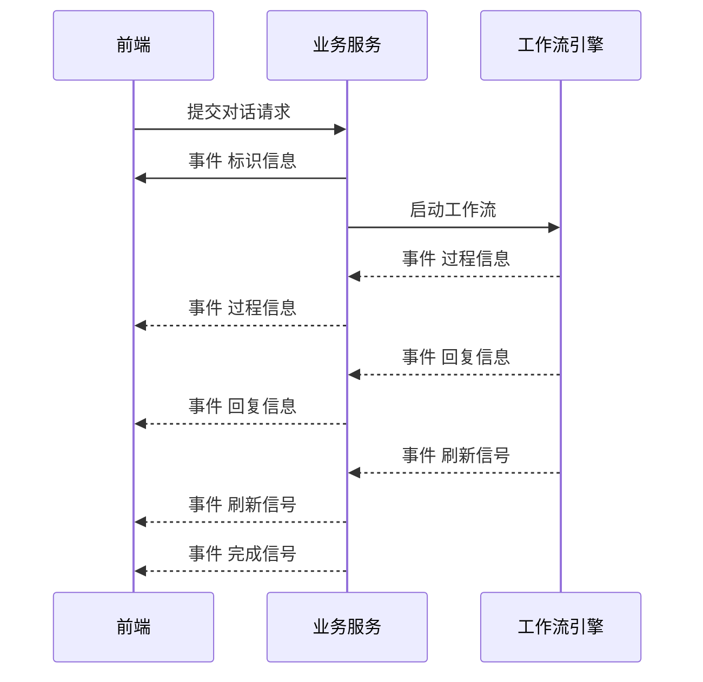

### 图 4-10 知识索引结构图
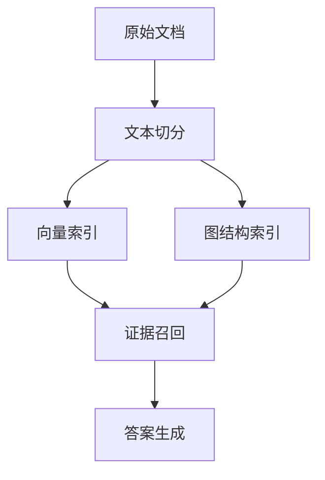

### 图 4-11 调度协作视图
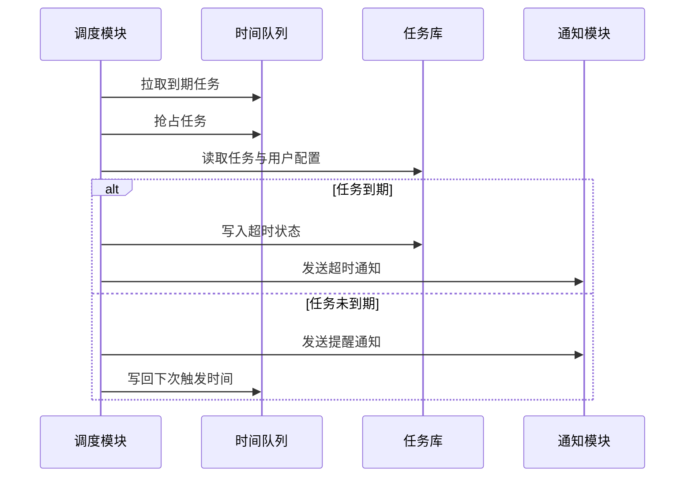

### 图 4-12 数据存储映射图
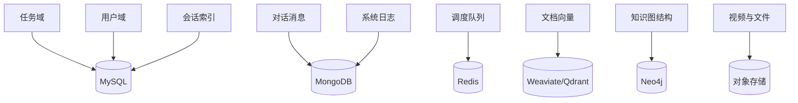

### 图 4-13 接口分层关系图
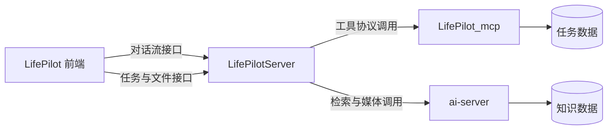

## 第

### 图 5-1 登录认证总流程图
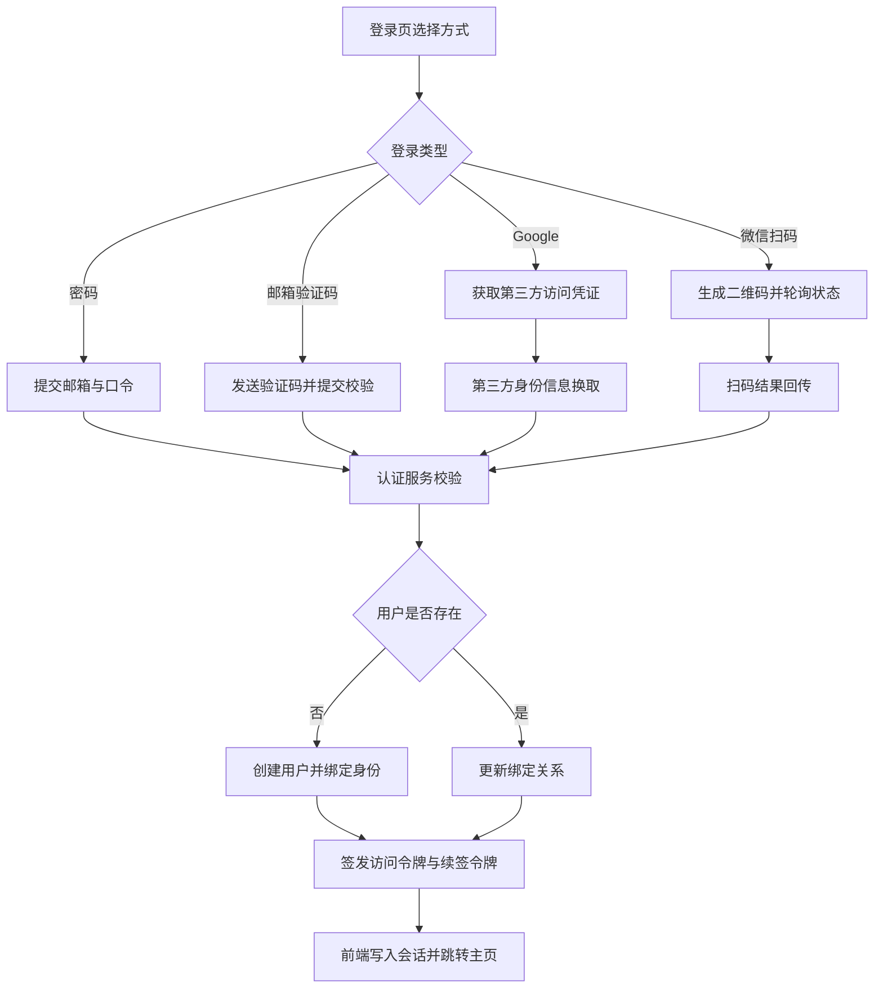

### 图 5-2 会话令牌生命周期图
```mermaid
stateDiagram-v2
    [*] --> 未登录
    未登录 --> 已登录: 登录成功并签发令牌
    已登录 --> 可续签: 访问令牌过期
    可续签 --> 已登录: 续签成功
    可续签 --> 未登录: 续签失败
    已登录 --> 未登录: 主动退出或令牌失效
```

### 图 5-3 任务状态迁移图
```mermaid
stateDiagram-v2
    [*] --> 待执行
    待执行 --> 进行中: 启动处理
    进行中 --> 已完成: 完成打卡
    待执行 --> 已完成: 直接完成
    待执行 --> 已超时: 超过截止时间
    进行中 --> 已超时: 超过截止时间
    待执行 --> 已删除: 用户删除
    进行中 --> 已删除: 用户删除
    已完成 --> [*]
    已超时 --> [*]
    已删除 --> [*]
```

### 图 5-4 任务写入与更新流程图
```mermaid
flowchart TD
    A[任务创建请求] --> B{来源}
    B -->|面板直建| C[校验字段并写入任务表]
    B -->|代理规划| D[用户确认后批量写入]
    C --> E[计算下次提醒时间]
    D --> E
    E --> F[写入时间队列]
    F --> G[前端刷新清单与日历]
    G --> H[后续更新: 编辑/完成/删除]
    H --> I[同步更新队列与任务状态]
```

### 图 5-5 任务调度时序图
```mermaid
sequenceDiagram
    participant SCH as 调度进程
    participant REDIS as 时间队列
    participant MYSQL as 任务库
    participant MAIL as 通知服务

    SCH->>REDIS: 拉取到期任务
    SCH->>REDIS: 抢占任务
    REDIS-->>SCH: 返回抢占结果
    SCH->>MYSQL: 读取任务与用户提醒配置
    alt 超过截止时间
        SCH->>MYSQL: 写入超时状态
        SCH->>MAIL: 发送超时通知
    else 未超过截止时间
        SCH->>MAIL: 发送到期提醒
        SCH->>REDIS: 写回下一次触发时间
    end
```

### 图 5-6 个人记录与贴图联动流程图
```mermaid
flowchart TD
    A[开启摄像头预览] --> B[画布实时渲染]
    B --> C[插入贴图并调整位置尺寸]
    C --> D[开始录制]
    D --> E[停止录制并封装视频]
    E --> F[上传对象存储]
    F --> G[写入记录元数据]
    G --> H[刷新视频列表并支持回放]

    I[上传贴图素材] --> J[对象存储写入]
    J --> K[写入贴图库元数据]
    K --> C
```

### 图 5-7 记录对象关系图
```mermaid
flowchart LR
    U[用户] --> RV[记录视频]
    U --> ST[贴图库素材]
    ST --> CANVAS[画布实例]
    CANVAS --> RV
```

### 图 5-8 代理路由分发图
```mermaid
flowchart LR
    IN[用户输入] --> R[路由决策]
    R --> W1[build_todo]
    R --> W2[what_to_do]
    R --> W3[trivel]
    R --> W4[howToGo]
    R --> W5[rag]
```

### 图 5-9 `build_todo` 节点级工作流图
```mermaid
flowchart TD
    A[get_time 时间注入 统一当前时间基准]
    B[prepare_context 上下文准备 加载历史对话与任务快照]
    C[executor 任务草案生成 拆解标题/截止时间/描述/标签]
    D[inspector 草案校验 校验格式、冲突与语义一致性]
    E{校验分流}
    F[formatter 结果格式化 转成前端可确认文本]
    G[user_judgment 人工判断中断 等待 accept/reject]
    H{用户决策}
    I[save_to_mcp 任务写入 调用工具服务批量落库]
    J[refresh event 刷新通知 驱动任务列表重拉]
    K((END))

    A --> B --> C --> D --> E
    E -->|未通过且未达阈值| C
    E -->|通过或达到重试阈值| F
    F --> G --> H
    H -->|reject| C
    H -->|accept| I --> J --> K
```

### 图 5-10 `what_to_do` 节点级工作流图
```mermaid
flowchart TD
    A[get_time 时间注入 统一时间表达基准]
    B[prepare_context 上下文准备 加载历史对话与任务快照]
    C[executor 事实层生成 输出任务分析与建议草稿]
    D[inspector 质量校验 检查遗漏、范围偏移、指代错误]
    E{校验分流}
    F[manager 结果整理 输出自然表达]
    G[direct_output 直接输出 达到拒绝阈值时返回当前结果]
    H((END))

    A --> B --> C --> D --> E
    E -->|通过| F --> H
    E -->|不通过且未达阈值| C
    E -->|不通过且达到阈值| G --> H
```

### 图 5-11 `trivel` 节点级工作流图
```mermaid
flowchart TD
    A[get_time 时间注入 提供当前时段信息]
    B[prepare_context 上下文准备 处理连续追问与省略指代]
    C[planner 规划节点 拆解行程目标并选择工具]
    D{工具选择}
    E[maps tools 地理/天气/距离查询]
    F[content tools 攻略/地点/活动信息查询]
    G[planner 结果整合 合并工具结果并重规划]
    H[response 输出行程建议]
    I((END))

    A --> B --> C --> D
    D -->|需要地理信息| E --> G
    D -->|需要内容信息| F --> G
    D -->|信息已充分| H --> I
    G --> C
    C -->|完成规划| H
```

### 图 5-12 `howToGo` 节点级工作流图
```mermaid
flowchart TD
    A[get_time 时间注入 提供出行时段基准]
    B[prepare_context 上下文准备 解析历史位置指代]
    C[planner 规划节点 解析起终点与出行意图]
    D{位置信息是否完整}
    E[maps_ip_location 定位补全起点]
    F[maps_geo 地理编码 解析终点坐标]
    G{交通方式选择}
    H[maps_direction_driving 驾车路径]
    I[maps_direction_transit_integrated 公共交通路径]
    J[maps_direction_walking/bicycling 步行或骑行路径]
    K[planner 方案整合 比较时长、换乘与可达性]
    L[response 输出路线方案]
    M((END))

    A --> B --> C --> D
    D -->|起点缺失| E --> C
    D -->|信息完整| F --> G
    G --> H --> K
    G --> I --> K
    G --> J --> K
    K --> L --> M
```

### 图 5-13 事件协议时序图
```mermaid
sequenceDiagram
    participant FE as 前端
    participant BE as 业务服务
    participant WF as 工作流
    FE->>BE: 提交请求
    BE-->>FE: id
    BE->>WF: 启动流程
    WF-->>FE: think
    WF-->>FE: response
    WF-->>FE: confirm/thread_id
    FE->>BE: judgment
    WF-->>FE: refresh
    WF-->>FE: done
```

### 图 5-14 RAG 入库管线图
```mermaid
flowchart TD
    A[接收文件地址] --> B[下载原始文件]
    B --> C[按格式解析文本]
    C --> D[语义切分]
    D --> E[批量向量化]
    E --> F[写入向量索引]
    D --> G[抽取实体关系]
    G --> H[写入图索引]
    F --> I[回写处理状态]
    H --> I
```

### 图 5-15 RAG 问答节点级工作流图
```mermaid
flowchart TD
    A[user query 用户问题]
    B[agent.rag RAG执行节点 调用知识服务]
    C{是否命中知识片段}
    D[rag_fallback 回退普通回答]

    E[query_analyzer 意图识别与查询改写]
    F{意图分流}
    G[chat_node 闲聊直接回复]
    H[retrieval_node 多路召回 稠密+稀疏+关系检索]
    I[filter_merge_node 去重与权限过滤]
    J[reranker_node 候选重排]
    K[generator_node 答案生成与证据组织]
    L[response 返回答案]

    A --> B --> C
    C -->|未命中| D --> L
    C -->|命中| E --> F
    F -->|chat| G --> L
    F -->|retrieval| H --> I --> J --> K --> L
```

### 图 5-16 数据落点图
```mermaid
flowchart TB
    BIZ[业务层] --> MYSQL[(MySQL)]
    BIZ --> MONGO[(MongoDB)]
    BIZ --> REDIS[(Redis)]
    BIZ --> VEC[(Qdrant/Weaviate)]
    BIZ --> GRAPH[(Neo4j)]
    BIZ --> OSS[(对象存储)]
```

### 图 5-17 核心实体关系图
```mermaid
erDiagram
    USER ||--o{ TASK : owns
    USER ||--o{ TAGS : owns
    USER ||--o{ CHAT_INDEX : owns
    USER ||--o{ RECORD_VIDEO : owns
    USER ||--o{ STICKER : owns
    USER ||--o{ FOLDER : owns
    CHAT_INDEX ||--o{ CHAT_MESSAGE : contains
```

## 第

### 图 6-1 生产部署拓扑图
```mermaid
flowchart TB
    USER["用户浏览器"] --> NGINX["Nginx反向代理"]

    NGINX --> FE["lifepilot-frontend:3000"]
    NGINX --> BE["lifepilot-server:5000"]
    NGINX --> MCP["lifepilot-mcp:7000"]
    NGINX --> AI["rag-server:7100"]

    FE --> BE
    FE --> AI
    BE --> MCP

    BE --> MYSQL["MySQL"]
    BE --> REDIS["Redis"]
    BE --> MONGO["MongoDB"]

    AI --> QDRANT["Qdrant"]
    AI --> NEO4J["Neo4j"]
    AI --> WEAVIATE["Weaviate（兼容层）"]
```

### 图 6-2 CI_CD 执行流水图
```mermaid
flowchart LR
    DEV["开发者提交代码"] --> GIT["Git仓库"]
    GIT --> TRIGGER["Jenkins触发流水线"]

    TRIGGER --> FEJOB["前端流水线\nCheckout -> Build -> Docker Build"]
    TRIGGER --> BEJOB["后端流水线\nCheckout -> Build -> Docker Build"]
    TRIGGER --> AIJOB["AI流水线\nCheckout -> Build -> Compose Build"]

    FEJOB --> FEDP["部署前端容器"]
    BEJOB --> BEDP["部署后端容器"]
    AIJOB --> AIDP["部署RAG及依赖容器"]

    FEDP --> HEALTH["健康检查"]
    BEDP --> HEALTH
    AIDP --> HEALTH
    HEALTH --> CLEAN["清理悬空镜像"]
```

### 图 6-3 build_todo 中断恢复流程图
```mermaid
flowchart TD
    START["用户输入任务需求"] --> CTX["加载时间与上下文"]
    CTX --> EXE["executor 生成任务JSON"]
    EXE --> INS["inspector 校验"]
    INS -- "不通过" --> EXE
    INS -- "通过" --> FMT["formatter 格式化输出"]
    FMT --> HITL["interrupt 等待用户确认"]

    HITL -- "reject" --> EXE
    HITL -- "accept" --> SAVE["save_to_mcp 批量创建任务"]
    SAVE --> REFRESH["发送 refresh 事件"]
    REFRESH --> END["流程结束"]
```

### 图 6-4 SSE 事件协议与前端状态图
```mermaid
stateDiagram-v2
    [*] --> Connecting
    Connecting --> Streaming: id
    Streaming --> Thinking: think
    Thinking --> Streaming: response
    Streaming --> Confirming: confirm
    Confirming --> Resuming: accept/reject
    Resuming --> Streaming: think/response
    Streaming --> Refreshing: refresh
    Refreshing --> Streaming
    Streaming --> Done: done
    Streaming --> Error: error
    Done --> [*]
    Error --> [*]
```

### 图 6-5 提醒调度抢占流程图
```mermaid
flowchart TD
    LOOP["轮询开始"] --> PULL["zrangebyscore 拉取到期任务"]
    PULL --> CHECK{"是否有到期任务"}
    CHECK -- "否" --> SLEEP["sleep 3s"]
    SLEEP --> LOOP

    CHECK -- "是" --> REM["zrem 抢占任务"]
    REM --> OWN{"抢占是否成功"}
    OWN -- "否" --> LOOP
    OWN -- "是" --> QDB["查询任务与用户信息"]
    QDB --> DONE{"任务是否完成"}
    DONE -- "是" --> LOOP
    DONE -- "否" --> TIMEOUT{"是否超时"}

    TIMEOUT -- "是" --> UPD["更新状态为 timeout"]
    UPD --> MAIL1["发送超时邮件"]
    MAIL1 --> LOOP

    TIMEOUT -- "否" --> MAIL2["发送提醒邮件"]
    MAIL2 --> NEXT["计算下一次触发时间"]
    NEXT --> READD["zadd 重新入队"]
    READD --> LOOP
```

### 图 6-6 知识入库异步回写状态图
```mermaid
sequenceDiagram
    participant U as 用户
    participant FE as 前端页面
    participant API as 前端API
    participant OSS as 对象存储
    participant AI as ai-server
    participant VS as Qdrant/Neo4j
    participant DB as MySQL(folder)

    U->>FE: 上传文件
    FE->>OSS: 上传原文件
    FE->>API: POST /api/knowledge
    API->>DB: 写入 alreadyRag=ragIng
    FE->>AI: POST /documents/process-url(fileID)
    AI->>OSS: 下载文件
    AI->>AI: 解析/切分/Embedding
    AI->>VS: 索引写入
    AI->>API: POST /api/file(success/fail)
    API->>DB: 更新 alreadyRag 与 ragError
    FE->>API: GET /api/knowledge 刷新状态
```

### 图 6-7 视频录制与上传管线图
```mermaid
flowchart TD
    CAM["摄像头+麦克风流"] --> CANVAS["Canvas 合成层"]
    STICKER["贴图库（拖拽/缩放）"] --> CANVAS
    CANVAS --> CAP["canvas.captureStream(60fps)"]
    CAP --> REC["MediaRecorder(webm/vp9,opus)"]
    REC --> STOP["停止录制触发 onstop"]
    STOP --> BLOB["生成视频Blob"]
    BLOB --> QN["七牛上传"]
    QN --> SAVE["保存视频元数据"]
    SAVE --> LIST["刷新最近视频列表"]
```

