# 第4章 系统总体设计

第3章给出了系统的需求边界，但需求能够稳定落地，还取决于整体设计是否能够同时承接结构化任务处理、知识检索、语音交互和外部工具协作等多类业务。若仅按普通信息管理系统组织服务，难以支撑模型路由、流式反馈和人工确认等环节；若把模型能力直接嵌入业务数据通路，又会增加耦合和控制风险。本章围绕功能模块划分、整体架构、Agent 协同方式以及数据模型展开说明，为后续详细实现提供设计依据。

## 4.1 系统功能模块划分与业务流程设计

总体设计首先要回答两个问题：系统由哪些模块构成，以及这些模块如何围绕用户需求形成完整流程。LifePilot 的业务主线并不复杂，入口始终是用户交互，差别在于输入会被分流到任务处理、知识问答、语音服务或出行辅助等不同链路。因此，功能划分不能停留在页面级罗列，而应体现各模块在业务闭环中的职责位置。

### 4.1.1 系统模块架构

从实现边界看，系统可以划分为核心应用层、工具服务层和数据存储层三个层次。核心应用层直接面向用户，负责交互承载与业务编排；工具服务层负责把模型能力和业务能力封装为可复用服务；数据存储层则根据数据类型提供差异化支撑。这样的划分方式，一方面有利于隔离界面逻辑、流程控制和底层存储，另一方面也便于后续独立扩展各子系统。

核心应用层包含前端主应用和对话编排服务两部分。前端主应用采用 Next.js 16 与 React 19 构建，承担任务管理、日历查看、知识库入口、语音交互和记录管理等界面功能，是用户感知系统能力的主要载体。对话编排服务则负责承接自然语言输入，对其进行意图判断，并把请求分发到不同工作流。该层的关键作用，不是直接完成所有业务，而是把复杂输入整理为可执行流程。

工具服务层包含任务工具服务与 AI 能力服务。前者以工具调用接口的形式封装任务和标签等业务操作，避免模型直接接触底层数据结构，从而降低错误写入带来的影响。后者负责文档解析、知识入库、混合检索、语音识别、语音合成等能力，为知识问答和多模态交互提供统一支撑。两类服务分离后，业务编排服务只需关注流程控制，不必同时承担文档处理和底层数据写入职责。

数据存储层依据访问模式进行区分。关系型数据库保存用户、任务和标签等主业务数据，缓存与队列服务承担会话状态和提醒调度，对话记录与日志适合放入文档型数据库，知识检索则由向量数据库和图数据库共同支撑，原始文件与录制内容交由对象存储保存。采用多种存储并行协作，并不是为了追求复杂架构，而是因为系统中的数据类型、读写频率和查询方式差异较大，单一存储很难同时满足全部要求。

### 4.1.2 业务流程设计

业务流程设计的重点，在于把不同功能组织成统一而可控的处理链路。LifePilot 以自然语言交互作为统一入口，用户不需要先判断自己应进入哪个页面或模式，系统会在接收输入后完成初步分流，再转入相应的业务流程。这样设计可以降低使用门槛，也能让任务管理、知识问答和出行辅助共用同一套交互入口。

任务规划流程对应系统最核心的业务闭环。用户提出待办需求后，系统先对输入内容进行理解和归类，再生成结构化任务方案，并通过校验环节检查时间信息、任务粒度和表达完整性。只有当结果满足要求后，系统才将其提交给用户确认。人工确认被放在写入业务数据之前，原因在于任务一旦落库，就会继续影响提醒、统计和日程展示；若省略该环节，模型输出中的偏差会被直接放大到后续流程。

知识问答流程由文档入库和检索应答两个阶段构成。文档入库阶段负责完成解析、切分、索引和关系抽取，为后续问答建立可检索基础；问答阶段则根据用户问题从向量检索、关键词检索和图谱检索等通道收集候选证据，再经过排序和整合后生成答复。把这两部分拆开处理，可以避免每次提问都重复进行重型文档处理，也让知识库状态管理更加清晰。

出行规划流程面向开放信息场景。用户提出地点、路线或攻略相关问题后，系统需要在推理过程中按需调用地图与内容检索能力，再把获取到的外部信息组织为可读结果。与知识问答不同，此类流程依赖实时信息，系统设计的关键不是预置静态答案，而是建立模型推理与外部工具调用之间的协作路径。

## 4.2 系统整体架构与 Agent 协同设计

功能模块解决了“系统由什么组成”的问题，整体架构和 Agent 协同机制则进一步回答“这些部分如何在运行时配合工作”。LifePilot 不仅要处理普通业务请求，还要承接流式对话、工具调用、文档检索和人工确认等异步环节，因此总体架构既要保持分层清晰，也要允许工作流在不同节点之间转移状态。

### 4.2.1 分层架构设计

系统总体上采用五层结构，包括用户层、网关层、服务层、AI 服务层和数据层。该设计遵循关注点分离原则：用户层负责交互承载，网关层负责统一接入与转发，服务层负责主业务流程控制，AI 服务层负责模型相关能力封装，数据层负责不同类型数据的持久化。分层后的各部分边界较清晰，便于后续替换单个服务而不必整体调整。

用户层支持桌面浏览器、移动端页面以及语音、视频等交互入口。前端主应用除了承担常规页面展示外，还需要处理流式消息呈现、文件上传、录音采集和多媒体记录等操作，因此用户层并不是单纯的视图层，而是包含一定交互控制能力。将这些入口统一放在同一应用内，有利于维持连续使用体验。

网关层负责对外提供统一访问入口，并将请求分发给后端服务。普通业务请求、流式对话请求和后续可扩展的实时通信需求，在传输特征上并不相同，因此需要在接入层提前区分。这样做的目的，是让后端服务能够围绕自身处理模式设计接口，而不必在每个服务内部重复处理接入问题。

服务层由前端服务、对话编排服务、任务工具服务和 AI 能力服务共同构成。其中，对话编排服务处于系统主流程的中心位置，承担请求路由、Agent 协调、流式输出和人工确认恢复等任务；任务工具服务负责面向模型封装业务操作；AI 能力服务则负责知识检索和语音处理。服务层内部采用职责分解方式组织，而不是把所有能力堆积到同一进程中，这有助于减小单点负担，也便于定位问题来源。

AI 服务层整合多种模型与外部信息能力，并根据任务类型选择适合的处理路径。复杂生成任务依赖通用大模型，意图识别采用轻量分类模型，知识问答再结合向量化、重排和生成模型完成闭环，出行场景还需要接入地图和内容平台的数据支持。模型能力被放在独立层次中，原因在于其更新频率高、供应方式多样，若直接嵌入业务层，会降低系统的演进灵活性。

数据层则面向结构化数据、会话状态、对话记录、检索索引和原始文件分别提供存储支撑。不同数据之间虽然存在关联，但不需要强行放入同一数据库维护。通过在业务层建立统一的数据访问边界，可以在保持存储异构的同时维持整体一致性。

### 4.2.2 Agent 协同机制

LifePilot 的智能交互不是单轮问答式调用，而是围绕图式工作流组织的多角色协同过程。选择图式工作流框架，主要是因为系统中存在条件分支、循环校验、人工中断和恢复执行等需求，线性调用链难以稳定承载这些状态转移。系统因此把每次用户请求视为一段可跟踪的流程状态，而不是一次性的文本生成任务。

在协同入口处，路由代理首先负责判断用户输入所属场景，再将请求送入任务规划、知识问答或出行辅助等分支。将路由逻辑单独抽离出来，可以避免后续各工作流重复判断输入意图，也能把新增场景的改动控制在分发层，而不是扩散到全部模块。

任务规划采用执行、校验和呈现三角色协作方式。执行角色负责根据用户意图组织任务方案，校验角色检查内容完整性与可执行性，呈现角色则把通过检查的结果转换为适合确认的交互内容。该设计的重点不在于角色数量本身，而在于把“生成”和“判断是否可写入业务数据”分开处理。这样一来，模型生成结果在进入数据库前就会经历一次内部复核，能够减少明显偏差传递到任务主链路的概率。

知识问答分支强调证据组织。系统会在多个检索通道中并行收集候选内容，再由排序环节压缩上下文范围，最后交给生成模型形成答复。这里的 Agent 协同，实质上体现在“检索、筛选、生成”三个阶段的分工，而不是简单地把问题直接交给单一模型处理。

出行辅助分支采用“推理带动工具调用”的方式工作。模型需要在推理过程中判断是否访问地图信息、是否继续获取路线数据、是否还要补充攻略内容。工具调用结果会再次回流到后续推理环节，直到形成相对完整的答复。与静态提示式调用相比，这种协同方式更适合处理信息来源开放、步骤数量不固定的问题。

人工确认机制贯穿任务规划主链路。系统在关键节点保存流程状态，并在前端展示确认结果，待用户作出接受或拒绝的选择后，再恢复后续执行。这样设计保留了用户对业务数据落库的最终控制权，也让模型生成能力和真实业务操作之间保持必要隔离。

## 4.3 核心数据模型与模块关系设计

系统设计最终需要落实到数据组织方式上。若数据模型定义不清，前述分层和工作流很难保持稳定；若模块关系边界含糊，后续实现就容易出现职责交叉。本节围绕核心实体和模块间关系展开，说明系统如何在多服务协作下维持数据一致性和职责划分。

### 4.3.1 实体数据模型

系统的数据模型以用户实体为起点。用户实体保存账户认证与基础配置，并与任务、对话历史、知识文档和个人记录等核心对象建立关联关系。这种以用户为中心的组织方式，有利于保证不同业务数据在权限和归属上的一致性，也是后续个性化能力得以建立的前提。

任务实体是主业务数据的核心。围绕任务，需要保存标题、描述、起止时间、优先级、状态和提醒设置等信息，以支撑列表展示、日历视图、提醒调度和统计分析。标签实体承担分类作用，与任务之间形成多对多关系，从而支持按场景、主题或优先方向进行筛选。任务与标签分离建模，而不是将分类信息直接写入任务字段，主要考虑到任务在后续使用中可能具有多维归类需求。

对话历史实体用于保存用户与系统交互过程中产生的消息内容。该部分数据的结构变化相对频繁，且更强调连续上下文的保留，因此适合与严格结构化的任务数据分开管理。这样既方便对话恢复，也能避免消息记录对主业务表结构产生过多影响。

知识文档实体承担知识库入口角色。除了文档来源和存储位置外，还需要维护处理状态、文本分块和索引关联信息，以支撑文档上传后的解析、检索与删除操作。文档内容不会直接全部写入关系型数据库，而是通过索引映射连接到向量检索和图谱检索结果，这样可以兼顾管理便利性与检索效率。

记录实体主要对应视频或其他多媒体内容。该类数据本身通常存放在对象存储中，业务数据库只保存归属关系、访问地址、时长和创建时间等元数据。采用“文件外置、元数据内管”的方式，可以降低业务数据库的存储压力，也便于后续扩展媒体内容管理能力。

### 4.3.2 模块间关系

模块间关系的设计原则，是让每个服务只处理自己最擅长的部分，再通过明确接口完成协作。前端主应用负责用户交互与结果呈现，对话编排服务负责流程控制，任务工具服务负责业务数据操作，AI 能力服务负责知识检索与语音处理，各类存储系统则承接最终持久化。这样的链路组织，有助于把“展示”“决策”“执行”“存储”分开管理。

在任务处理链路中，前端将用户输入交给对话编排服务，由后者完成意图识别和工作流选择。若流程最终进入任务落库阶段，实际写入操作并不由模型直接完成，而是通过任务工具服务执行。这样设计的价值，在于把自然语言生成结果与数据库写入动作隔开，从而减少模型误操作对主业务数据的影响。

在知识库链路中，原始文档先进入对象存储，随后由 AI 能力服务完成解析、索引和知识组织。业务数据库保存文档元数据和处理状态，向量数据库与图数据库保存检索所需索引信息。问答时，对话编排服务并不直接维护底层索引，而是调用 AI 能力服务获取检索结果，再把结果纳入回复生成流程。这样可以把知识处理的复杂性控制在专门服务内部。

在对话与提醒链路中，对话内容需要与会话状态、任务调度和消息发送共同协作。对话记录主要服务于上下文连续性，缓存和队列服务则承担临时状态与提醒触发，二者与主业务数据库各自承担不同职责。模块边界清晰后，即使某一辅助能力发生波动，也不必直接影响全部核心业务链路。

## 4.4 概要设计

为便于后续实现与说明，本节以结构图形式归纳前文设计结果。图4-1展示系统的功能模块划分，图4-2展示整体分层架构，图4-3展示 Agent 协同路径，图4-4展示核心数据模型，图4-5则从整体视角汇总系统框架。考虑到后续实现章节还需要对应到任务规划、RAG、LangGraph、MCP、语音交互和出行辅助等子系统，本节继续补充图4-6至图4-14，对关键子模块进行展开说明。各图之间并非彼此独立，而是分别对应“功能边界、运行结构、智能协作、数据组织和全局关系”等不同观察角度。

### 图4-1 系统功能模块划分

如图4-1所示，系统以核心应用层为交互入口，以工具服务层承接智能能力与业务工具，再由数据存储层提供持久化支撑。该图对应 4.1 节的模块划分结果，反映了用户交互、流程控制与底层存储之间的基本边界。

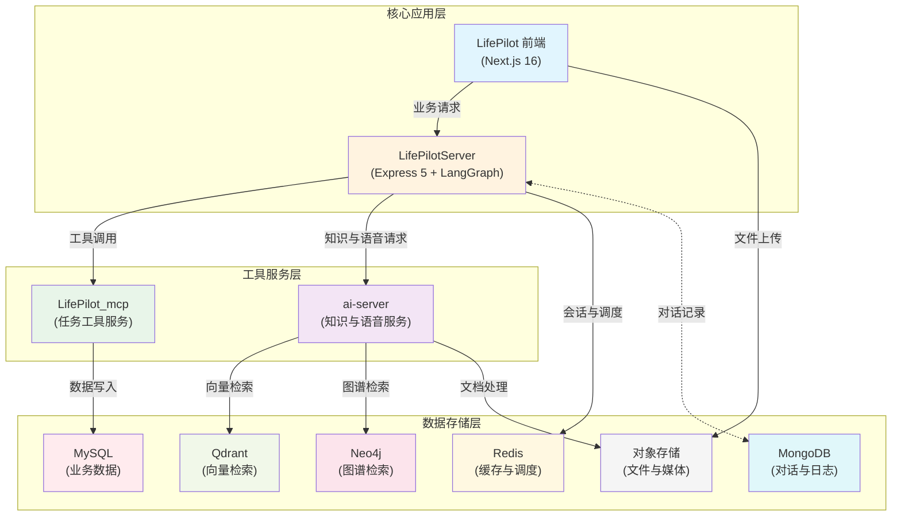

### 图4-2 系统整体架构

如图4-2所示，系统从用户交互到数据持久化形成自上而下的分层关系。图中突出的是统一接入、服务分工和模型能力外置三项设计思路，说明系统如何在多入口场景下维持稳定的服务组织方式。

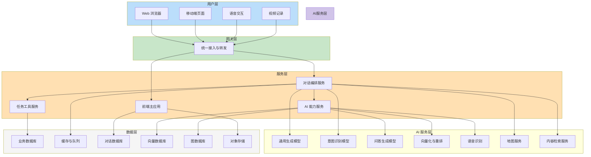

### 图4-3 Agent 协同设计

如图4-3所示，用户请求首先进入路由环节，再根据场景分流到任务规划、知识问答或出行辅助分支。图中同时体现了任务规划中的内部校验循环以及用户确认后的恢复执行路径，用于说明 Agent 协同并非单次生成，而是一个可回退、可中断、可恢复的流程。

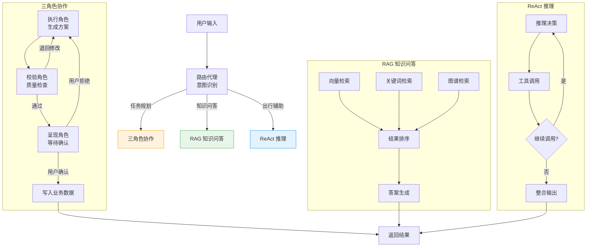

### 图4-4 核心数据模型

如图4-4所示，用户实体处于数据模型中心位置，并与任务、对话、文档和记录等对象形成主从关系。任务与标签之间采用关联关系组织分类信息，文档再向知识检索索引延伸，体现出“业务数据管理”和“知识索引管理”分层处理的思路。

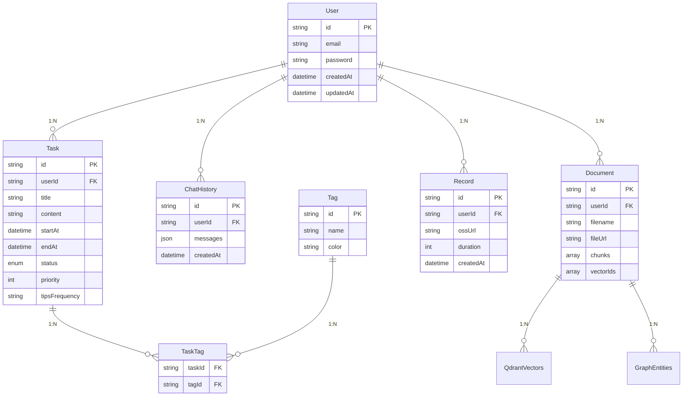

### 图4-5 系统整体框架图

如图4-5所示，系统整体框架把客户端、接入协议、服务编排、AI 能力和数据支撑放在统一视角下观察。该图可作为后续实现章节的总览图，用于说明不同模块在完整运行链路中的位置和连接关系。

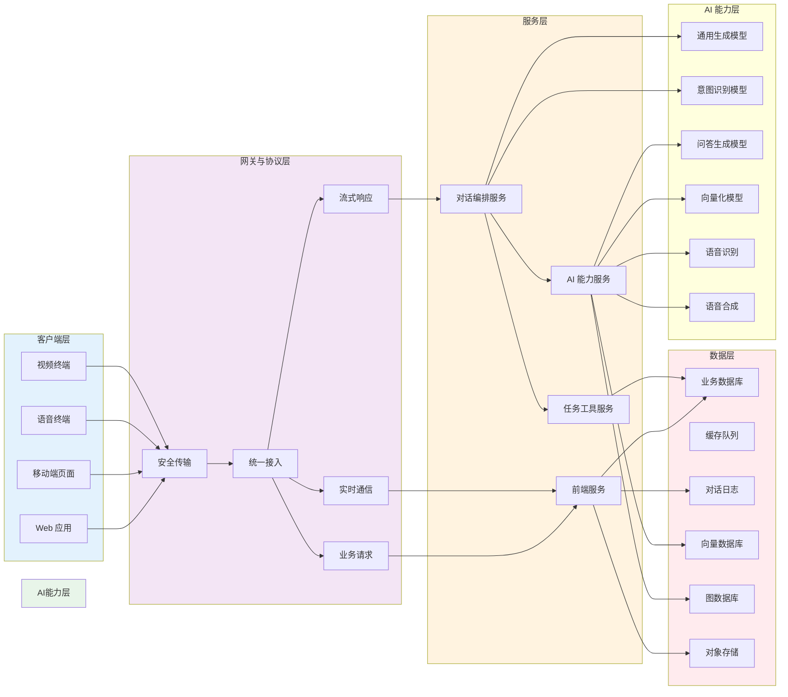

### 图4-6 任务规划子系统设计

如图4-6所示，任务规划子系统从自然语言输入开始，依次经过路由判断、上下文准备、生成校验、用户确认和任务落库等环节。该图比图4-3更聚焦任务主链路，便于后文说明人工确认为何必须插入写库之前。

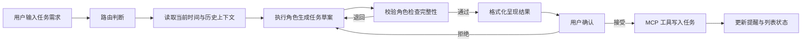

### 图4-7 RAG 子系统总体结构

如图4-7所示，RAG 子系统由文档处理、索引构建、混合检索和答案生成四个部分组成。图中强调的是知识库服务内部的能力分工，而不是整个主系统的全局关系。

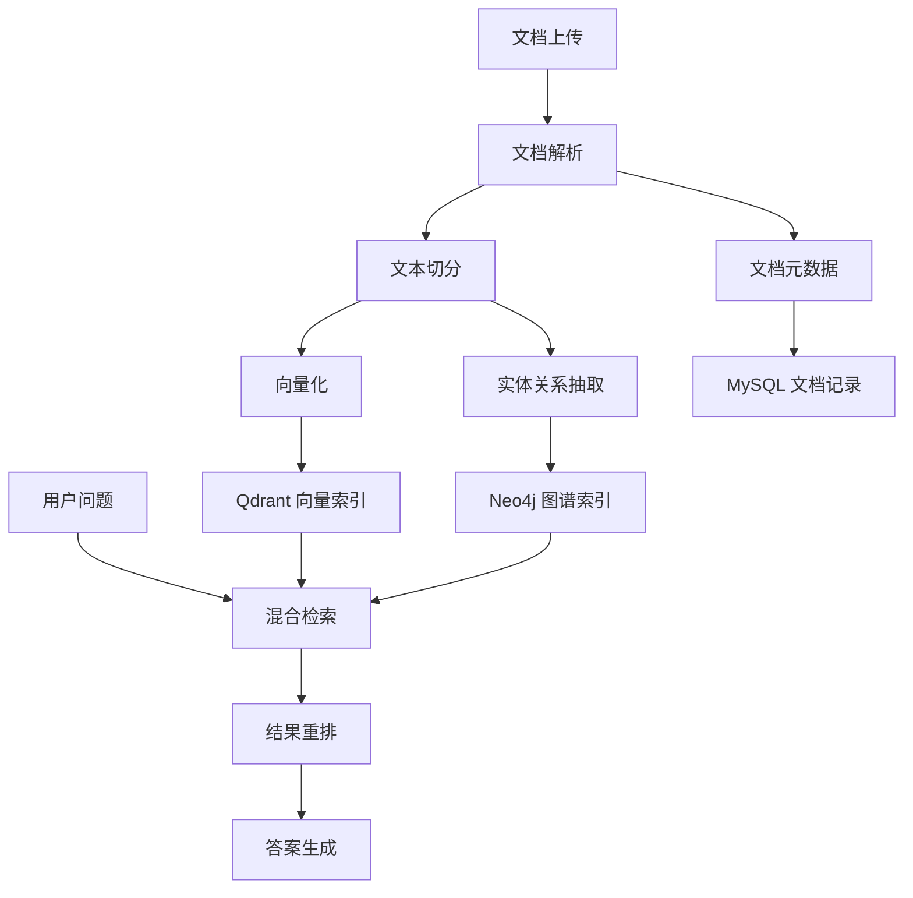

### 图4-8 LangGraph 工作流状态流转

如图4-8所示，LangGraph 在任务规划场景中的核心价值是能够显式表示状态流转、循环检查和人工中断。该图展示的是工作流抽象状态，而不是单个接口调用顺序。

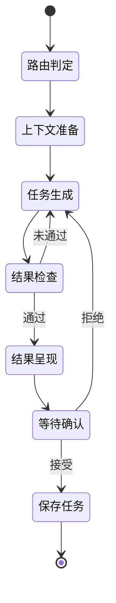

### 图4-9 MCP 工具服务交互架构

如图4-9所示，MCP 工具服务位于工作流与业务数据库之间，负责将模型请求转化为受控工具调用。这样可以把模型推理层和真实数据写入边界分开。

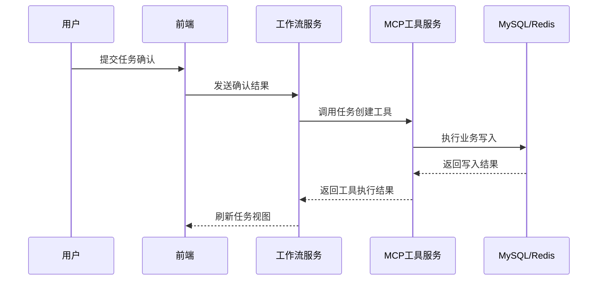

### 图4-10 语音交互子系统架构

如图4-10所示，语音交互同时涉及浏览器端采集、语音识别服务、对话编排服务和结果回传。该图强调采集、识别和反馈之间的协作路径。

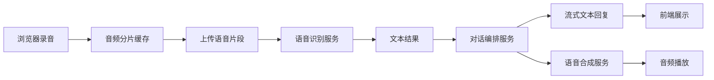

### 图4-11 出行辅助子系统设计

如图4-11所示，出行辅助并不是单次问答，而是围绕推理、工具调用和结果整合构成的迭代过程。地图信息和内容检索作为外部信息源，共同支撑最终答复。

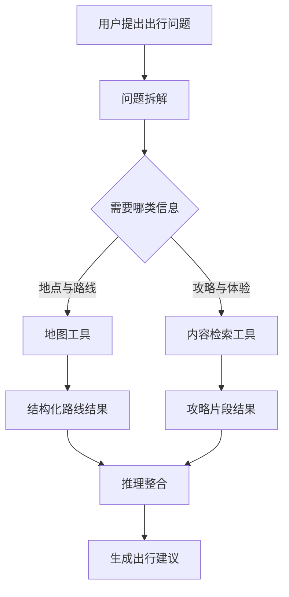

### 图4-12 知识入库链路设计

如图4-12所示，知识入库链路覆盖上传、解析、索引构建和状态回写四个阶段。该图可与后文实现章节中的文档处理流程一一对应。

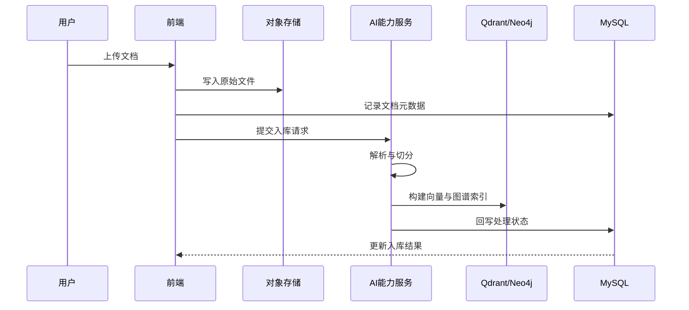

### 图4-13 混合检索协同关系图

如图4-13所示，向量检索、关键词检索和图谱检索并行产出候选结果，随后统一进入排序与生成阶段。该图突出的是多路召回的组合关系。

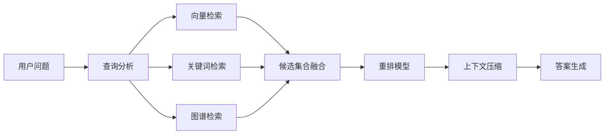

### 图4-14 服务通信关系图

如图4-14所示，系统内部同时存在普通业务请求、流式响应、工具调用和知识服务调用等多种通信关系。该图从协议视角补充了前述结构图中不易直接看出的接口类型差异。

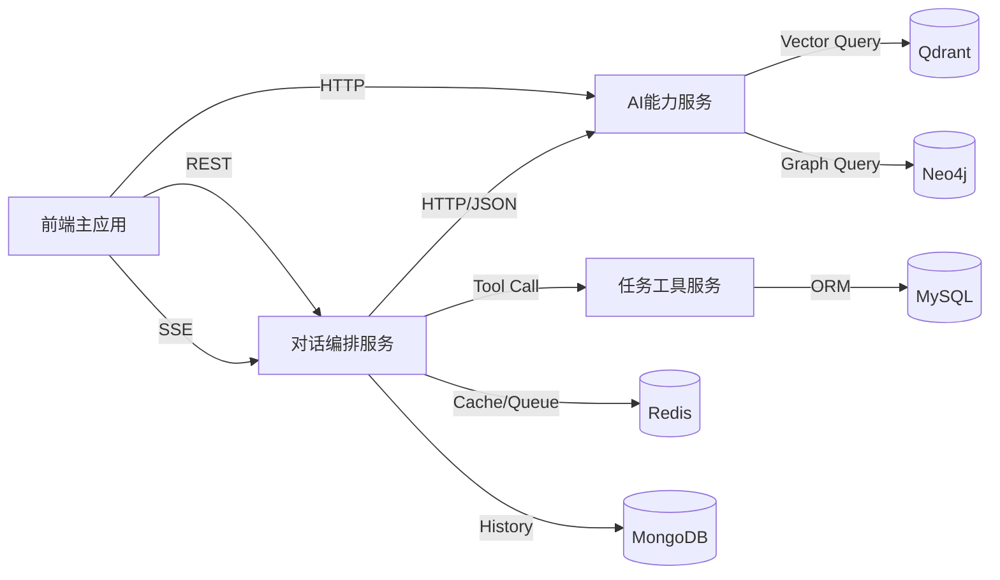

### 图4-15 前端主应用内部结构图

如图4-15所示，前端主应用内部并不是单纯的页面集合，而是由路由层、状态层、组件层和数据访问层共同支撑。该图用于补充系统前端在总体设计中的内部拆分方式。

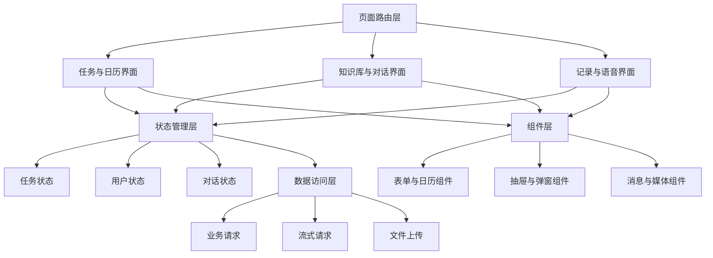

### 图4-16 对话编排服务设计图

如图4-16所示，对话编排服务位于系统主流程中心，内部同时承担路由、上下文准备、工作流调度和流式输出组织等职责。该图用于说明为什么该服务在总体设计中需要独立部署。

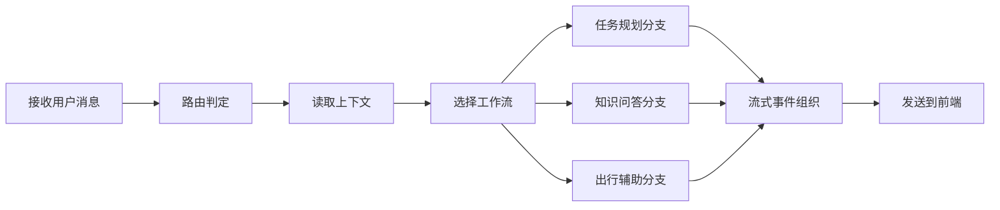

### 图4-17 任务工具服务设计图

如图4-17所示，任务工具服务将任务创建、更新、查询和删除等能力封装为独立工具，并通过统一参数校验层连接业务数据库。该图用于说明工具服务如何承担数据访问边界。

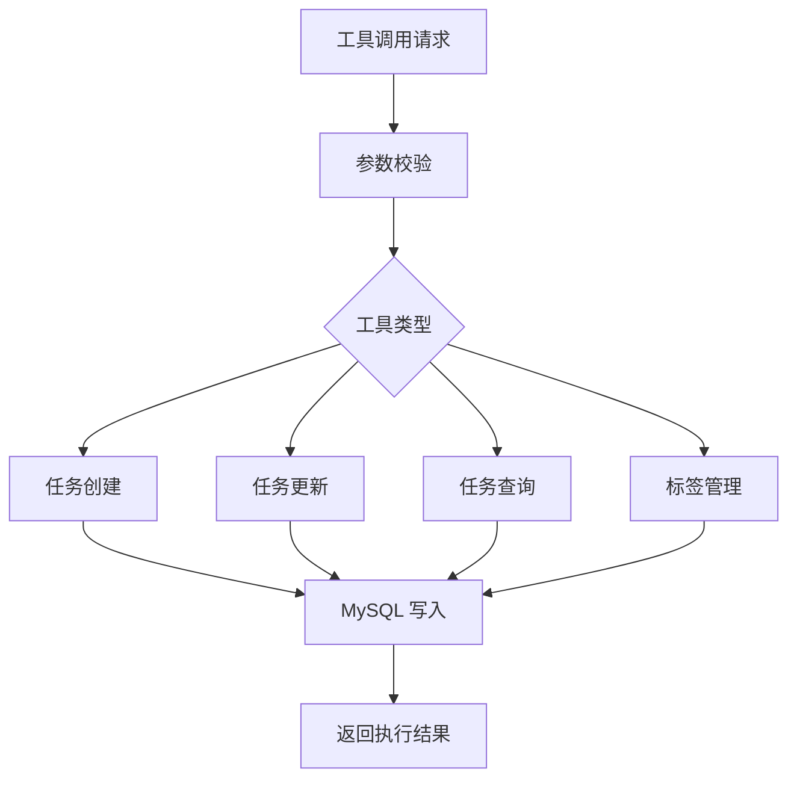

### 图4-18 提醒调度子系统结构图

如图4-18所示，提醒调度子系统由任务写入、调度集合、后台轮询和邮件投递四部分构成。该图用于说明提醒功能为何需要借助缓存与调度服务共同完成。

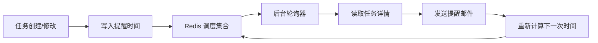

### 图4-19 多存储协作关系图

如图4-19所示，关系型数据库、缓存数据库、文档数据库、向量数据库和图数据库分别承担不同数据职责。该图从存储协作视角补充 4.3 节的数据组织方式。

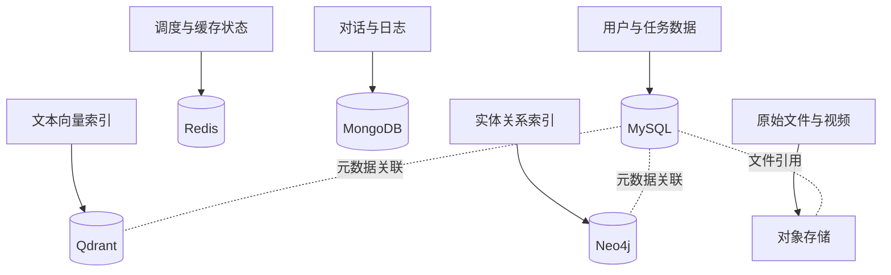

### 图4-20 系统安全边界图

如图4-20所示，系统在前端、工作流服务、工具服务和数据库之间建立了多层安全边界。该图用于说明总体设计中为何强调“模型不能直接写库”和“敏感能力后移”。

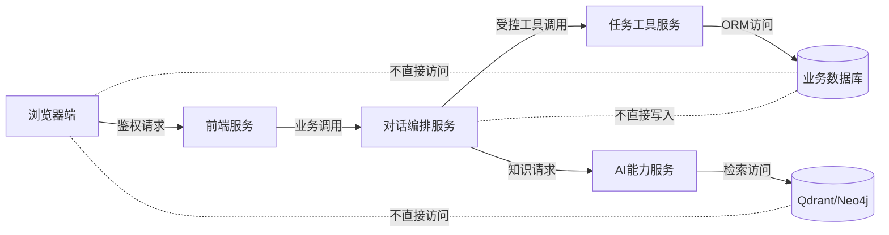
