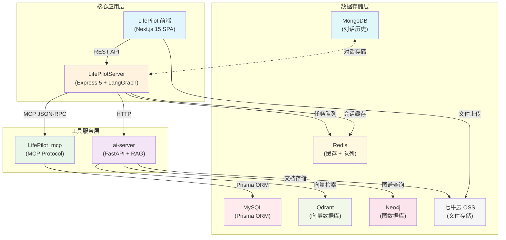
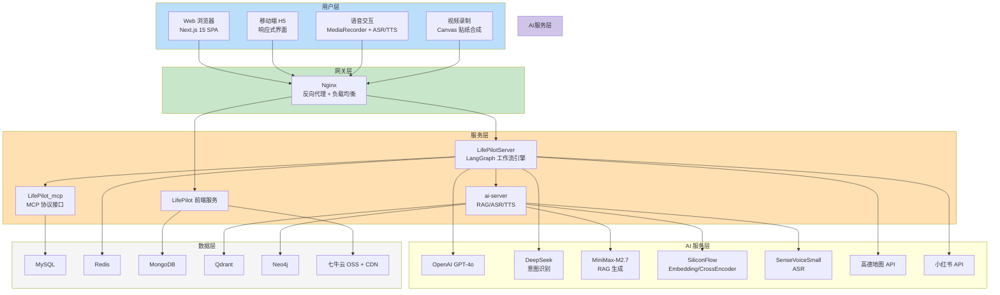
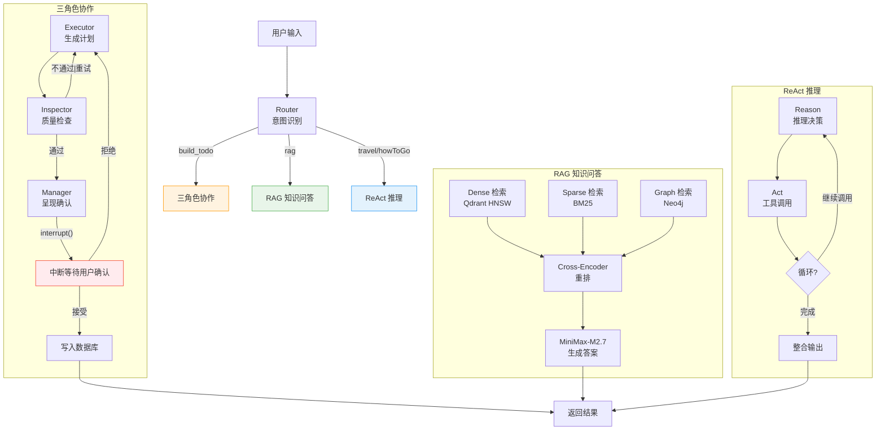
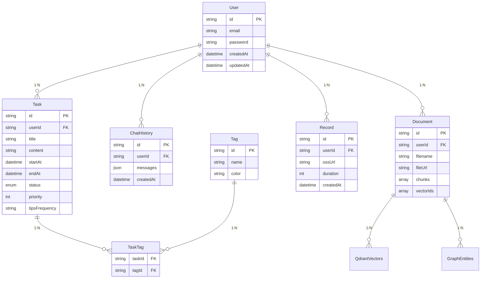
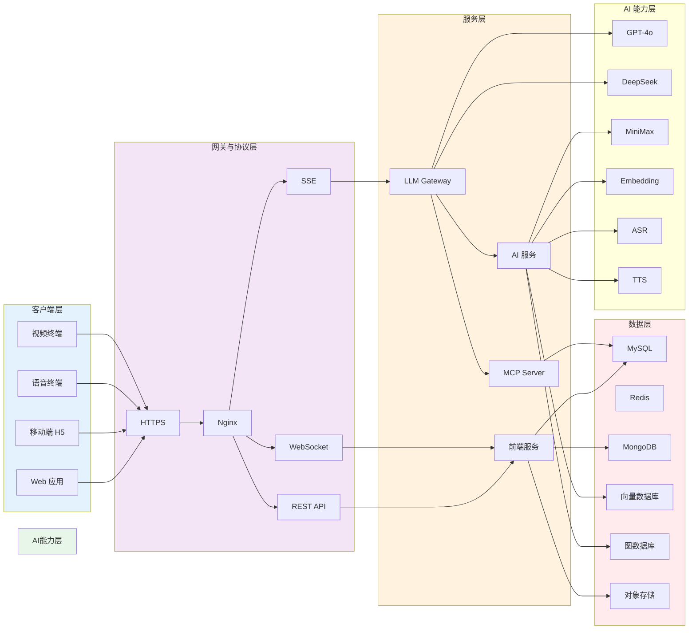

# 第4章 系统总体设计

## 4.1 系统功能模块划分与业务流程设计

### 4.1.1 系统模块架构

LifePilot 智能生活管家系统采用多模块独立部署架构，各模块间通过标准化接口实现协作。系统整体可划分为核心应用层、工具服务层和数据存储层三个层次，各层职责边界清晰，耦合度低。

核心应用层包含两个面向终端用户的产品。LifePilot 前端应用作为用户交互的主界面，基于 Next.js 15 框架构建单页应用（SPA），集成了任务管理、AI 对话交互、日历视图、知识库管理、语音交互以及视频自我记录等功能模块。LifePilotServer 是系统的 AI 对话核心服务，采用 Express 5 框架结合 LangGraph 工作流引擎构建，核心职责包括用户对话流的处理、意图识别分类以及向不同工作流分支的动态分发，同时负责管理 SSE 流式输出的完整生命周期。

工具服务层由两个独立进程组成。LifePilot_mcp 实现了 MCP（Model Context Protocol）协议工具服务，通过 @modelcontextprotocol/sdk 封装标准化的工具调用接口，为 AI Agent 提供 create_task、get_tasks、update_task、delete_task 等数据库原子操作。ai-server 承担知识库与 AI 能力服务的角色，基于 Python FastAPI 框架构建，提供 RAG 多路召回检索、ASR 语音识别、TTS 语音合成、文档解析入库以及 SiliconFlow 平台 API 集成等后端能力。

数据存储层采用多元化的存储策略以适应不同数据类型的访问模式。MySQL 作为主数据库，通过 Prisma ORM 管理用户账户、任务数据、标签等核心业务数据。Redis 承担会话缓存和任务调度队列的职责，其 ZSet 结构特别适合实现基于时间的任务优先级队列。MongoDB 用于存储对话历史和系统日志，其灵活的 Schema 设计能够适应结构不固定的数据。Qdrant 作为向量数据库，存储文档嵌入向量，基于 HNSW 索引算法支持高效的语义相似度检索。Neo4j 图数据库存储从文档中抽取的知识图谱，采用 Cypher 查询语言支持复杂的实体关系查询。七牛云 OSS 提供文件对象存储服务，用户的文档、图片以及录制的视频均存储于该服务，并通过 CDN 加速分发以优化访问延迟。

### 4.1.2 业务流程设计

系统的核心业务流程以自然语言对话为统一入口。用户输入首先到达 Router 节点进行意图识别，DeepSeek 模型对输入进行分类，输出意图标签（build_todo、what_to_do、rag、travel、howToGo 等），系统根据标签决定后续工作流的走向。

任务规划流程引入了三角色协作模式。Executor 负责理解用户需求并生成结构化的任务计划；Inspector 承担验证职责，检查输出内容的完整性、合理性和格式规范性，当检查不通过时将结果返回 Executor 重试，形成闭环直到满足质量要求；Manager 则负责将经过验证的计划以用户友好的方式呈现，并等待用户确认。这一流程中引入了人在回路机制：AI 生成的计划不会直接执行，而是暂停工作流等待用户确认。用户接受则通过 MCP 协议将任务写入数据库并设置提醒；用户拒绝则将上下文返回 Executor 重新生成计划。

RAG 知识问答流程包含文档入库和问答检索两个阶段。文档入库时，系统自动完成解析、分块、向量化存储三个步骤，同时 LLM 从文档中抽取实体和关系三元组存入 Neo4j 图数据库。问答检索时，系统并行执行三种检索操作：Dense 检索利用 Qdrant 向量相似度匹配，Sparse 检索采用 BM25 算法进行关键词匹配，Graph 检索通过 Neo4j 图谱进行关联查询。三路检索结果经 Cross-Encoder 重排后取最相关的片段作为上下文，最后由 MiniMax-M2.7 模型生成答案。

出行规划流程基于 ReAct（Reason + Act）推理模式实现。用户提出出行需求后，LangGraph 工作流加载高德地图和小红书 MCP 工具。模型在推理过程中自主决定工具的调用时机和顺序：对于地点基本信息查询，可能仅需一次地图搜索调用；若需比较多条路线，则会多次调用路线规划 API 获取对比数据；若用户还想了解旅游体验，则额外调用小红书攻略搜索接口获取UGC内容。最终答案由模型整合各类信息后以自然语言形式返回。

## 4.2 系统整体架构与 Agent 协同设计

### 4.2.1 分层架构设计

系统采用经典的分层架构设计，从上到下依次为用户层、网关层、服务层、AI 服务层和数据层。这种分层方式使得各层关注点分离，便于独立开发和演进。

用户层支持多种客户端接入方式。Web 浏览器通过 Next.js 15 构建的 SPA 应用访问完整功能。移动端 H5 提供响应式适配界面，能够在不同尺寸的设备上保持可用性。语音交互模块通过 MediaRecorder API 采集音频数据，配合 ASR/TTS 服务实现语音对话功能。视频录制模块通过 Canvas API 实现贴纸合成和录制功能。

网关层由 Nginx 承担反向代理和负载均衡职责。所有客户端请求经过 HTTPS 加密后到达 Nginx，由 Nginx 根据请求路径将请求转发到对应的后端服务。REST API 处理常规的增删改查请求，SSE（Server-Sent Events）用于 AI 对话的流式输出，WebSocket 预留用于未来扩展实时音视频通话场景。

服务层包含四个独立部署的服务，各服务拥有独立的进程和资源。LifePilot 前端服务处理页面渲染和用户交互逻辑。LifePilotServer 作为 AI 对话核心，运行 LangGraph 工作流引擎，包含 Router 意图识别节点以及三角色协作、ReAct、RAG 等工作流分支。LifePilot_mcp 提供 MCP 协议接口，封装了 Prisma ORM 操作 MySQL 数据库的工具集。ai-server 提供 RAG 检索、ASR/TTS、文档解析等 Python 服务能力，同时集成了 SiliconFlow 平台 API。

AI 服务层整合了多个外部 AI 服务，根据不同任务特点选择最适合的模型。OpenAI GPT-4o 作为主力模型处理需要复杂推理和生成的任务。DeepSeek 用于轻量级的意图识别分类任务。MiniMax-M2.7 用于 RAG 答案生成。SiliconFlow 平台提供文本向量化模型（Qwen3-Embedding-8B）和 Cross-Encoder 重排能力。SenseVoiceSmall 用于中文普通话语音识别。高德地图 API 和小红书 API 为出行规划提供数据支持。

数据层部署了六种数据存储服务。MySQL 存储结构化的业务数据。Redis 提供高性能缓存和任务队列。MongoDB 存储非结构化的对话历史。七牛云 OSS 存储用户上传的文档和录制的视频文件，通过 CDN 加速访问。Qdrant 和 Neo4j 分别作为向量检索和图谱检索的专用引擎。

### 4.2.2 Agent 协同机制

LifePilot 的 AI 核心采用 LangGraph 工作流框架实现多 Agent 协同。LangGraph 基于图的架构使得复杂的条件分支、循环和人为中断成为可能，这是传统链式调用（Chain）无法实现的。状态（State）在节点间流转，每个节点对状态进行更新后传递到下一个节点。

Router 节点作为用户请求的统一入口，负责意图识别和请求分发。用户输入后，Router 调用 DeepSeek 模型进行分类，输出意图标签，决定后续进入哪个工作流分支。这种设计将用户输入的解析与业务逻辑分离，提高了系统的可维护性。

三角色协作模式应用于任务规划场景。Executor、Inspector、Manager 三个角色形成验证循环。Executor 生成的计划经过 Inspector 检查，如果质量不达标，Inspector 会指出问题并要求 Executor 重新生成，直到 Inspector 认可结果后交给 Manager 呈现给用户。这种设计确保了 AI 生成计划的质量和安全性。

ReAct 推理模式应用于需要自主工具调用的场景。LLM 被赋予工具调用权限，在推理过程中自主决定何时调用工具、调用什么工具。高德地图和小红书 MCP 工具的接入，使得 Agent 能够获取实时地点信息和旅游攻略，为用户提供完整的出行规划。

人在回路机制通过 LangGraph 的 interrupt() 函数实现。调用 interrupt() 后，工作流暂停并保存检查点（Checkpoint）。前端收到中断事件后展示确认界面，用户操作后前端调用 resume 接口并传递用户决策，后端从检查点恢复工作流继续执行。这一机制确保了 AI 生成结果不会自动执行，保留了用户的最终决策权。

## 4.3 核心数据模型与模块关系设计

### 4.3.1 实体数据模型

User（用户表）是系统的基础实体，存储用户认证信息。字段包括 id（主键）、email（登录邮箱）、password（bcrypt 加密存储）、createdAt（注册时间）和 updatedAt（更新时间）。每个用户与 Task 是一对多关系，与 ChatHistory 也是一对多关系。

Task（任务表）存储任务的核心信息。字段包括 id、title（标题）、content（描述内容）、startAt（开始时间）、endAt（截止时间）、status（状态：待办/进行中/已完成）、priority（优先级）、tipsFrequency（提醒频率）等。任务与标签是多对多关系，通过 TaskTag 关联表实现。

Tag（标签表）用于对任务进行分类管理。字段包括 id、name（标签名称）和 color（显示颜色）。用户可以为任务添加多个标签，便于按类别筛选任务。

ChatHistory（对话历史表）存储用户与 AI 的对话记录。字段包括 id、userId（关联用户）、messages（消息数组，每条消息包含 role、content、timestamp）和 createdAt。对话历史用于上下文理解和连续对话支持。

Document（文档表）管理用户上传的知识库文档。字段包括 id、userId、filename、fileUrl（存储地址）、chunks（文本分块数组）和 vectorIds（Qdrant 向量 ID 数组）。文档与 Qdrant 向量库和 Neo4j 图数据库存在关联关系。

Record（记录表）存储用户自我记录的视频信息。字段包括 id、userId、ossUrl（七牛云存储地址）、duration（时长）和 createdAt。视频文件存储于七牛云 OSS。

### 4.3.2 模块间关系

系统各模块通过清晰的数据模型和接口定义实现协作。前端 LifePilot 通过 REST API 与后端服务通信，SSE 实现 AI 对话的流式输出。MCP 协议连接 LifePilotServer 和 LifePilot_mcp，实现数据库操作的工具化封装。ai-server 直接操作 Qdrant 和 Neo4j，提供向量检索和图谱查询能力。文档上传后直接写入七牛云 OSS，存储地址和元数据存入 MySQL。

## 4.4 概要设计

### 图4-1 系统功能模块划分

### 图4-2 系统整体架构

### 图4-3 Agent 协同设计

### 图4-4 核心数据模型

### 图4-5 系统整体框架图

