# 第5章 系统实现与关键问题解决

第4章给出了系统总体设计，但设计能否成立，还需要通过实现路径加以验证。LifePilot 的实现难点，不在于单个页面或单个接口本身，而在于如何把任务管理、智能工作流、知识检索、语音交互和提醒调度组织成一条可运行、可恢复、可扩展的链路。若实现层只关注局部功能，系统很容易出现状态分散、流程失控和服务耦合过高等问题。本章围绕用户交互实现、Agent 处理机制以及记录与提醒链路中的关键问题展开说明。

## 5.1 用户模块与多交互方式实现

用户层实现直接影响系统的可用性，也是多种智能能力能否被顺畅调用的前提。LifePilot 前端不仅承担页面展示任务，还需要承接任务管理、对话输入、语音采集、知识库操作和多媒体记录等交互过程。因此，用户层实现的重点不只是界面搭建，而是如何在保证交互流畅性的同时，把前端状态、后端服务和异步反馈组织起来。

### 5.1.1 前端架构选择与技术方案

前端主应用采用 Next.js 16 与 React 19 构建。之所以选择该技术组合，主要考虑到系统既包含大量交互页面，也包含需要快速首屏展示的任务列表、日历与知识库页面。基于 App Router 的组织方式，界面结构、数据获取和交互逻辑可以按页面边界清晰拆分，适合承载较复杂的多视图应用。

在状态管理上，系统没有采用模板较重的集中式方案，而是使用 MobX 按业务域维护任务、标签、用户和对话等状态。这样处理更符合 LifePilot 的实际需求：一方面，不同状态域之间存在联系，但变化频率和作用范围并不相同；另一方面，对话流、任务列表和用户设置都需要较高的界面响应性。将状态按领域拆开后，既减少了全局联动更新带来的负担，也方便后续扩展新的交互模块。

组件层采用以无样式基础能力为核心的方式进行封装。弹窗、下拉菜单、日历和表单交互等复杂控件由通用组件提供稳定行为，外观和业务交互再由项目内部统一组织。这样做的原因，在于 LifePilot 的交互场景较多，若过度依赖封闭式组件库，后期在任务抽屉、知识库面板和对话区之间复用样式与逻辑时会受到较大限制。

如图5-1所示，前端实现并不是单层页面渲染，而是由路由层、状态层、交互组件层和数据访问层共同组成。该图用于说明前端主应用内部的职责拆分关系。

### 图5-1 前端主应用实现结构

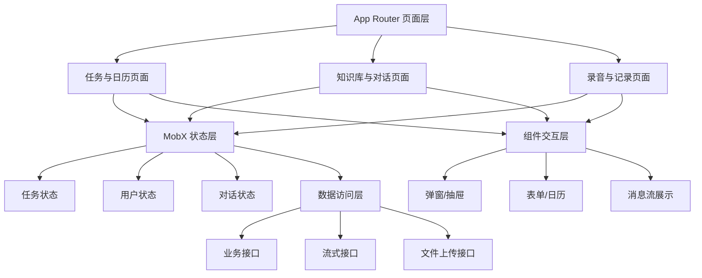

如图5-2所示，前端状态管理以业务域为边界组织任务、用户、标签和对话等状态对象。该图对应 5.1.1 节关于状态拆分策略的说明。

### 图5-2 前端状态组织图

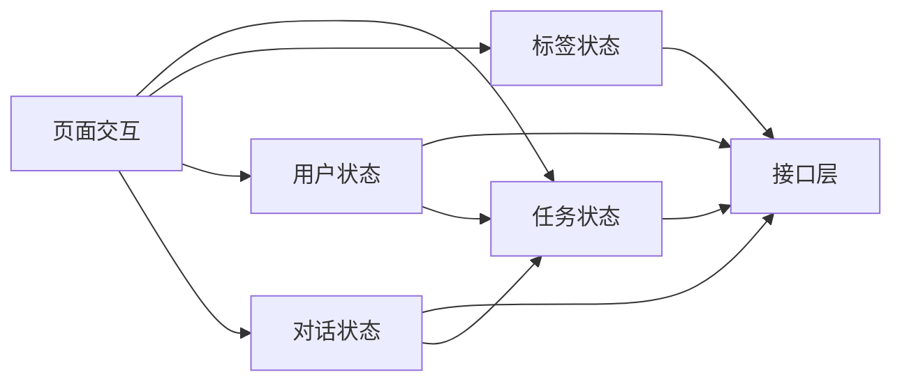

### 5.1.2 语音交互方案

语音交互的目标，是为文本输入之外再提供一条自然入口，但实现时必须兼顾浏览器能力差异和后端模型能力边界。LifePilot 在浏览器端负责完成音频采集与录制，在服务端完成语音识别和后续语义处理，这样既避免了把模型密钥暴露在前端，也使识别链路更容易统一管理。

录音部分采用浏览器媒体采集能力完成。前端在获取麦克风权限后启动录制，并将音频按较短时间片逐步收集，而不是等到录制结束后再一次性处理。采用分片收集的方式，一方面可以减轻内存压力，另一方面也为后续扩展实时反馈保留了空间。界面中显示的波形并非静态装饰，而是借助音频分析节点对输入信号进行可视化，从而让用户及时感知录音状态。

识别链路采用“浏览器采集，服务端转写”的组织方式。录制得到的音频首先由前端上传，再由语音识别服务输出文本结果，并回接到原有对话流程中。这样设计比直接依赖单一浏览器原生识别能力更稳妥，因为不同平台对浏览器语音能力的支持程度并不一致，而服务端模型更容易维持统一识别质量。

在输出侧，系统优先通过流式文本反馈降低等待感，在需要播报的场景下再调用语音合成。将文本流作为主要反馈形式，可以让用户在模型生成过程中持续获得响应；语音播报则更适合提醒和特定辅助场景。两类输出分工明确后，语音能力既不会压制正常对话流程，也不会因为等待音频生成而拖慢整体交互。

如图5-3所示，语音交互从浏览器采集开始，经过上传、转写、工作流处理和结果回传，形成一条完整的闭环链路。该图强调语音输入并不是独立模块，而是接入原有对话主链路。

### 图5-3 语音交互时序图

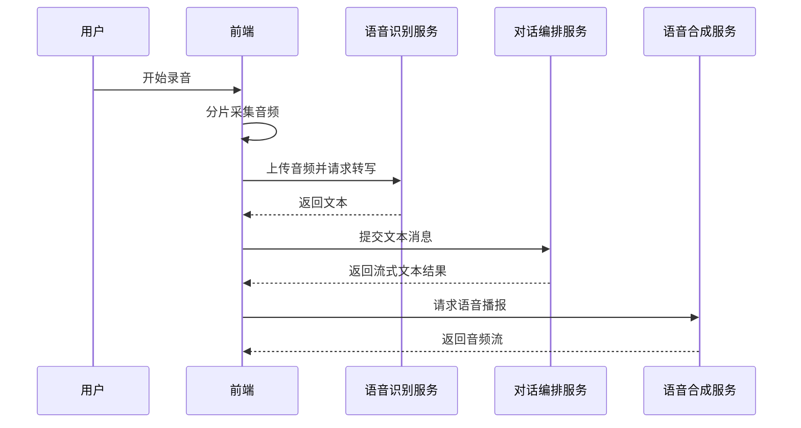

如图5-4所示，浏览器端录音、波形绘制和音频上传分别占据采集、可视化和传输三个步骤。该图对应 5.1.2 节对音频分片与实时反馈的说明。

### 图5-4 音频采集与上传管线

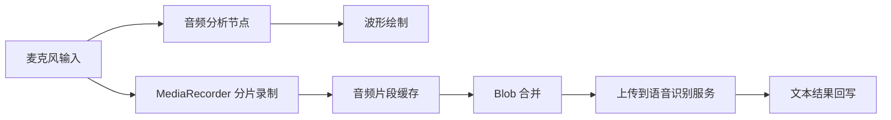

### 5.1.3 响应式布局方案

LifePilot 的使用环境覆盖桌面浏览器和平板、手机等移动设备，因而布局实现不能只围绕单一屏幕宽度展开。系统采用移动优先的组织方式，在保证小屏场景可用的基础上，再逐步扩展到更复杂的多栏结构。这样的策略能够优先保障高频移动场景的基本操作，再在大屏环境下提升信息密度和并行操作能力。

从具体布局上看，小屏界面更强调单列浏览和快速切换，便于用户在有限空间中完成任务查看、对话输入和知识检索。屏幕空间增大后，系统逐渐引入分栏结构，把列表、详情和对话等区域拆开显示，从而减少页面来回跳转。导航方式也随设备形态变化而调整，移动端更适合底部切换，较大屏幕则更适合侧边导航与可折叠面板。

响应式布局的难点并不只是断点本身，而是组件在不同容器中的表现是否稳定。为此，系统在设计时尽量让任务卡片、对话面板和媒体区域具备独立伸缩能力，避免某一局部组件过度依赖整页宽度。这样一来，相同组件在首页、抽屉和详情区域之间切换时，仍能保持较一致的交互效果。

如图5-5所示，页面布局会随可用空间变化而从单列逐步扩展为双列或三列结构。该图可用于展示响应式布局在不同设备宽度下的组织差异。

### 图5-5 响应式布局切换图

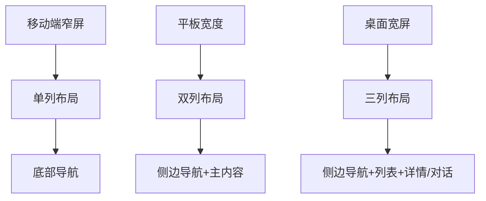

### 5.1.4 数据持久化与离线支持

用户交互场景中最常见的问题，是页面状态与远端数据之间存在时间差。若每次操作都等待远端返回后再更新界面，任务新增、状态切换和对话反馈都会显得迟缓。LifePilot 因此在前端引入本地持久化和即时更新机制，让用户操作能够先反映到界面，再由后端完成最终确认。

本地持久化主要用于保存用户在短时间内高频访问的数据，如任务列表和部分界面状态。这样处理后，即使页面重新加载，系统也能先给出基本内容，再与远端数据继续同步。对于任务管理这类以连续使用为主的场景，本地缓存能够明显减少“空白等待”带来的割裂感。

在同步策略上，系统采用先更新界面、后提交请求的方式组织部分交互。当后端返回成功结果时，界面状态自然延续；若请求失败，再将状态回退并提示用户。该策略的价值不在于掩盖网络延迟，而在于把用户的操作反馈前移，从而维持更顺畅的交互节奏。

如图5-6所示，本地缓存、界面更新和远端同步之间形成先反馈、后确认的处理路径。该图对应 5.1.4 节对持久化和回滚机制的说明。

### 图5-6 本地缓存与同步流程

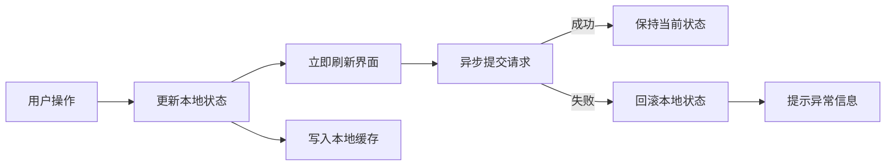

## 5.2 Agent设计与用户意图处理实现

用户侧交互能够成立，还需要后端工作流把自然语言输入转化为稳定的处理路径。LifePilot 的智能部分不是单模型直接回答，而是通过路由、任务规划、知识检索和工具调用等多个环节共同完成。因此，实现重点在于如何维持流程状态、控制工具访问边界，并在复杂链路中保证结果仍可被业务系统接纳。

### 5.2.1 LangGraph 工作流设计

系统在工作流编排上采用图式结构，而不是简单的线性链式调用。这样选择的原因在于，任务规划和工具调用场景都存在明显的条件分支与循环。例如，任务计划生成后不一定立即通过检查，出行辅助中工具也不一定只调用一次；若仍采用单向链路组织，就很难优雅表达“生成后检查，不通过则返回重试”这类控制过程。

图式工作流将一次请求视为可演进的状态集合。用户输入、当前时间、历史上下文、模型输出、中间检查结果和最终呈现内容，会随着节点执行不断被补充和修正。状态集中管理后，各节点不需要重复构造全部上下文，只需针对自身职责更新必要部分即可，这也是工作流能够持续推进而不丢失关键信息的基础。

任务规划流程中的关键设计，是将生成、检查、格式化和写入拆成独立节点。生成节点负责组织候选任务结果，检查节点负责判断内容是否完整、时间表达是否合理，格式化节点负责把模型输出转换为便于确认的呈现结果，真正的数据写入则放在用户确认之后执行。这样的组织方式比“生成后立即入库”更符合主业务对可控性的要求。

系统还引入了检查点机制保存中断状态。当流程需要等待用户确认时，当前状态会被暂存，待用户给出接受或拒绝的反馈后再恢复执行。检查点的存在，使人工确认不再是工作流之外的临时补丁，而是整个流程中的正式节点。由此，系统既能保持智能生成能力，又不会放弃对业务数据写入时机的控制。

如图5-7所示，任务规划工作流中的生成、检查、格式化、确认和写入被组织为一条可回退的图式路径。该图比第4章的总体设计图更强调实现层节点之间的顺序关系。

### 图5-7 任务规划工作流实现图

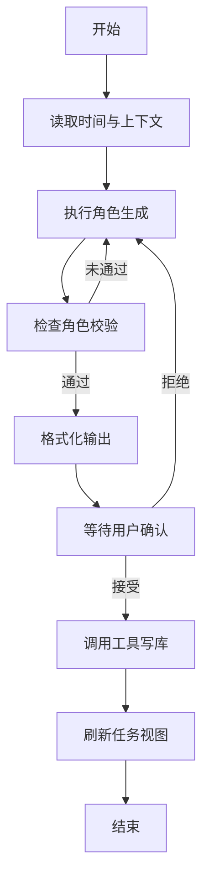

如图5-8所示，检查点机制把等待用户确认的阶段显式保存在工作流中。这样设计后，确认动作不再依赖额外的临时接口状态，而是成为可恢复流程的一部分。

### 图5-8 检查点与确认恢复时序图

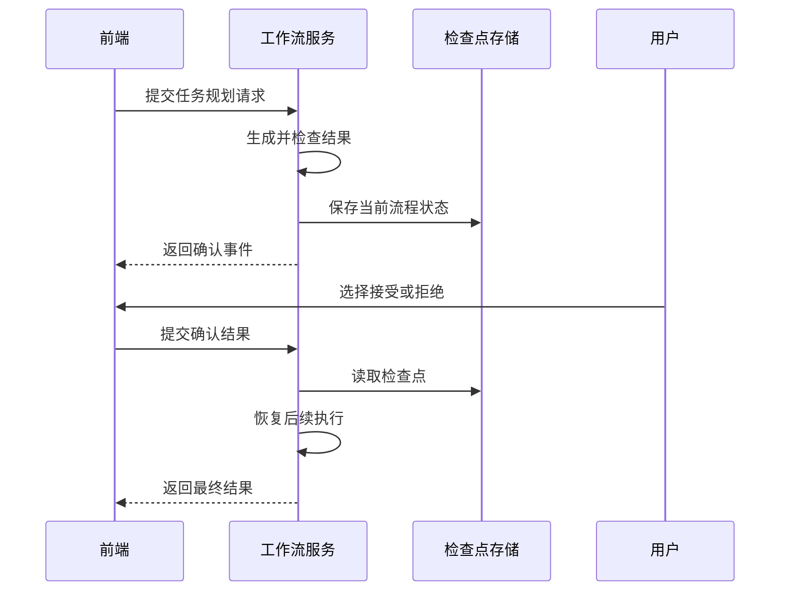

### 5.2.2 MCP 协议实现

模型具备生成能力，并不意味着它应直接操作业务数据库。若将数据库访问直接暴露给模型层，不仅会扩大错误写入风险，还会把数据结构细节和访问权限混入模型调用链。LifePilot 因而在业务写入路径上引入 MCP 工具服务，把模型的操作范围限制在预先定义的工具集合内。

MCP 层的作用，可以理解为模型与业务数据之间的一道受控边界。对模型而言，它看到的是任务创建、查询、更新等语义明确的工具；对数据库而言，所有写入仍由后端服务按照既定参数约束执行。这样一来，模型不能越过业务层直接构造任意数据库操作，数据访问路径也更容易审计和维护。

任务工具服务被独立部署后，还带来另外两个实际收益。其一，模型工作流只需要关注“何时调用某类工具”，而不必承担底层连接和数据校验细节；其二，业务工具的扩展可以在相对稳定的接口边界内完成，不会直接扰动上层工作流。对于需要长期迭代的系统而言，这种隔离方式有助于减轻后续演进成本。

如图5-9所示，MCP 调用链把模型层、工具服务和数据库访问明确分开。该图能够直观看到受控调用边界在实现层中的位置。

### 图5-9 MCP 调用时序图

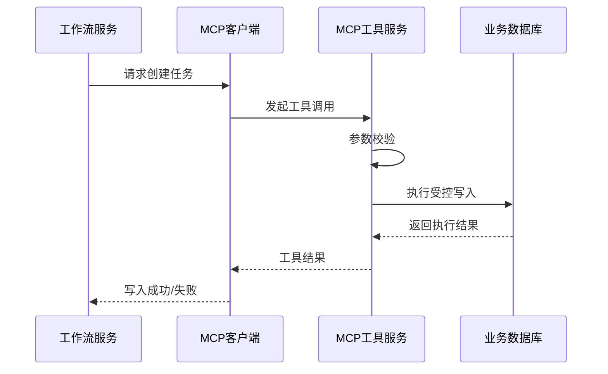

### 5.2.3 RAG 多路召回设计

知识问答场景中，单一检索方式很难同时兼顾语义相关性、关键词精确性和实体关系推理。向量检索适合处理语义相近但表述不同的问题，关键词检索更擅长定位精确术语和专名，图谱检索则适合沿着实体关系继续扩展查询。LifePilot 采用多路召回结构，正是为了让不同类型的问题都能获得相对稳定的证据来源。

在检索流程中，多路召回并不是简单叠加结果，而是先分别获得候选内容，再进行融合与筛选。原因在于，不同检索通道的评分方式并不一致，若直接把原始分值放在一起比较，往往会得到失真的排序结果。系统因此先对候选内容做统一整理，再进入后续排序环节，从而减小检索机制差异对最终结果的影响。

排序阶段引入更细粒度的重排模型，用于从候选集合中压缩出真正与问题最相关的片段。这样设计的目的是把“广泛找回”和“精确筛选”拆开处理：前一阶段尽量保证召回范围，后一阶段再提升输入生成模型的上下文质量。对于知识问答而言，只有把证据范围控制在较高相关度集合内，生成结果才更容易保持稳定。

如图5-10所示，RAG 实现采用“多路召回 + 重排 + 生成”的三段式处理结构。该图更接近实现逻辑，可直接对应到后续代码分析。

### 图5-10 RAG 召回与重排流程图

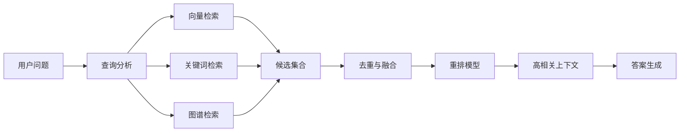

### 5.2.4 意图识别设计

对话入口承担着多类业务请求的统一接入任务，因此路由判断必须尽量简单、稳定且便于扩展。当前实现采用结构化路由结果来决定后续进入任务规划、待办查询、知识问答或出行辅助等工作流分支。与把全部问题直接交给同一模型处理相比，先做路由判断能够明显减少后续分支中的无效计算。

在实现上，路由环节并不返回自由文本，而是输出固定工作流标识及其辅助说明。这样设计可以让后端依据明确字段完成分发，避免因为自然语言解释不稳定而引发路由错误。当路由结果无法可靠解析时，系统会退回到默认的知识问答路径，从而保证请求至少能够落入一条可运行的处理链路，而不是在入口处直接中断。

这种路由方式的优势，在于它兼顾了扩展性和控制力。新增业务场景时，只需在路由集合中加入新的分支定义，并为其补充后续流程即可；原有分支无需整体改写。由此，对话入口得以在保持统一形态的同时，持续容纳新的智能能力。

如图5-11所示，路由环节以统一入口承接请求，再把问题分发到不同工作流分支。该图强调的是入口简化与后端分流的实现思路。

### 图5-11 意图路由分发图

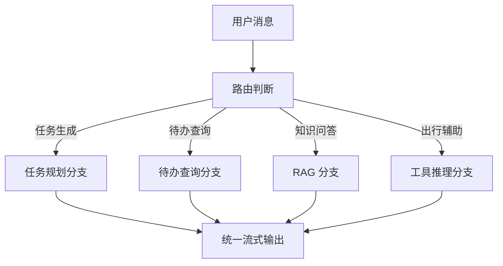

## 5.3 WebRTC记录模块与提醒机制实现

系统的多模态能力不只体现在语音交互上，还体现在浏览器端的媒体记录与后端提醒协作中。记录模块涉及画面合成、录制与存储，提醒机制则跨越前端写入、缓存调度和邮件发送多个环节。两类功能虽然服务对象不同，但都要求系统正确处理时间、状态和异步执行问题。

### 5.3.1 Canvas 渲染管线设计

记录模块的关键问题，是如何在浏览器端把摄像头画面、贴纸元素和其他叠加内容组织成一套可实时更新的画面。若所有元素都直接绑定在同一更新逻辑中，任何局部变化都可能导致整幅画面频繁重绘，拖慢录制过程。LifePilot 因而采用分层绘制思路，将背景画面、装饰元素和文字信息分别组织，再统一合成为输出帧。

在画面交互中，贴纸并不是静态覆盖层，而是支持拖动、缩放等位置变化。为了避免不同分辨率下布局失真，系统在位置管理上采用相对化表示，使元素更关注其在画面中的比例位置，而不是固定像素点。这样处理后，同一套贴纸布局在不同设备和导出尺寸下都更容易保持一致。

渲染循环采用与浏览器刷新节奏一致的方式推进，而非依赖固定时间间隔强制重绘。原因在于媒体画面和交互元素都属于高频更新内容，若刷新节奏与浏览器渲染不同步，容易出现卡顿和资源浪费。通过让重绘过程跟随浏览器渲染时机，可以在视觉平滑度和资源消耗之间取得更合理的平衡。

如图5-12所示，画布渲染管线把视频背景、贴纸元素和文字层拆开处理，再统一输出到录制流。该图对应 5.3.1 节对分层绘制的说明。

### 图5-12 Canvas 渲染管线图

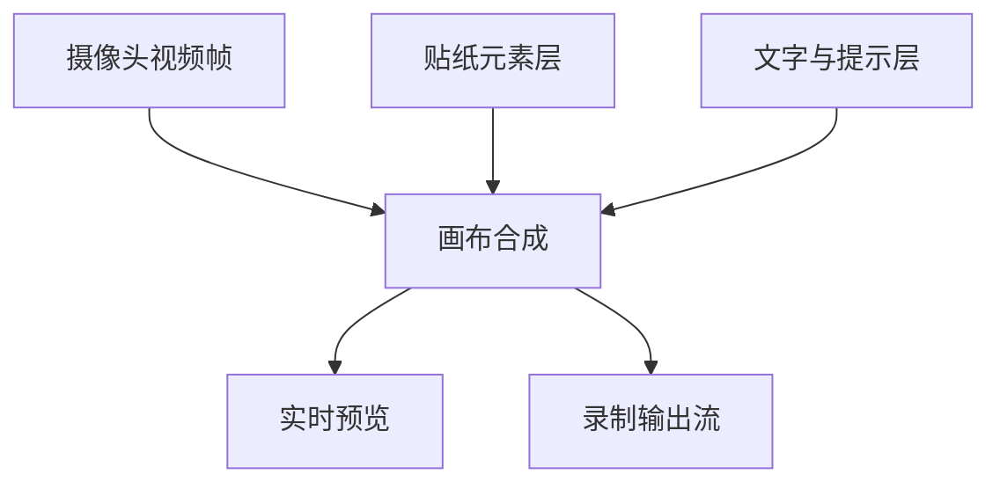

### 5.3.2 录制与编码方案

记录模块的第二个问题，是如何把实时画面和音频共同组织成可保存的视频结果。浏览器端的画布流天然更适合表示视频内容，但音频轨道通常来自独立媒体流，因此系统需要在录制前完成音视频合并，再交给统一录制器处理。只有这样，导出的媒体内容才不会出现“有画面无声音”或时间轴错位的问题。

在编码策略上，系统优先选择主流浏览器支持度较高、压缩效率较好的格式；当运行环境不支持优先格式时，再退回兼容性更强的备选方案。采用分级选择的原因，是不同浏览器在媒体编码支持上存在明显差异，若固定使用单一格式，系统在部分终端上会面临无法录制或导出异常的问题。

录制过程还需要考虑长时任务的稳定性。若所有数据都在结束时统一处理，浏览器端会承受更大内存压力，也不利于异常中断后的恢复。将录制数据拆分为较小片段逐步收集，可以降低单次处理负担，并为后续上传、预览或断点处理提供更灵活的空间。

如图5-13所示，录制实现包含画面合成、音频接入、统一编码和分片保存几个步骤。图中突出的是音视频在进入录制器前已经被整理为统一媒体流。

### 图5-13 录制与编码方案图

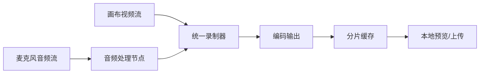

### 5.3.3 提醒调度机制

任务提醒的实现难点，不在于发送邮件本身，而在于如何让提醒在正确时刻触发，并避免多实例环境下重复执行。LifePilot 将待提醒任务按时间顺序放入有序集合中，由后台调度器持续检查到期任务。采用时间有序结构的原因，在于它天然适合表示按时触发的调度需求，不需要额外构造复杂的时间轮或状态表。

调度过程中，系统并不是简单地读取到期任务后直接执行，而是先尝试将任务从待调度集合中移除，再继续后续处理。这样做相当于给调度器增加了一步抢占判断：只有成功取走任务的实例才继续发送提醒，其余实例即使同时读到同一任务，也不会重复执行。该机制对多实例部署场景尤为重要。

提醒触发后，系统会进一步判断任务是否已经结束、是否仍需继续提醒，并据此更新任务状态或重新写入下一次触发时间。通过把“提醒发送”和“下一次调度计算”放在同一处理环节中，系统能够维持连续调度链路，而不必为每个任务额外维护独立定时器。

如图5-14所示，提醒调度的关键在于“读取到期任务”和“抢占成功后执行”两步必须连续发生。该图用于说明多实例环境下如何避免重复提醒。

### 图5-14 提醒调度抢占流程图

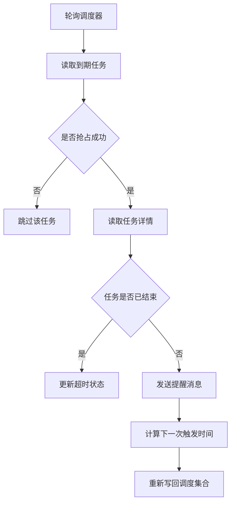

### 5.3.4 SSE 流式输出设计

智能对话的实现不仅依赖模型推理能力，还依赖结果如何被及时送达前端。LifePilot 采用 SSE 作为流式输出通道，主要是因为该场景本质上属于服务端持续推送、客户端顺序接收的单向通信过程。与双向实时通信相比，这种模式更贴合对话生成的输出特征。

SSE 的优势在于其接入成本较低，能够直接建立在常规 HTTP 通道之上，因而更容易与现有反向代理、鉴权和路由结构结合。对于前端而言，流式消息可以按段逐步累积并即时显示，用户无需等待完整回复生成后才看到结果，这也是系统能够维持“边生成边反馈”体验的关键。

在服务端实现中，系统会将不同阶段的输出组织为结构化事件，例如思考提示、正文内容、确认请求和结束标记等。把消息切分为多种事件类型，可以让前端更精确地决定当前应更新哪一部分界面，而不是把所有流式数据都当作同一类文本处理。由此，任务规划中的确认节点、知识问答中的正文输出和流程结束信号都能在同一通道内被统一承接。

如图5-15所示，SSE 输出按事件类型逐段送达前端，前端再根据类型更新当前消息、确认区域或刷新动作。该图对应 5.3.4 节对结构化流式消息的说明。

### 图5-15 SSE 流式输出时序图

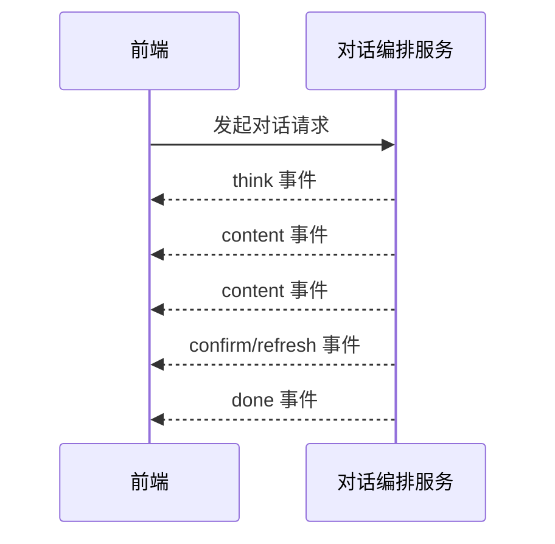

如图5-16所示，前端对流式消息的处理也可以抽象为一组状态转移关系。这样便于说明为什么同一条 SSE 连接能够承接普通回复、确认结果和结束标记。

### 图5-16 SSE 客户端状态图

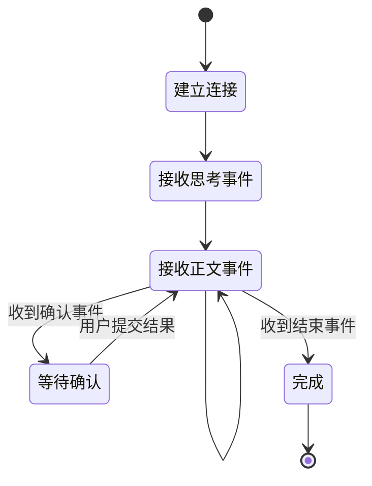

如图5-17所示，前端对话消息在本地状态、流式事件和历史记录之间持续流转。该图用于说明消息展示并不是单次覆盖，而是一个逐步累积的过程。

### 图5-17 对话消息流转图


如图5-18所示，任务生成与用户确认之间存在一个完整的交互往返过程。该图把前端展示、工作流校验和工具写库放在同一条时序线上观察，更便于说明主链路控制点。

### 图5-18 任务生成确认时序图

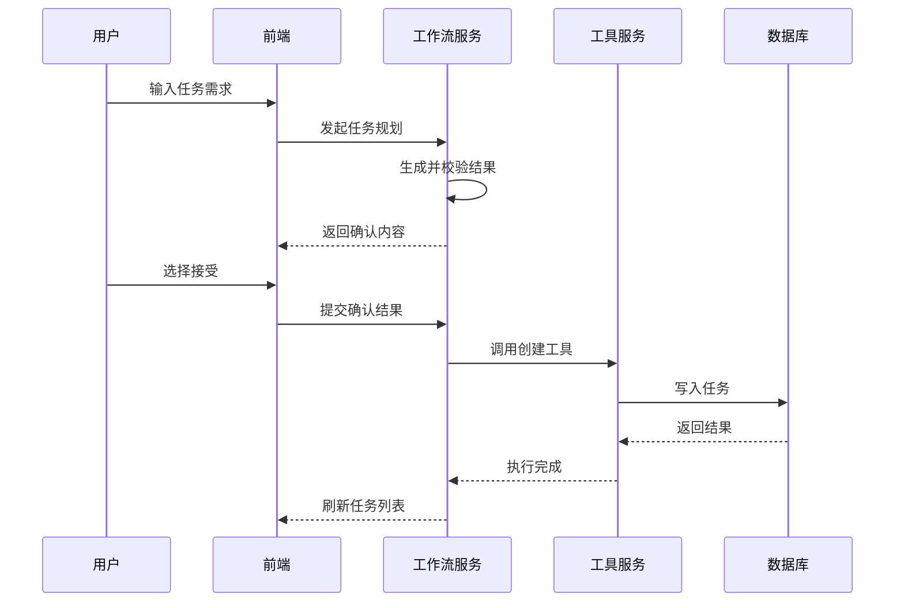

如图5-19所示，知识入库的实现链路覆盖文件上传、解析、切分、索引构建和状态回写。该图可与第4章中的总体设计图形成前后呼应。

### 图5-19 知识入库实现管线

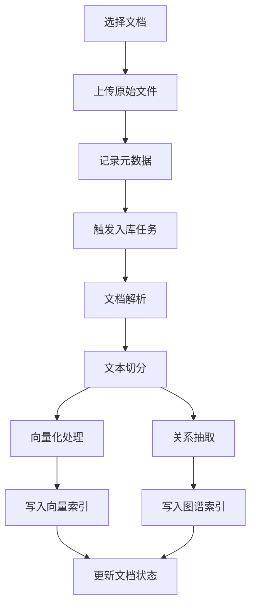

如图5-20所示，知识问答过程先经过多路召回，再进入重排与生成阶段。该图对应实现层的问答时序，强调查询在多个服务之间的协作关系。

### 图5-20 知识问答时序图

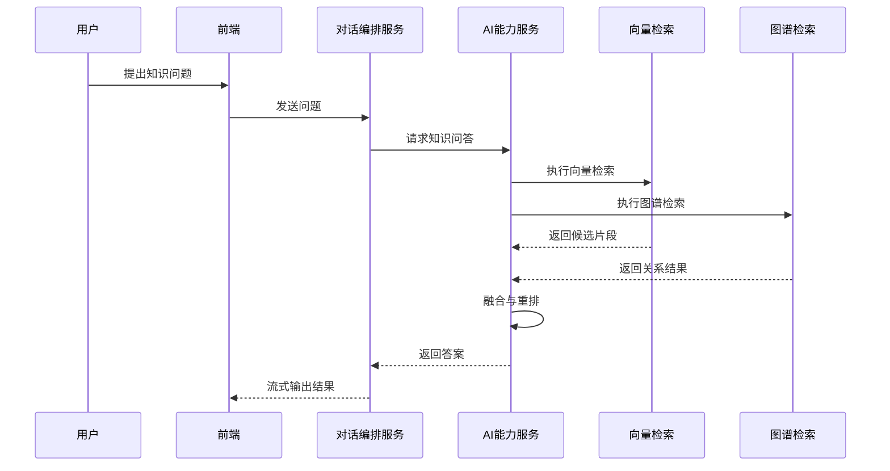

如图5-21所示，路由判定并非只有成功分支，还需要考虑无法可靠解析结果时的回退路径。该图用于说明入口层的兜底策略。

### 图5-21 路由回退机制图

```mermaid
flowchart TB
    A[用户输入] --> B[路由判定]
    B --> C{是否得到有效结果}
    C -->|是| D[进入目标工作流]
    C -->|否| E[回退到知识问答分支]
    D --> F[统一流式输出]
    E --> F
```

如图5-22所示，媒体记录场景不仅包含录制本身，还包含贴纸加载、画面预览和导出保存。该图用于补充 5.3.1 和 5.3.2 节之间的连接关系。

### 图5-22 媒体记录交互图

```mermaid
flowchart LR
    A[加载摄像头] --> B[实时预览]
    C[选择贴纸] --> D[贴纸叠加]
    B --> E[画布合成]
    D --> E
    E --> F[开始录制]
    F --> G[结束录制]
    G --> H[生成视频结果]
    H --> I[保存与回看]
```

如图5-23所示，调度器、缓存和邮件服务之间形成一条独立的后台执行链路。该图能够更直观地体现提醒功能与前端界面之间并非同步耦合。

### 图5-23 提醒调度时序图

```mermaid
sequenceDiagram
    participant FE as 前端
    participant DB as 业务数据库
    participant RD as Redis调度集合
    participant SC as 后台调度器
    participant Mail as 邮件服务

    FE->>DB: 保存任务与提醒时间
    FE->>RD: 写入调度时间
    SC->>RD: 轮询到期任务
    RD-->>SC: 返回任务标识
    SC->>DB: 查询任务详情
    SC->>Mail: 发送提醒邮件
    SC->>RD: 写回下一次触发时间
```

如图5-24所示，SSE 客户端除了正常接收事件外，还要处理连接建立、事件累积、确认等待和连接结束等多个阶段。该图从实现层补充前端消息处理状态。

### 图5-24 流式会话处理图

```mermaid
flowchart TB
    A[建立SSE连接] --> B[接收思考事件]
    B --> C[接收正文片段]
    C --> D[更新当前消息]
    D --> E{是否收到确认事件}
    E -->|是| F[进入确认等待]
    E -->|否| G{是否结束}
    F --> H[提交确认结果]
    H --> C
    G -->|否| C
    G -->|是| I[关闭连接并固化消息]
```

## 5.4 本章小结

本章围绕前端交互、智能工作流和异步执行链路说明了系统的主要实现方式。实现层的核心思路，是将用户交互、流程控制、工具访问和调度执行分别组织，再通过受控接口连接成完整业务闭环。基于这些实现，下一章将进一步说明系统部署方式与运行环境配置。
