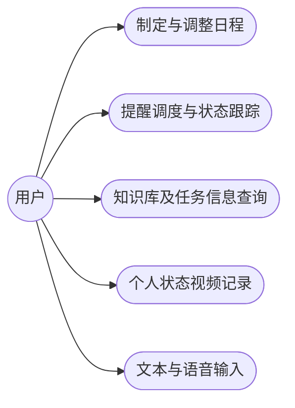
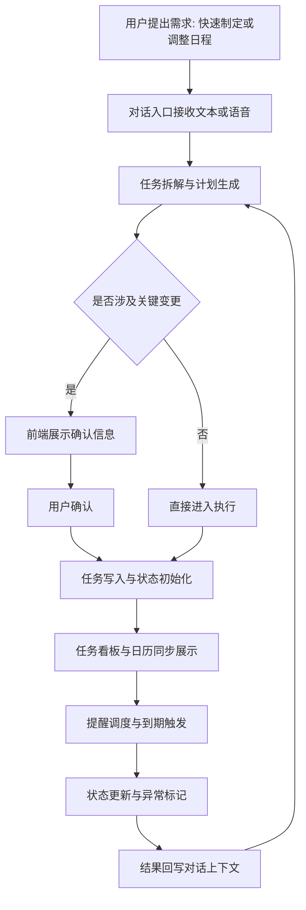
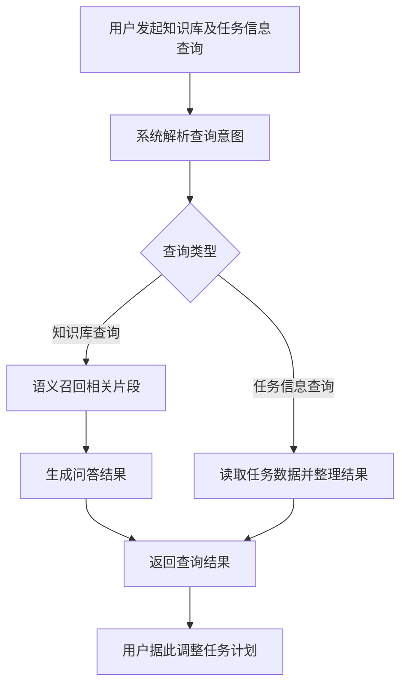
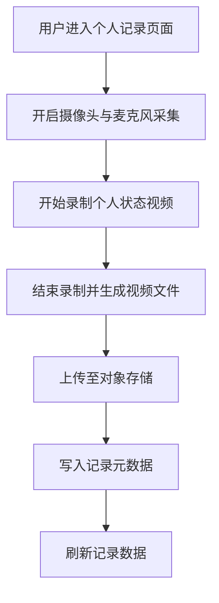
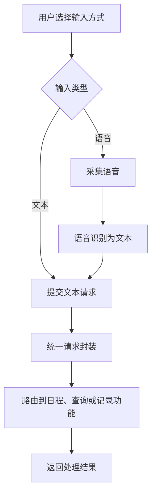
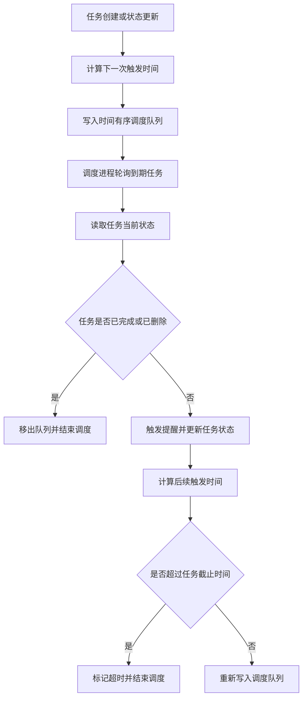

# 第3章 可行性分析

## 3.1 可行性分析

本节从工程基础与技术路径两个层面评估系统落地条件。LifePilot 已形成前端应用、AI 业务服务、工具服务与知识服务的分层结构，模块边界清晰。当前版本完成了任务管理、对话交互、文档入库与检索问答的联调流程。部署侧已具备容器化与持续集成链路，后续功能设计具备实现基础。

### 3.1.1 技术可行性分析

本系统采用 TypeScript 与 Python 的组合路线。前端基于 Next.js 与 React 构建，配合状态管理与组件化开发模式完成页面渲染、交互响应和数据绑定。该技术栈在工程实践中应用广泛，配套文档、调试工具与社区支持较为完备，适合论文项目的持续迭代。

服务端按职责拆分为 AI 业务服务、MCP 工具服务与 RAG 服务。AI 业务服务负责对话编排与任务调度，MCP 服务承接受控数据操作，RAG 服务承担文档解析与语义检索。各服务通过标准 HTTP 接口通信，跨语言协作成本可控，单个模块可独立演进，不会牵动整体结构。

数据层采用 MySQL、MongoDB、Redis 与 Weaviate 的组合。MySQL 承载结构化业务数据，MongoDB 存储对话与日志记录，Redis 负责缓存与定时队列，Weaviate 支持向量检索。该分工与各数据库的典型使用场景一致，数据访问组件与对象映射工具较成熟，可降低实现复杂度并压缩后期迁移代价。

在工程实施层面，项目已具备 Docker 与 Jenkins 的构建发布流程，并完成多服务联调。文件上传、文档处理与语音相关能力已接入对象存储和 Python 服务。现有技术路径能够支撑课题功能实现与实验推进，主要风险集中在外部模型接口波动和网络依赖，当前架构通过服务解耦与降级路径对该风险进行控制。

### 3.1.2 经济可行性分析

本课题采用开源框架与通用云服务组合，初期投入主要集中在算力调用、存储与基础运维，不依赖专用硬件采购。前端、后端与知识服务均可在常规服务器环境部署，开发阶段可按需启停服务，资源使用成本可控。

从运行成本看，系统采用模块化拆分策略。任务管理链路与知识检索链路可独立扩缩容，避免全量服务同步升级带来的冗余开销。文档存储与向量检索采用按量计费模式，适合论文阶段的渐进式数据增长。

从维护成本看，项目已形成容器化部署与持续集成流程，版本迭代不需要大规模人工发布操作。综合开发投入、部署复杂度与运行成本，当前方案能够满足课题实施周期内的资源约束，具备经济可行性。

### 3.1.3 操作可行性分析

本课题面向日程管理与个人知识管理场景。目标用户在学习和工作中已普遍接触待办清单、日历应用与对话式助手，因此交互认知门槛较低。

系统界面围绕任务、日历、知识库和对话四类高频功能组织，主要操作入口位置固定。关键按钮提供明确的文字标签和状态反馈，用户在少量尝试后即可完成创建任务、调整计划、上传文档与检索问答等常用操作。对于影响数据状态的提交动作，界面在执行前提供确认步骤，用于降低误操作风险。

当前版本已完成多模块联调，主要功能路径可连续闭环。交互结构与用户既有使用习惯保持一致，能够满足论文系统对上手效率和日常使用连续性的要求，因此该方案具备操作可行性。

## 3.2 需求可行性分析与功能可行性分析

3.1 节已经给出技术与部署条件，3.2 节进一步讨论需求覆盖与功能落实。判断可行性时，关键不在模块数量，而在功能是否对应真实使用场景，且能够稳定执行。因此，本节从用户任务出发，逐项分析需求与功能之间的对应关系。

### 3.2.1 需求可行性分析

1. 用户需要制定并持续执行日程，系统提供任务拆解、任务创建、提醒调度和状态跟踪能力。输入计划后，系统可生成可执行任务，并在执行阶段持续更新状态。
2. 用户需要进行知识库及任务信息查询，系统提供文档入库、语义检索、问答生成和任务信息查询能力。查询结果可直接用于任务调整，信息利用路径保持连续。
3. 用户需要进行个人状态视频记录，系统提供基于 WebRTC 媒体采集的个人记录功能，支持摄像头与麦克风采集、视频保存和记录管理。
4. 用户需要降低输入负担并减少切换成本，系统提供文本语音双通道交互和统一工作界面。任务操作、知识库及任务信息查询、个人状态视频记录可在同一应用内完成。

如图 3-1 所示，用户角色与系统功能用例之间存在直接对应关系，需求覆盖范围由此得到验证。

图 3-1 用户功能用例关系图

### 3.2.2 功能可行性分析

功能可行性需要落实到操作流程。针对 3.2.1 的各项需求，系统均给出可执行链路，而非停留在概念描述层。

图 3-1 至图 3-6 在论文定稿阶段将按 UML 绘图规范统一重绘，以满足学院对流程图与用例图的版式要求。

如图 3-2 所示，用户输入先进入对话入口，系统完成任务拆解并生成计划。涉及关键变更时，界面先给出确认，再将结果写入任务存储。任务进入调度阶段后触发提醒并更新状态，执行结果回写到对话层，作为下一轮调整依据。

图 3-2 日程制定与调整功能实现流程

知识库及任务信息查询的实现路径见图 3-3。查询请求进入系统后先进行意图识别。知识库查询走语义召回与问答生成链路，任务信息查询走任务数据检索链路，结果在同一界面返回，并用于后续任务调整。

图 3-3 知识库及任务信息查询功能实现流程

个人状态视频记录的实现路径见图 3-4。用户进入记录页面后开启设备采集，系统将实时画面与音频写入记录流；结束记录后执行对象存储上传，并将时长、体积和资源地址写入记录库。

图 3-4 WebRTC 个人状态记录功能实现流程

文本与语音双通道输入的实现路径见图 3-5。用户可选择文本输入或语音输入，语音输入先完成识别再与文本输入汇合，系统通过统一请求入口路由到日程、查询或记录相关功能，从而保持交互链路一致。

图 3-5 文本与语音双通道输入功能实现流程

任务调度功能的实现路径见图 3-6。任务创建或更新后，系统计算触发时间并写入调度队列。调度进程按时间窗口拉取到期任务，再结合任务当前状态决定提醒、重排或终止，形成可持续执行的调度闭环。

图 3-6 任务调度功能实现流程
