# 第4章 概要设计

第3章完成可行性分析后，系统进入概要设计阶段。本章直接对应当前项目的工程结构，围绕 `LifePilot` 前端、`LifePilotServer` 业务服务、`LifePilot_mcp` 工具服务与 `ai-server` 知识服务展开。章节目标是给出模块边界、协同路径、数据落点与接口组织，为第5章详细设计和第6章实现与测试提供统一框架。

## 4.1 设计目标

本项目的设计目标来自三类高频业务：任务规划与执行、知识入库与问答、个人状态记录。系统需要在同一应用内支持三类业务连续完成，减少页面跳转和信息割裂。系统还要支持持续迭代，前端、业务服务、工具服务和知识服务采用独立演进方式，便于后续扩展能力。

如图4-1所示，设计目标与系统能力形成固定映射关系。后续架构划分与流程组织均基于该映射执行。

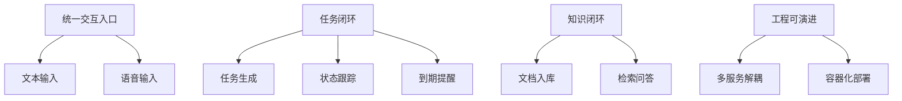

图4-1 设计目标与能力映射

图4-2给出本章覆盖范围。概要设计关注系统结构和协同逻辑，不进入代码实现细节。

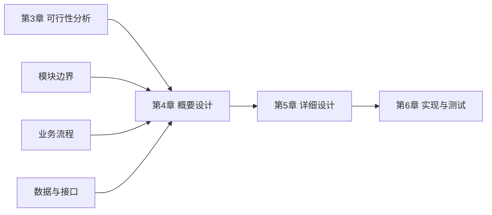

图4-2 章节衔接关系

## 4.2 系统总体架构

系统采用四层结构。表现层对应 `LifePilot`，负责页面组织与交互承载。业务层对应 `LifePilotServer`，负责对话编排、工作流路由和调度控制。工具层对应 `LifePilot_mcp`，负责任务域数据操作。能力层对应 `ai-server`，负责文档解析、检索问答与语音处理。数据层由 MySQL、MongoDB、Redis、向量存储和对象存储组成。

如图4-3所示，当前版本的部署节点与连接方向已经固定，主链路从前端进入业务服务，再按意图分发至工具服务和知识服务。

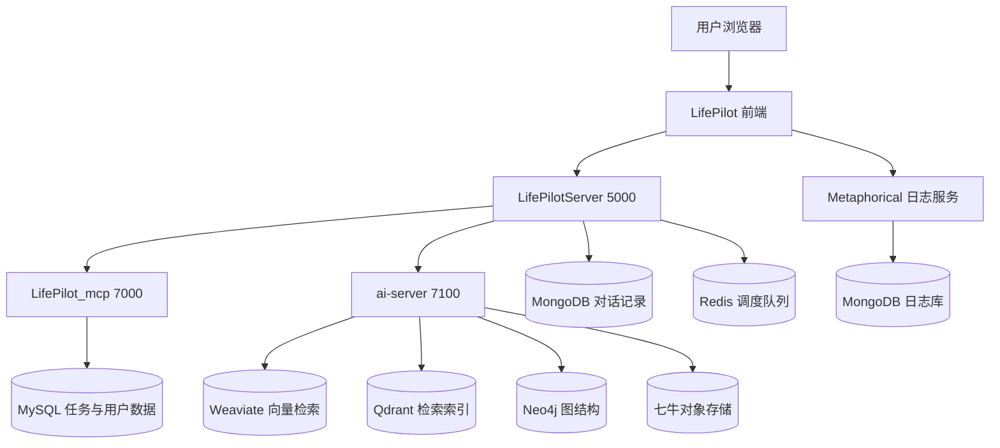

图4-3 系统总体架构图

图4-4展示一次完整请求的协同过程。该时序覆盖当前项目中的核心调用关系。

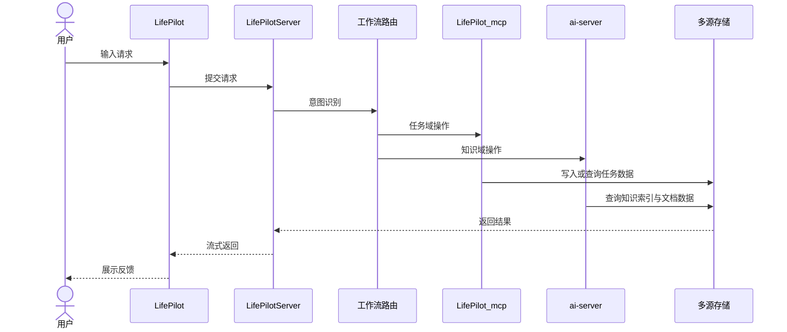

图4-4 业务协同时序图

## 4.3 功能模块划分

前端模块按用户任务组织，主页面覆盖清单、日历、知识库与记录四类入口。业务服务模块按能力组织，包含对话编排、任务规划、任务操作、出行规划、检索问答和提醒调度。工具服务负责任务和标签相关操作。知识服务负责文档解析、检索召回、语音识别和语音合成。

如图4-5所示，前端功能围绕 `home` 主路径组织，知识库和记录功能在同一应用内独立成页，和任务模块保持联动。

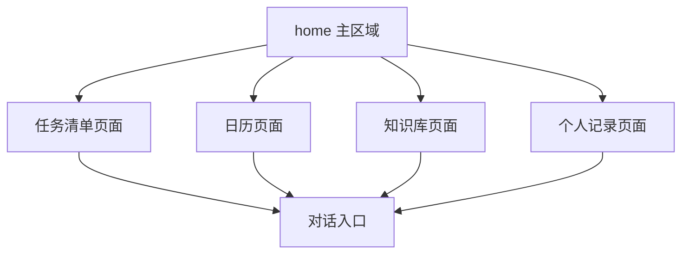

图4-5 前端功能结构图

如图4-6所示，业务服务内部以路由节点组织多个工作流。不同工作流共享上下文准备节点，再进入各自处理链路。

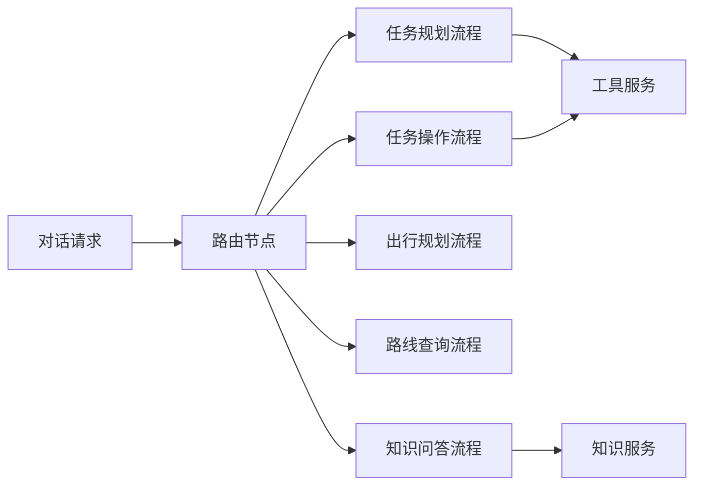

图4-6 业务服务工作流结构图

## 4.4 核心设计视图

第3章已经给出业务执行流程，本节改为展示系统设计视图。图4-7至图4-11分别覆盖职责分配、状态模型、事件协议、索引结构与调度协作。该组织方式与第3章形成分工：第3章偏过程验证，第4章偏结构设计。

如图4-7所示，系统以“前端交互层、业务编排层、工具服务层、知识服务层”分配职责，各层通过明确接口协作。

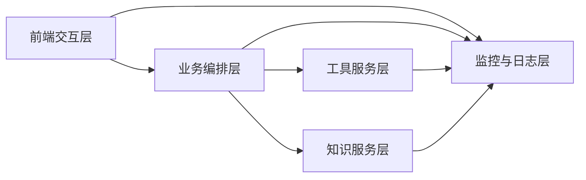

图4-7 分层职责视图

如图4-8所示，任务对象以状态迁移组织，提醒逻辑和超时逻辑以状态变化为触发条件。

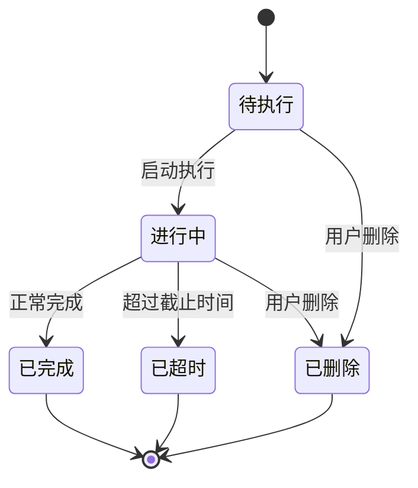

图4-8 任务状态模型图

如图4-9所示，对话链路采用事件协议返回内容。事件类型用于区分过程信息、结果信息和界面刷新信号。

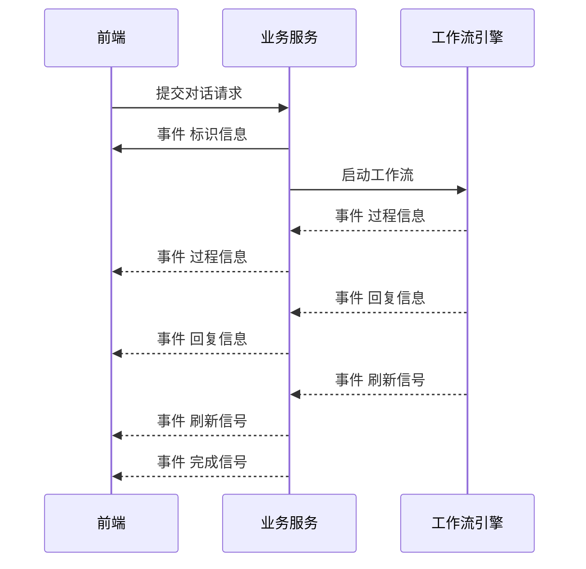

图4-9 对话事件协议图

如图4-10所示，知识服务将原始文档拆分为片段，再分别写入向量索引和图结构索引，问答阶段从双索引取回证据后生成结果。

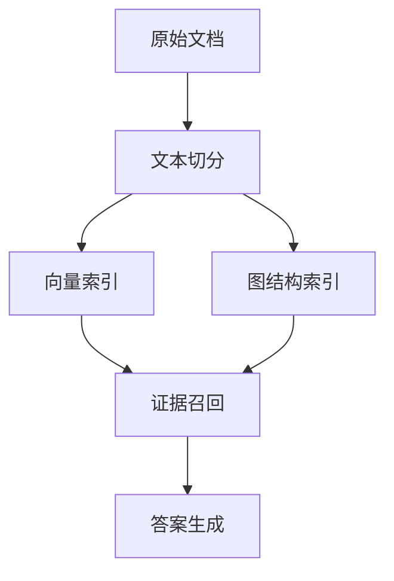

图4-10 知识索引结构图

如图4-11所示，调度模块与缓存、任务库和通知模块形成协作闭环。到期任务先从队列取出，再根据任务状态执行提醒或结束处理。

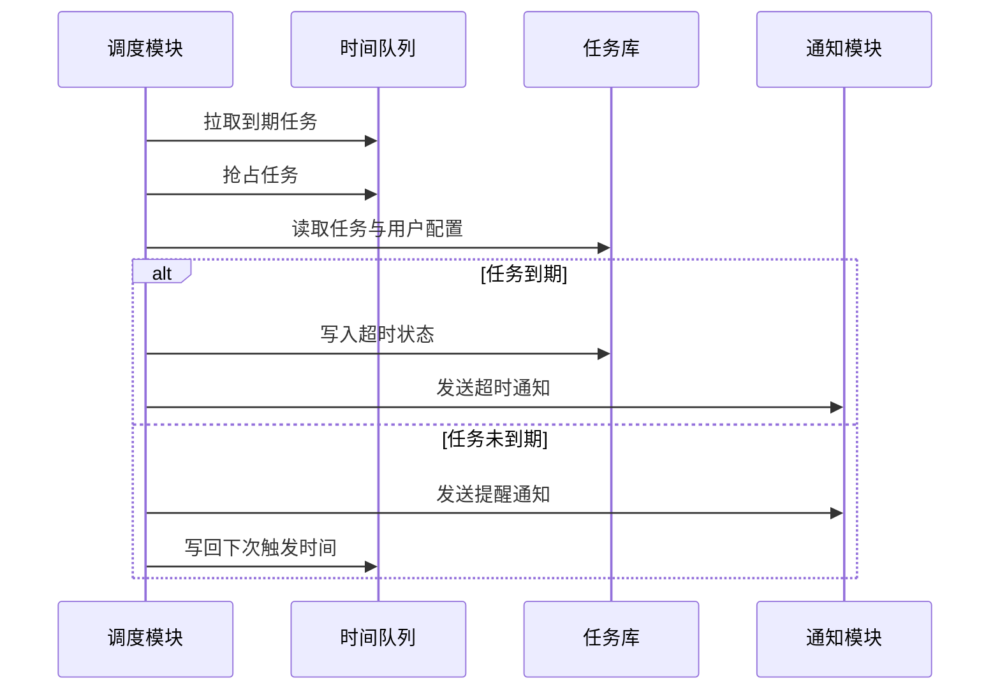

图4-11 调度协作视图

## 4.5 数据与接口概要

数据层采用职责分工方式。MySQL承载任务、用户、标签与会话索引数据。MongoDB承载对话消息与日志记录。Redis承载调度时间队列。知识服务将文档切片写入向量存储，并维护图结构索引。媒体文件统一进入对象存储。

如图4-12所示，当前项目的数据落点关系已经固定，业务域与存储域呈一对多映射。

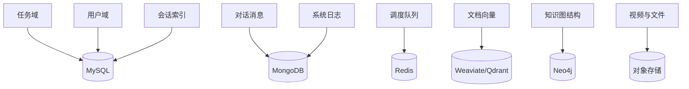

图4-12 数据存储映射图

接口层按通信对象分为三组：前端到业务服务、业务服务到工具服务、业务服务到知识服务。前端对话链路使用流式返回，文件和任务操作使用请求响应。服务间调用采用协议化或标准 HTTP 调用，接口语义围绕任务、知识和媒体三类业务组织。

如图4-13所示，不同接口通道承担不同职责，接口层和存储层之间没有跨域直连。

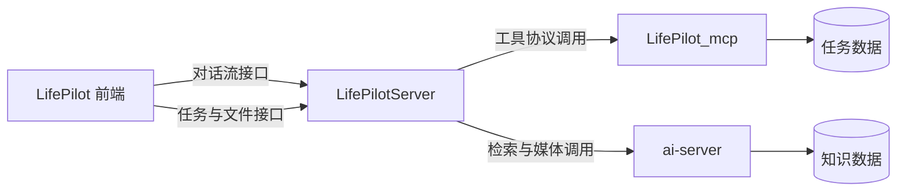

图4-13 接口分层关系图
